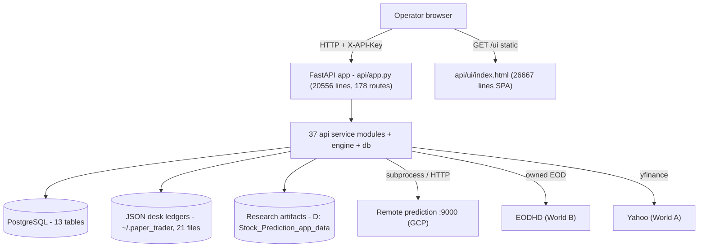
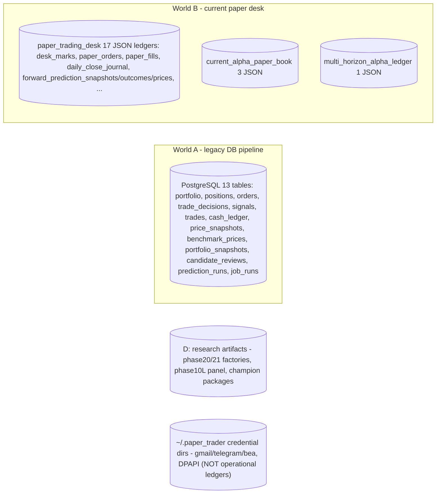
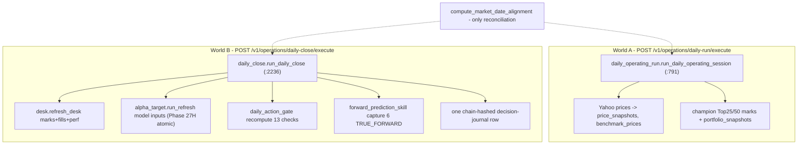
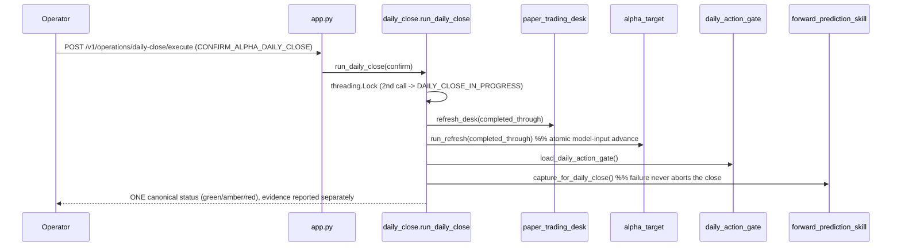
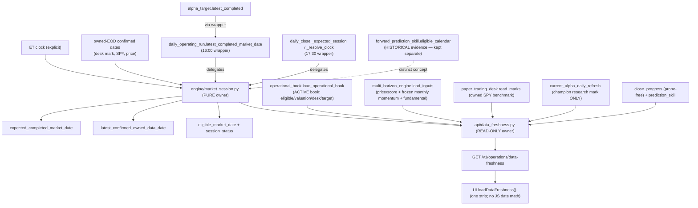
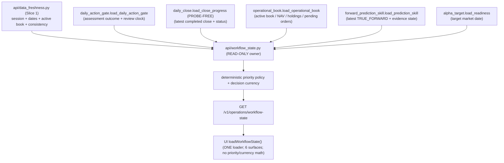
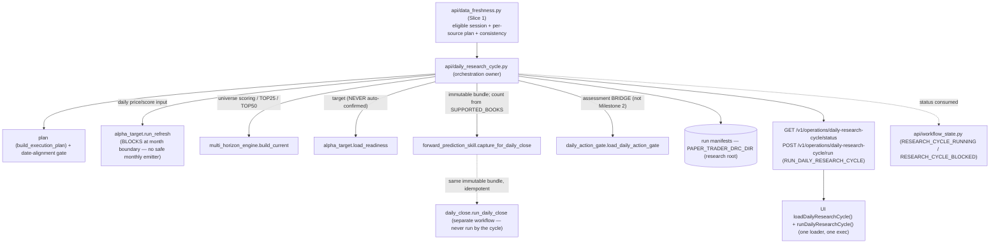
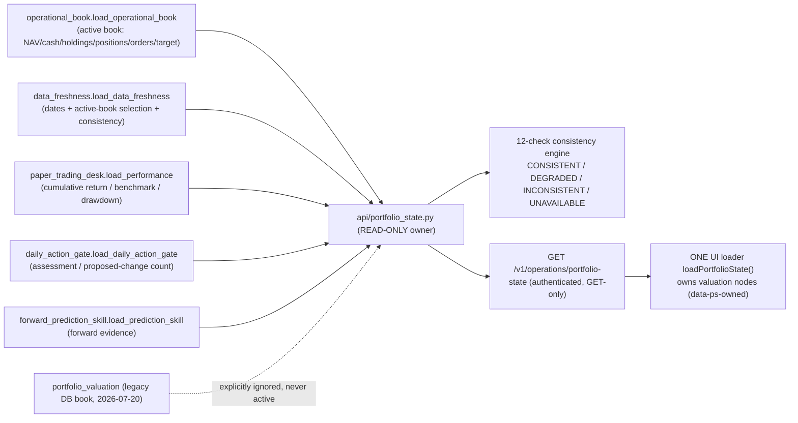

# Paper Trader — Current Architecture (as-built)

> Evidence-based snapshot of the system as it exists at commit `06ed05d`
> (branch `main`). Every non-trivial claim cites `file:line`. This document
> describes **what is**, not what should be — see
> [TARGET_ARCHITECTURE.md](TARGET_ARCHITECTURE.md) for the intended boundaries
> and [CONSOLIDATION_ROADMAP.md](CONSOLIDATION_ROADMAP.md) for the path between
> them. Governing intent: [PROJECT_CHARTER.md](PROJECT_CHARTER.md).
>
> Static analysis does not prove runtime behavior. Findings here were derived by
> reading source and cross-checked with the tests; treat any "dead"/"orphan"
> label as a lead to confirm, never as authorization to delete.

## 1. System context

Paper Trader is a single-operator, **paper-only** research-and-portfolio
workstation. One human runs a local FastAPI backend and drives a single-page
browser cockpit. No live orders, no broker, no automation are enabled anywhere
(charter Safety Boundaries).

| Actor / system | Role | Location |
|---|---|---|
| Operator (browser) | Runs the daily workflow, approves proposals, reads evidence | `http://127.0.0.1:8001/ui/` |
| FastAPI backend | All business logic + 178 routes | `api/app.py` on `:8001` |
| PostgreSQL | Legacy engine state (positions, orders, price snapshots) | `localhost:5432/paper_trader` |
| JSON desk ledgers | Current paper book, marks, fills, forward evidence | `C:\Users\binis\.paper_trader` (21 files) |
| Research artifacts | Frozen panels, factories, champion packages | `D:\Stock_Prediction_app_data` |
| Prediction service | Remote model inference (never local) | `http://127.0.0.1:9000` (GCP tunnel) |
| Market data (owned) | EODHD end-of-day (World B), Yahoo/`yfinance` (World A) | vendor / local files |

## 2. Runtime topology

Key runtime facts:

- **No `startup`/`lifespan` handler exists** (repo-wide search is empty). The app
  object is built at import (`api/app.py:235`); the UI is served by Starlette
  `StaticFiles` (`api/app.py:20551`) with `/` redirecting to `/ui/`. The one piece
  of import-time deployment wiring is `_wire_production_monthly_emitter()` (Phase
  29D.2): it activates the production monthly-momentum emitter resolver in the
  running backend and is GUARDED off under pytest (`"pytest" in sys.modules`) so the
  test suite stays hermetic — it runs no subprocess and imports no numpy/pandas.
  (`api/app.py:20554`). Editing `api/ui/index.html` requires a **backend restart
  and a `?cb=` cache-buster** to be visible (ETag/Last-Modified caching, no
  `--reload`), which is a real operator prerequisite even though no code caches
  the HTML.
- **Authentication** is one API-key dependency, `_verify_api_key`
  (`api/app.py:242`, `APIKeyHeader("X-API-Key")` at `:230`), attached per-route
  via `dependencies=[Depends(_verify_api_key)]`. Liveness `GET /v1/health`
  (`:4014`) and readiness `GET /v1/ready` (`:4033`, DB `SELECT 1`) plus the
  static `/ui` mount are the operator-facing probes; `/v1/ready` gates on
  **Postgres only** and does not imply owned-EOD or model inputs are ready.

## 3. Module map

171 first-party Python source files. Distribution: `api/` 38, `alpha_agent/` 86,
`engine/` 13, `db/` 11, `scripts/` 20, `workflows/` 2.

**Two monoliths dominate:**

| File | Lines | What it is |
|---|---|---|
| `api/app.py` | 20,556 | The entire HTTP surface — **all 178 routes**, request models, and much orchestration/business logic inline. No `APIRouter` modules exist. |
| `api/ui/index.html` | 26,667 | The entire SPA — 6 views, ~150 loaders, all styling and JS inline. |

**Other modules above the 1,500-line review threshold** (audit
`large_modules`): `alpha_agent/runtime.py` 5,798; `api/daily_close.py` 2,758;
`alpha_agent/tournament.py` 2,590; `alpha_agent/research_director.py` 2,589;
`alpha_agent/telegram_control.py` 2,201; `api/forward_prediction_skill.py`
2,111; `engine/absolute_return_research.py` 2,071; `alpha_agent/analyst_revisions.py`
1,796; `alpha_agent/historical_backfill.py` 1,639; `alpha_agent/research_registry.py`
1,557.

The `api/` service modules cluster into families that mirror the phase history:
`current_alpha_*` (12 modules — champion book/preview/tournament/decision-gate/
performance/revalidation/integrity), `multi_horizon_*` (7 — the scoring engine
and its registry/history/ledger/artifacts), `alpha_*` (registry, factory, book,
target), `daily_*` (operating-run, close, action-gate, workflow-dashboard),
`portfolio_*` (valuation, manager, terminal), `paper_trading_desk`,
`operational_book`, `forward_*` (evidence, prediction-skill). The `alpha_agent/`
package (86 modules) is the autonomous research OS (ingestion → director →
tournament → runtime); it is **shadow-only** and never changes operational
holdings. `engine/` holds the **legacy** DB-backed pipeline
(`scoring`, `strategy`, `portfolio`, `reconciler`, `market_data`,
`market_screener`, `risk`, `universe`).

See the machine-readable classification in
[architecture/system_inventory.json](architecture/system_inventory.json).

## 4. API map

- **178 route decorators, 100% declared in `api/app.py`.** There are **zero
  duplicate `(method, path)` declarations** (audit). Routes group by prefix:
  `/v1/research/*` (champion, factories, tournament, stage11/12, analyst
  revisions), `/v1/operations/*` (daily-action-gate, daily-close, daily-run),
  `/v1/evidence/*` (forward, attribution, prediction-skill, recovery),
  `/v1/paper-desk/*`, `/v1/alpha-book/*`, `/v1/alpha-target/*`,
  `/v1/portfolio-manager/*`, `/v1/operational-book`, `/v1/dashboard/*`.
- The UI references **131** distinct `/v1` endpoints; **43 declared `/v1` routes
  have no UI reference** (orphan-endpoint candidates — mostly legacy Daily-Plan
  preview and research routes), and **1 UI reference is dangling**
  (`/v1/ticker-detail/…`, a parameterized detail route). These are audit
  candidates, not confirmed-dead.
- A confirmed **dead wire**: `current_alpha_tournament.run_current_alpha_tournament_refresh`
  (`api/current_alpha_tournament.py:341`) is imported (`api/app.py:172`) but
  reachable by no route — superseded by the Phase-19 sync.

## 5. UI map

`api/ui/index.html` is a single-source-of-truth cockpit (Phases 27B/27C/28C):

- **6 sidebar views** (`.sidebar-link[data-route]`, hash-routed via
  `applyRoute`): Command Center → `tab-overview`; Portfolio → `tab-portfolio`;
  Daily Workflow → `tab-prediction-cockpit`; Portfolio Manager →
  `tab-portfolio-manager`; Model Target/Alpha Portfolio → `tab-multi-horizon`;
  Research & Audit → `tab-audit-advanced` (with a 9-item sub-nav). A legacy
  4-tab bar remains but is hidden.
- **3 HTTP helpers** (`call()`, `fetchWithTimeout()`, `_mhzGet()`); **152
  `call()` sites**; ~150 `load*/render*` functions.
- **One coalesced single-flight loader**, `loadOperationalBook()` (guard
  `window._obInFlight`), reused at **exactly 10 call sites**; it fans one
  `/v1/operational-book` payload out to every operator surface and chains
  `loadDailyActionGate()` + `loadDailyClose()`. This is the correct
  single-source pattern.
- **Forbidden constructs are absent**: **0** `alert(` / `confirm(` (toasts are
  used), no `setInterval`/polling, no automation/auto-promote, no live-broker
  order execution. Safety badges (`PREVIEW ONLY`, `NO LIVE BROKER ORDERS`,
  `AUTOMATION OFF`, `MANUAL REVIEW`, `CREATES … ONLY`) render across the header,
  Command Center, Daily Workflow, Portfolio Manager and previews.
- **Risk (documented, not changed here):** a legacy **"Create Paper Orders"**
  surface is still live-wired in the pre-27 Daily-Plan flow — it POSTs
  `/v1/review/create-orders` to create **PENDING paper tickets** (no broker, no
  fills), with companion paper fill/cancel steps. It is paper-only by design but
  is a "Create Orders" surface, so it is flagged for the roadmap against the
  CLAUDE.md "do not implement Create Orders" rule.

## 6. Data-store map

- The operational-ledger fingerprint covers the **21 JSON files** under
  `paper_trading_desk\` (17), `current_alpha_paper_book\` (3) and
  `multi_horizon_alpha_ledger\` (1). Credential directories
  (`alpha_agent_email`, `alpha_agent_telegram`, `alpha_agent_bea`) are **not**
  operational ledgers.
- **DB access is clean and single-source:** every consumer goes through
  `db/session.py` (`get_session`/`get_dedicated_session`); there are **zero**
  ad-hoc `Session(...)`/`sessionmaker(...)`/`create_engine(...)` constructions
  outside `db/session.py` (audit `direct_db_sessions = 0`).
- **Ledger access is the opposite — there is no store service:** ~13 modules each
  own a private store (its own DIR env var + default path) and carry **their own
  copy of the atomic-write helper** (`tempfile.mkstemp` + `os.replace`), ~11
  copies across 7 modules (e.g. `paper_trading_desk.py:237`,
  `current_alpha_book.py:271`, `alpha_target.py:667`, `alpha_factory.py:1042`).

## 7. Data lineage

| Concept | Producer(s) | Store | Consumers | PIT / mutability |
|---|---|---|---|---|
| Owned EOD prices (World B) | EODHD transport; `daily_close`/`alpha_target` | `desk_marks.json`, model-input CSVs | desk NAV, gate, close | append/refresh; PIT via completed-through date |
| Yahoo EOD (World A) | `engine/market_data.fetch_latest_prices` | `price_snapshots`, `benchmark_prices` | `portfolio_valuation`, screener | upsert, skip-if-exists per (ticker,date) |
| Universe scores (`composite_sn`) | `multi_horizon_engine.compute_scores/build_current` | in-memory from input CSVs | gate, close, operational book | recomputed per refresh; frozen monthly momentum |
| Confirmed target snapshot | `alpha_target.confirmation_gate` | `forward_prediction_snapshots`/desk snapshot ledger | desk fills, operational book | append-only, first-write-wins |
| Desk marks / fills / perf | `paper_trading_desk.refresh_desk` | desk JSON ledgers | book NAV, close | append-only chain-hashed |
| TRUE_FORWARD evidence | `forward_prediction_skill.capture_for_daily_close` | `forward_prediction_{snapshots,outcomes,prices}.json` | `forward_evidence`, evidence GETs | immutable, no backfill |
| Champion Top25/50 marks | `current_alpha_daily_refresh` (subprocess) | local book JSON + `D:` mark artifact | command-center, model-target view | new-mark-only |
| Challenger factories | `alpha_factory` / `price_alpha_factory` | `D:\…\phase20/21_*` registries | research/audit view | full overwrite per commit |

## 8. Current workflows

Fourteen operator workflows were traced end-to-end. The two that define the
system's shape:

The other twelve (application readiness; market-data refresh; Daily Alpha Run;
Daily Research Cycle; portfolio valuation; forward-evidence capture; evidence
recovery; champion evaluation; challenger research; portfolio review; target
generation; paper-order workflow; Stage 13A) are detailed with triggers,
prerequisites, writes, idempotency keys and failure behavior in
[CONSOLIDATION_ROADMAP.md](CONSOLIDATION_ROADMAP.md) and the inventory.

## 9. Research vs Operations vs Execution boundaries

```mermaid
flowchart LR
  subgraph Research["RESEARCH (shadow-only, never mutates holdings)"]
    R1["alpha_agent/* research OS"]
    R2["alpha_factory / price_alpha_factory"]
    R3["current_alpha_* tournament / revalidation"]
    R4["Stage 13A analyst revisions (Data Expansion)"]
  end
  subgraph Ops["OPERATIONS (paper, token-gated writes)"]
    O1["daily_close / daily_operating_run"]
    O2["paper_trading_desk / operational_book / alpha_book"]
    O3["portfolio_valuation / portfolio_manager"]
  end
  subgraph Exec["EXECUTION (deferred - Milestone 7)"]
    E1["NOT IMPLEMENTED - no broker, no live orders"]
  end
  Research -. "evidence only" .-> Ops
  Ops -. "manual approval" .-> Exec
```

The boundary is largely respected: **no research-only module contains an
order-execution call** (audit `research_execution_terms = 0`), and challenger
research never auto-promotes (`decide_tournament` yields eligibility only). The
**leak to document** is the legacy paper-order "Create Orders" surface (§5) and
the two-worlds operations split (§8).

## 10. Current sources of truth

| Canonical concept | Intended owner | Reality | Verdict |
|---|---|---|---|
| Portfolio NAV / valuation | `api/portfolio_state` (**Slice 5, LANDED**) — READ owner over `paper_trading_desk.book_nav` (`:518`, LIVE authority) + `portfolio_valuation` (legacy DB archive) | Canonical read model of the complete operational portfolio state (active-book identity + selection, dates, capital/NAV/cost basis/P&L/cumulative return/benchmark/drawdown, positions, orders/fills, target/assessment/evidence refs, consistency verdict, stable state hash) at `GET /v1/operations/portfolio-state`; ONE UI `loadPortfolioState()` owns the valuation nodes (no JS NAV/total/active-book/valuation computation). Selects the active Alpha Paper Book #1, never the dormant legacy DB book (`legacy_paper_portfolio`, 2026-07-20); the PM status bar is cut over from the dormant book to the active book. The live NAV authority is `paper_trading_desk.book_nav`; `engine/portfolio.py:262` (`cached_total_value`) and `current_alpha_book`/`absolute_return_research` remain research/legacy writers scoped for Slices 8/11 | **RESOLVING (Slice 5)** |
| Eligible market date | `engine/market_session` (**Slice 1, LANDED**) | Canonical pure owner; `daily_operating_run:171`, `daily_close._expected_session/_resolve_clock` and `alpha_target` now **delegate** (byte-identical parity). Remaining resolvers documented: `paper_trading_desk._required_mark_date`, `current_alpha_tournament_sync`, `market_screener`, the `func.max(PriceSnapshot.market_date)` sites | **RESOLVING (Slice 1)** |
| Cross-source data freshness | `api/data_freshness` (**Slice 1, LANDED**) | One read-only owner classifies every input under its declared cadence and composes the market session; served at `GET /v1/operations/data-freshness`, rendered by the single UI `loadDataFreshness()` | **OK** |
| Universe scoring / rankings | `api/universe_scoring` (**Slice 4, LANDED**) over the `multi_horizon_engine` kernel | Canonical composition & read owner: calls the pure kernel once, deep-copies the cache, and normalises it into ONE frozen contract (identity + content-level `input_contract_hash` + reconciled counts + deterministic ranking + TOP25/TOP50 + exclusions + universe identity + consistency validator) at `GET /v1/research/universe-scoring`; `current-alpha-scores` is a compat wrapper; the DRC and identity re-exports (`alpha_target`, `forward_prediction_skill`) consume it. No operational module duplicates the kernel's combined-score math. `engine/scoring.py` remains the legacy DB screener lineage (retires with Slice 11) | **RESOLVING (Slice 4)** |
| Target portfolio | `alpha_target` → desk snapshot | Two "book" concepts: operational confirmed snapshot vs frozen champion book (`current_alpha_book`); top-N-sector-cap algorithm duplicated (`multi_horizon_engine:476` vs `multi_horizon_history:117`) | **PARTIAL** |
| Holding opportunity cost / recommendation | `engine/holding_opportunity_cost` (kernel) + `api/holding_opportunity_cost` (composition/read) (**Slice 6, LANDED**) | The SOLE per-holding comparison + decision engine (HOLD/REDUCE/EXIT/REPLACE/ADD) over an immutable PIT input contract; reuses `multi_horizon_engine` constants + `paper_trading_desk` cost model, sources owned trailing price/volume from `price_panel`, sources prior rank from the previous eligible artifact (UNAVAILABLE otherwise). Runs inside the Daily Research Cycle; persists immutable artifacts under `PAPER_TRADER_HOC_DIR`; read at `GET /v1/operations/holding-opportunity-cost` (one UI loader, no JS computation); the Daily Action Gate delegates to its summary. Review-only; no target/order/fill/NAV write | **OK** |
| Workflow / gate state | `api/workflow_state` (**Slice 2, LANDED**) | Canonical combined-interpretation owner composes the domain facts; the specialized owners (`daily_action_gate.evaluate_daily_action_gate`, `daily_close`, `operational_book.derive_lifecycle_view`) keep their domain facts; the 4 legacy stage vocabularies (`app.py:_build_workflow_state` + `_canonical_daily_stage`, `command_center._derive_stage`, `daily_workflow_dashboard`) remain until Slice-11 quarantine | **RESOLVING (Slice 2)** |
| Forward evidence | `forward_prediction_skill` + `forward_evidence` | Coherent; ACTIVE vs SHADOW never mixed; gaps documented, never fabricated | **OK** |
| DB session | `db/session.py` | Single-source, clean | **OK** |
| Model mark | `paper_trading_desk` desk marks | Coherent within World B; diverges from World A `price_snapshots` | **PARTIAL** |

## 11. Known architectural risks

1. **Two parallel "daily operating" worlds** (World A Yahoo→Postgres vs World B
   owned-EODHD→JSON) with different providers, stores and market-date semantics;
   only `compute_market_date_alignment` reconciles them. This is the root of the
   NAV and date conflicts.
2. **No canonical market-session/date service** — ≥8 date resolvers + 6 `_today()`
   seams can disagree about "today".
3. **NAV has two authorities** and is rendered from three UI payloads without a
   reconciliation point.
4. **Five independent mark/refresh writers**, several with standalone endpoints
   (`desk.refresh_desk`, `alpha_target.run_refresh`) that bypass the atomic
   Daily Close and re-introduce the pre-27H desync.
5. **No ledger/store service** — 13 private stores and ~11 hand-copied atomic
   writers; contrast the clean DB layer.
6. **Very tight private coupling** — 172+ cross-module `alias._private` accesses,
   worst `api/alpha_book.py` → `paper_trading_desk` privates ×80; any refactor of
   desk internals silently breaks callers.
7. **Two monoliths** (`app.py` 20.5k, `index.html` 26.7k) concentrate change risk
   and hide ownership.
8. **Hidden prerequisites** — Daily Close silently needs an ACTIVE book (a full
   prior chain); `ALREADY_PROCESSED` closes never capture TRUE_FORWARD;
   operational close can be green while forward evidence stays amber at a month
   boundary; champion refresh shells into a separate research repo; factories
   need frozen `D:` artifacts; `/v1/ready` only checks Postgres.
9. **Legacy Daily-Plan preview pipeline** (candidate→signal→decision→order, DB
   tables `signals`/`trade_decisions`/`orders`, large regions of `app.py`) is the
   "monthly rotation tool" the charter says the system is **not**, and includes a
   live paper "Create Orders" surface.
10. **Tests coupled to implementation** — 648 `.count(`/`.index(` assertions
    across 49 test files (`test_api.py` alone 436), many pinning UI substrings, so
    consolidation must migrate contracts, not just code.

## 12. Slice 1 — Canonical market session & data freshness (implemented, Phase 29B)

The first consolidation slice landed the date/freshness foundation for Milestone 1.
No runtime was deleted; migrated resolvers became thin delegating wrappers.

- **Canonical owner** `engine/market_session.py`: pure (no IO), distinguishes
  expected vs owned-confirmed vs eligible date; frozen status vocabulary
  (`BEFORE_SESSION_CLOSE`, `EXPECTED_SESSION_COMPLETE`, `WAITING_FOR_OWNED_DATA`,
  `SESSION_READY`, `NO_CONFIRMED_DATA`, `CALENDAR_POLICY_DEGRADED`,
  `INCONSISTENT_FUTURE_DATA`). Owned-provider-confirmed sessions are the
  holiday-safe authority; no exchange-calendar dependency is installed or used.
- **Compatibility wrappers** (unchanged signatures, byte-identical output):
  `daily_operating_run.latest_completed_market_date` (16:00), `daily_close`
  `_expected_session`/`_resolve_clock`/`_walk_back_weekend` (17:30),
  `alpha_target.latest_completed` (via the run wrapper).
- **Freshness owner** `api/data_freshness.py`: read-only, cadence-aware
  (`DAILY`/`MONTHLY`/`QUARTERLY`/`EVENT_DRIVEN`/`STATIC`), frozen vocabulary
  (`FRESH`/`STALE`/`MISSING`/`FUTURE_DATED`/`INCONSISTENT`/`NOT_DUE`/
  `NOT_APPLICABLE`/`UNKNOWN`). Composes existing loaders (probe-free); no provider
  call, no prediction, no write. A month boundary blocks signal refresh /
  TRUE_FORWARD when a monthly input is due, but never invalidates a completed
  operational close (D-7).
- **Consumers:** `GET /v1/operations/data-freshness` (authenticated, GET-only,
  read-only) and one UI `loadDataFreshness()` loader on the Command Center; the
  Daily Operating Run status payload also carries an additive `market_session`
  summary from the same owner.
- **World A vs World B / legacy status:** legacy Yahoo→Postgres availability is
  reported as a *separate* source status and never overrides owned-EODHD/desk
  authority (owned confirmation wins). Provider confirmation remains explicit.
- **Deliberately kept separate:** `forward_prediction_skill.eligible_calendar`
  (historical evidence calendar) and `alpha_agent/source_exhaustion.py` (research
  forward session-roll).
- **Remaining (Slice 1/2/3 follow-ups):** `paper_trading_desk._required_mark_date`
  (desk owner untouched this slice), `current_alpha_tournament_sync`,
  `engine/market_screener`, and the `func.max(PriceSnapshot.market_date)` sites.

### 12.1 Corrective patch — active operational book alignment (Phase 29B.1)

The first Slice 1 build composed every date from
`current_operating_state.load_current_operating_state`, whose
`current_operating_mark` is fed by `portfolio_valuation.load_portfolio_valuation`
— the **dormant legacy/current-alpha research book** ($9,999.52, 2 positions,
`yahoo_finance`, marked `2026-07-20`). Its stale mark leaked in as the *owned-data
confirmation*, so the freshness surface showed `WAITING_FOR_OWNED_DATA` and an
`eligible_market_date` of `2026-07-20` while the ACTIVE operational book
(*Alpha Paper Book #1*, `alpha_paper_book_1`) was already valued, desk-marked and
Daily-Close-complete at `2026-08-04`.

The corrective patch re-owns every concept:

- **Operational dates** (eligible/owned-data confirmation, valuation, desk mark,
  benchmark, target) come ONLY from the **active operational book**
  (`operational_book.load_operational_book` — the authoritative book-selection
  policy) and its owned desk marks (`paper_trading_desk`). A dormant
  legacy/current-alpha research book can never supply operational readiness.
- **Distinct research dates** are resolved from their OWN owners and never
  collapsed into one "research date": the champion research-evaluation mark
  (`current_alpha_daily_refresh`), the latest daily price/score refresh and the
  frozen monthly momentum input (`multi_horizon_engine.load_inputs` —
  `market_as_of_date` and `month_label` respectively), the fundamental panel
  as-of date, and the latest TRUE_FORWARD snapshot.
- **No monthly-input proxy:** the frozen monthly momentum input is read directly
  from its persisted `month_label`; it is NEVER inferred from the target date,
  valuation date, champion mark or expected session, and degrades to
  `MISSING`/`UNKNOWN` when no persisted source exists.
- **Active-book identity** (`active_book_id`/`name`/`status`/authoritative owner /
  operational mark date) is reported; multiple candidates degrade to
  `INCONSISTENT` rather than silently selecting one.
- **Cross-surface consistency validator** (read-only, no provider call) compares
  the freshness contract against the authoritative read models and reports
  `consistency_status` ∈ {`CONSISTENT`,`INCONSISTENT`,`UNKNOWN`} with named
  `consistency_violations`.
- **Corrected live semantics** (same state, no hardcoded dates): `SESSION_READY`,
  `eligible_market_date` = active mark, operational close valid, `weakest_gate`
  names the exact stale **research** source (the due monthly momentum input) —
  never an owned-data lag. The UI Command Center strip renders operational and
  research dates in separate labelled groups from the SINGLE `loadDataFreshness()`
  loader and performs no market-date arithmetic.

## 13. Slice 2 — Canonical workflow / operator state (implemented, Phase 29C)

The second consolidation slice landed the ONE combined-operator-interpretation
owner on top of the Slice-1 freshness foundation. No runtime was deleted; the
specialized modules keep their domain facts and the legacy stage vocabularies
remain (they retire with the legacy Create-Orders surface in Slice 11).

- **Canonical owner** `api/workflow_state.py`: read-only composition; owns the
  frozen overall-state vocabulary (`WAITING_FOR_SESSION_CLOSE`,
  `WAITING_FOR_OWNED_DATA`, `RESEARCH_CYCLE_REQUIRED`,
  `PORTFOLIO_REASSESSMENT_REQUIRED`, `READY_FOR_DAILY_CLOSE`,
  `DAILY_CYCLE_COMPLETE`, `DAILY_CYCLE_COMPLETE_EVIDENCE_GAP`,
  `MANUAL_REVIEW_REQUIRED`, `INCONSISTENT_STATE`), the assessment-currency
  vocabulary (`CURRENT`/`STALE`/`DUE`/`OVERDUE`/`MISSING`/`INCONSISTENT`), the
  action-severity vocabulary (`INFO`/`SUCCESS`/`ATTENTION`/`BLOCKED`/`ERROR`), the
  deterministic priority policy and the decision-currency rule. It performs no
  provider/prediction call, no Daily Close, no research refresh, no reassessment,
  no model promotion and no write.
- **Decision-currency repair:** an older Daily Action Gate result is never
  re-presented as a stale "NO ACTION TODAY" today-conclusion; the historical
  no-change result is preserved (dated) in `completed_summary`, and a stale/overdue
  assessment is reported as "reassessment is due".
- **Separation of concerns (D-7):** a valid completed operational close with a
  documented forward-evidence gap is ATTENTION, never an operational failure;
  research staleness never invalidates the completed close.
- **Consumers:** `GET /v1/operations/workflow-state` (authenticated, GET-only,
  read-only) and ONE UI `loadWorkflowState()` loader that fans the ONE payload to
  the Command Center, Daily Workflow, Portfolio, Portfolio Manager, Research &
  Audit and the Action/Safety panel. The UI derives no workflow priority or
  assessment currency (audit `workflow_state_ownership`).
- **UI hard cutover (Phase 29C.1):** `api/workflow_state.py` adds two additive
  backend presentation blocks — `assessment_presentation` (a DATED historical
  result with its canonical currency; "today" wording only when current) and
  `evidence_presentation` (the still-open current session kept distinct from the
  completed close's documented, attention-level forward-evidence gap) — and
  `renderWorkflowState` becomes the EXCLUSIVE owner of every visible primary
  interpretation: the workflow banners, the right Action/Safety panel (task / next
  action / primary button / factual close chip / assessment-currency chip) and the
  reframed Daily-Action-Gate card TITLE / currency BADGE / HEADLINE / EXPLANATION.
  Ownership is enforced by a STATIC guard in the shared setters
  (`_dcSet`/`_dagSet`/`_obSet` refuse canonical nodes) plus a `data-wf-owned` stamp,
  so the final visible state is independent of async completion order (the canonical
  value wins by ownership, not timing — proven by an in-process DOM harness). The
  specialized loaders keep DETAIL only; the raw Daily Action Gate endpoint retains
  its `NO_ACTION_TODAY` outcome code (see [ARCHITECTURE_DECISIONS.md](ARCHITECTURE_DECISIONS.md) D-12.1).
- **Deliberately kept:** the four legacy stage vocabularies
  (`app.py:_build_workflow_state` + `_canonical_daily_stage`,
  `command_center._derive_stage`, `daily_workflow_dashboard`) and every existing
  endpoint/panel. Slice 2 performs no workflow action; the Persistent Daily
  Research Cycle and portfolio reassessment (Slice 3) are described/routed but not
  executed.

## 14. Slice 3 — Persistent Daily Research Cycle (implemented, Phase 29D)

The third consolidation slice landed the ONE orchestration path for the daily
research-and-reassessment pass (Milestone 1) with no hidden operator prerequisite.
It composes the existing authoritative owners through adapters; no runtime was
deleted and no owner's business logic was re-implemented.

- **Canonical owner** `api/daily_research_cycle.py`: frozen 16-state machine
  (`NOT_STARTED` / `WAITING_FOR_SESSION_CLOSE` / `WAITING_FOR_OWNED_DATA` /
  `PLANNING` / `REFRESHING_REQUIRED_INPUTS` / `VALIDATING_INPUT_ALIGNMENT` /
  `SCORING_UNIVERSE` / `PREPARING_TARGET` / `CAPTURING_FORWARD_EVIDENCE` /
  `RUNNING_PORTFOLIO_ASSESSMENT` / `COMPLETE` / `COMPLETE_WITH_EVIDENCE_GAP` /
  `BLOCKED` / `FAILED` / `INCONSISTENT` / `RUN_IN_PROGRESS`) and a full per-step
  audit contract. Read-only status plans deterministically; execution is token-gated
  (`RUN_DAILY_RESEARCH_CYCLE`) and every provider/write boundary is an injectable
  seam.
- **Idempotency / concurrency / resume:** key = `sha256(eligible date | active book
  | strategy version | universe | input-contract hash)`; completed runs are reused,
  safe incomplete runs resume, a conflicting concurrent contract is `INCONSISTENT`,
  a stale lock is classified/recovered, and a different contract for the same date
  never overwrites the immutable evidence bundle.
- **Month boundary made explicit:** the frozen monthly momentum input has a DECLARED
  canonical in-repo adapter owner (`api/monthly_momentum_input.py`, Phase 29D.1) that
  wraps an injectable emitter seam and owns the safe contract (due-ness / schema /
  period / provenance validation / idempotency / atomic persist / reuse-or-reject). It
  computes no `mom_6_1` and never approximates it intramonth. **Phase 29D.2** wires
  the production PRODUCER behind that seam — the pure-stdlib subprocess bridge
  `api/monthly_momentum_emitter.py`, activated by the `api/app.py` import-time wiring —
  so when momentum_monthly is due, ONE `RUN DAILY RESEARCH CYCLE` action resolves it
  with no separate command / button / restart / manual file operation. The bridge
  inspects the owned Phase-24 panel's coverage, runs the Phase-25 mathematics in an
  isolated temp dir through an explicit subprocess argument array, validates the
  outputs (schema / unique tickers / produced month == eligible month / produced date
  == eligible / no future data / provenance / source-panel fingerprint / no intramonth
  approximation) and hands them back for the adapter to promote atomically (old/new-hash
  promotion manifest; scoring cache cleared only after a validated promotion). Phase 24
  supports no safe incremental extension, so a behind / future / unverifiable panel is
  an explicit DATA_HOLD blocker rather than an uncontrolled full rebuild. A due month
  still blocks HONESTLY (`RUN_RESEARCH_MONTHLY_INPUT_EMITTER`, never `NO_REFRESH_OWNER`
  and never a separate operator button) when the production environment or owned panel
  is unavailable — the documented "August evidence gap" is removed on the normal path.
- **Consumers:** `GET /v1/operations/daily-research-cycle/status` (read-only) +
  `POST /v1/operations/daily-research-cycle/run`; one UI status loader
  (`loadDailyResearchCycle()`) + one execution function (`runDailyResearchCycle()`)
  render the canonical Daily-Research-Cycle card (the shell "Daily Alpha Refresh" is
  demoted to a champion-mark research detail). `api/workflow_state` composes the
  cycle status and adds the `RESEARCH_CYCLE_RUNNING` / `RESEARCH_CYCLE_BLOCKED`
  overall states + a `research_cycle_state` block; the research primary action is now
  executable.
- **Deliberately kept separate:** the operational Daily Close (a separate workflow
  that idempotently reuses the SAME immutable fps bundle — the cycle never runs it),
  the champion daily-refresh subprocess (research detail), and universe scoring /
  portfolio state (Slices 4/5). The assessment is a compatibility BRIDGE to the Daily
  Action Gate, explicitly not the Milestone-2 opportunity-cost engine.
- **Static guard:** `scripts/audit_architecture.py:check_daily_research_cycle_ownership`
  enforces the sole orchestration owner, full delegation, no forbidden execution
  calls, one UI loader + one execution function, no UI planning, and the endpoints;
  inventory drift = 0.
- **Live-acceptance completion (Phase 29D.1).** The first real post-close live
  acceptance (2026-08-05, after the 17:30 ET cutoff, owned data only through
  2026-08-04) exposed a false-holiday inference in `engine/market_session` (the desk
  marks and the SPY benchmark share one owned provider and lag together on a normal
  publish delay), which cascaded into a `RESEARCH_CYCLE_BLOCKED` workflow state and a
  `target_calculation — NO_REFRESH_OWNER` blocker. Corrected: a weekday is a
  `NON_SESSION` ONLY through an authoritative exchange calendar or a provider-confirmed
  contract; otherwise the expected weekday stays `WAITING_FOR_OWNED_DATA` with a
  `calendar_policy_degraded` flag (the prior valid close unchanged), and the session
  is confirmed only when BOTH owned market marks AND the benchmark reach the expected
  date. `WAITING_FOR_OWNED_DATA` strictly outranks any research blocker.
  `target_calculation` is a DECLARED prepared-downstream owner
  (`alpha_target.load_readiness`) — never `NO_REFRESH_OWNER`. The monthly momentum
  input is the declared adapter above. Static guard
  `check_slice3_live_acceptance_ownership`; the DRC badge is corrected to
  `CREATES RESEARCH EVIDENCE ONLY`. Slice 5 remains not started; cadence disabled.
- **Production monthly emitter bridge (Phase 29D.2).** The first real Daily Research
  Cycle and Daily Close (2026-08-05) succeeded, but only after a MANUAL external
  monthly-input workflow (running the owned Phase-24 panel + Phase-25 emitter outside
  Paper Trader and restarting the backend), because the released adapter's production
  emitter was unwired — the cycle returned `momentum_monthly — RUN_RESEARCH_MONTHLY_INPUT_EMITTER`.
  Successful live results: eligible session 2026-08-05, full universe scored 234, target
  `READY_TO_CONFIRM`, portfolio assessment `PROPOSAL_READY`, TRUE_FORWARD 6/6,
  `FORWARD_EVIDENCE_COMPLETE`, Daily Close `VALID — 2026-08-05`, 0 pending orders, 25
  holdings. Those artifacts are now the authoritative starting state. Phase 29D.2 wires
  ONE safe production monthly-momentum owner (`api/monthly_momentum_emitter.py`) into the
  canonical cycle so no hidden prerequisite command / button / restart / file operation
  remains: it resolves the external repo + Python, inspects the owned panel, runs the
  authoritative Phase-25 calculation in an isolated temp dir, validates the artifacts,
  atomically promotes through `api/monthly_momentum_input.py`, clears the scoring cache,
  and continues the SAME run through input alignment → scoring → target → TRUE_FORWARD
  evidence → assessment. Ownership boundaries unchanged (Phase 24 = source panel, Phase
  25 = mathematics, `monthly_momentum_input` = adapter/validation/promotion,
  `daily_research_cycle` = orchestration, `universe_scoring` = scoring interpretation);
  no second monthly formula exists in Paper Trader. Point-in-time safeguards: no
  future-dated rows, no current-constituent substitution into historical dates, no
  survivorship reconstruction, no duplicate ticker/date rows, provenance preserved.
  Static guard `check_monthly_emitter_bridge_ownership`; inventory drift = 0. Slice 5
  (portfolio state / one-NAV) remains next; the Persistent Alpha Research Agent remains
  a future milestone (Slice 8 / Milestone 4); cadence remains disabled.

### Canonical operational portfolio state (Slice 5, LANDED — Phase 29F)

- **Canonical owner** `api/portfolio_state.py`: read-only composition; the ONE
  authoritative complete operational portfolio-state of the active Alpha Paper Book
  (active-book identity + selection, dates, capital/NAV/cost basis/P&L/cumulative
  return/benchmark/drawdown, per-holding positions, order/fill summaries, target /
  assessment / evidence references, safety mode, a deterministic consistency verdict,
  a stable `state_hash` with `generated_at` excluded). It re-implements no business
  calculation; the LIVE NAV authority is `paper_trading_desk.book_nav` (ledger replay).
- **Active-book selection:** selects the active Alpha Paper Book #1 through the
  authoritative `operational_book` policy; the dormant legacy DB book
  (`legacy_paper_portfolio`, 2026-07-20) is NEVER selected and is reported only as an
  ignored archive. The Portfolio-Manager status bar is cut over from the dormant book
  ($9,999.52 / 2026-07-20 / 2 positions) to the active book ($100,327.99 / 2026-08-05 /
  25 holdings).
- **Consistency engine:** 12 read-only cross-source checks (Decimal-safe ±$0.01 NAV
  reconciliation) returning `CONSISTENT` / `DEGRADED` / `INCONSISTENT` / `UNAVAILABLE`
  with exact reason codes; never silently repairs; the endpoint stays available while
  degraded.
- **Consumers:** `GET /v1/operations/portfolio-state` (authenticated, GET-only,
  read-only) rendered by ONE UI `loadPortfolioState()` + `renderPortfolioState()` that
  own the operational valuation nodes across the Command Center card, the Portfolio
  header / performance KPIs / active holdings table, the right panel, the Daily-Plan
  summary and the PM active-book summary (STAMPED `data-ps-owned`; `_obSet` and
  `renderPmStatusbar` hard-refuse them). The UI computes no NAV/total/active-book
  selection/valuation date/pending count.
- **Preliminary proposal:** the reassessment proposal (the August 17 proposed changes)
  is review-only and unapproved, labelled `PRELIMINARY PROPOSAL — OPPORTUNITY-COST
  ENGINE NOT YET IMPLEMENTED`; no confirmation / order-creation path exists (Slice 6 /
  Slice 7 not implemented).
- **Static guard:** `scripts/audit_architecture.py:check_portfolio_state_ownership`
  enforces the sole owner, full delegation, no second owner, no writer, the
  dormant-legacy rejection, the GET-only route, ONE UI loader + renderer with no UI
  NAV/total/active-book/valuation computation; inventory drift = 0. Read-only: no
  provider / prediction call, no Daily Close, no research refresh, no reassessment, no
  write, no order/fill. Slice 6 (Holding Opportunity-Cost engine) remains next; cadence
  remains disabled.

### Canonical Holding Opportunity-Cost engine (Slice 6, LANDED — Phase 29G, Milestone 2)

- **Owners:** the pure deterministic calculation kernel
  `engine/holding_opportunity_cost.py` (`build_assessment`, no I/O) is the SOLE holding
  comparison + decision engine; `api/holding_opportunity_cost.py`
  (`load_holding_opportunity_cost` / `run_and_persist` / `persist_assessment`) is the
  SOLE composition / validation / immutable-artifact / read owner.
- **Input contract (PIT):** ONE immutable assessment-input contract sourced as of the
  portfolio-state eligible market date from `api.portfolio_state` (holdings / weights /
  NAV / cash / sectors / `state_hash`), `api.universe_scoring` (rank / score /
  eligibility / adv_dollar / `output_hash`), `api.price_panel` (owned trailing close +
  `dollar_vol` + `trailing_median_dollar_volume`), `engine.market_session`
  (`previous_trading_day`) and the previous eligible date's persisted artifact (prior
  rank). It reuses the `api.multi_horizon_engine` construction constants and
  `api.paper_trading_desk.COST_RATE_PER_SIDE` (never forked) via one versioned decision
  policy `hoc_decision_policy.v1`.
- **Per-holding measures:** current / previous rank + rank change (previous rank
  UNAVAILABLE when no prior artifact — no owner stored ranks before this slice), signal
  strength + deterioration, trailing returns (5/20/60), realized volatility (20/60),
  max drawdown (60), covariance risk contribution (`w_i (Σw)_i / portfolio variance`
  from date-aligned owned returns; explicit lookback / min-obs / variance floor;
  UNAVAILABLE when insufficient), concentration, liquidity (median dollar volume →
  days-to-liquidate; UNAVAILABLE when owned volume absent), the strongest eligible
  NON-ALLOCATED replacement candidate, switching cost (reused desk model), gross /
  risk-adjusted / net improvement (a SCORE comparison; `expected_return_delta` always
  null / UNAVAILABLE), and a recommendation from the frozen vocabulary HOLD / REDUCE /
  EXIT / REPLACE / ADD, plus non-held ADD candidates. Deterministic `assessment_hash`
  (`generated_at` excluded).
- **Execution path:** the sole normal path is the Daily Research Cycle — a new
  `ASSESS_HOLDING_OPPORTUNITY_COST` step runs after canonical scoring and before the
  portfolio-assessment step, persisting an immutable artifact under `PAPER_TRADER_HOC_DIR`
  (atomic, indexed, idempotent, conflict-rejected, interrupted-write recoverable — never
  the operational ledger / PostgreSQL / order / fill / holding / cash / NAV) and feeding
  its summary into the Daily Action Gate. NO separate manual execution endpoint exists.
- **Consumers:** `GET /v1/operations/holding-opportunity-cost` (authenticated, GET-only,
  read-only; readable in DEGRADED / BLOCKED / NOT_RUN) rendered by ONE UI
  `loadHoldingOpportunityCost()` (single-flight; no JS recommendation / rank / risk /
  cost / total computation) — summary + sortable holding table with ALL / HOLD / REDUCE
  / EXIT / REPLACE filters + a separate ADD-candidate section. The Daily Action Gate
  delegates to the opportunity-cost summary (`opportunity_cost_*`) and the review-only
  banner reads `HOLDING OPPORTUNITY-COST REVIEW — REALLOCATION ENGINE NOT YET
  IMPLEMENTED`.
- **Static guard:** `scripts/audit_architecture.py:check_holding_opportunity_cost_ownership`
  enforces the sole calculation + API owners, delegation, the GET-only route, no separate
  manual execution endpoint, no second recommendation engine, no order / fill /
  target-weight / NAV / universe-score in either owner, kernel purity, ONE UI loader with
  no computation, the gate delegation, and that no second/unified model registry exists;
  inventory drift = 0. Review-only, preview-first, paper-only: confirms no target, creates
  no order / fill, changes no holding / cash / NAV, promotes no model. Its assessment feeds
  the Reallocation Proposal engine (Slice 7, LANDED); the Persistent Alpha Research Agent
  (Slice 8 / Milestone 4) has LANDED (Phase 29I); cadence remains disabled.

### Canonical Reallocation Proposal engine (Slice 7, LANDED — Phase 29H, Milestone 3)
- **Two owners.** The pure deterministic calculation kernel
  `engine/reallocation_proposal.py` (`build_proposal`, no I/O) is the SOLE allocation-math
  owner; `api/reallocation_proposal.py` (`load_reallocation_proposal` / `run_and_persist` /
  `persist_proposal` / `load_proposal_summary`) is the SOLE composition / validation /
  immutable-artifact / read owner. From the current portfolio state (`api.portfolio_state`)
  and the Slice 6 Holding Opportunity-Cost assessment (`api.holding_opportunity_cost`) —
  plus the eligible universe ranking (`api.universe_scoring`) and owned returns
  (`api.price_panel`) — it builds ONE coherent paper-only proposed target portfolio.
- **Deterministic allocation.** HOLD/REDUCE retained, EXIT zeroed, each REPLACE swapped to
  a traceable eligible non-held candidate clearing the net-of-cost hurdle (unmatched
  REPLACEs retained, never a silent exit-to-cash), ADD candidates filling remaining slots by
  rank; equal-weight `min(1/N, name_cap)`, residual as cash, sector count-cap. Reuses (never
  forks) the `multi_horizon_engine` constants + `paper_trading_desk` cost model via one
  versioned policy (`reallocation_allocation_policy.v1`) and the Slice-6 covariance
  primitive. Emits per-ticker actions (RETAIN/INCREASE/REDUCE/EXIT/ADD/REPLACE_OUT/
  REPLACE_IN), turnover, transaction + switching cost, before/after portfolio SCORE
  (expected return NEVER fabricated — null/`NOT_CALIBRATED`), concentration and volatility
  before/after, and hard-constraint validation; states READY/DEGRADED/BLOCKED/NO_ACTIVE_BOOK
  (read layer adds NOT_RUN/UNAVAILABLE).
- **Orchestration.** The sole execution path is the Daily Research Cycle's
  `BUILD_REALLOCATION_PROPOSAL` step (after `ASSESS_HOLDING_OPPORTUNITY_COST`), persisting
  an immutable artifact under `PAPER_TRADER_REALLOC_DIR` (atomic, indexed, idempotent
  identical rerun; a different source HOC hash for the same date supersedes, never silently
  reuses). `GET /v1/operations/reallocation-proposal` is GET-only (NOT_RUN before a proposal
  exists); ONE UI loader `loadReallocationProposal()` renders a first-class Portfolio-Manager
  card plus concise Command Center / Daily Workflow status with no JS allocation math. The
  Daily Action Gate delegates to `load_proposal_summary`; `api.workflow_state` exposes the
  proposal state as an informational review action that never gates the (independent) Daily
  Close.
- **Static guard:** `scripts/audit_architecture.py:check_reallocation_proposal_ownership`
  enforces the sole calculation + API owners, delegation, the GET-only route, no create/
  apply/confirm-target/rebalance/order route, the DRC as the sole execution path, no order /
  fill / target / NAV / holdings mutation, kernel purity, ONE UI loader with no allocation
  computation, immutable/idempotent artifacts, and that no second/unified model registry
  exists; inventory drift = 0. Review-only, preview-first, paper-only, manual review
  mandatory. The Persistent Alpha Research Agent (Slice 8 / Milestone 4) has LANDED (below).

### Canonical Persistent Alpha Research Agent (Slice 8, LANDED — Phase 29I, Milestone 4)
- **Two owners.** The pure deterministic evaluation kernel `engine/research_agent.py`
  (`evaluate`, no I/O) is the SOLE research-state calculation owner; `api/research_agent.py`
  (`load_research_agent` / `run_and_persist` / `persist_assessment` / `load_research_agent_summary`)
  is the SOLE composition / persistence / read owner. It continuously answers *whether the
  current research/model stack remains trustworthy and whether bounded research experiments
  should be run*.
- **Reused evidence (never forked).** The API owner assembles one immutable point-in-time
  research-evidence contract by READING each metric from its existing owner: champion /
  challenger identity (`api.universe_scoring` / `api.current_alpha_tournament`), matured
  TRUE_FORWARD rank IC / decile spread / observation counts (`api.forward_prediction_skill`),
  realized benchmark-relative return / drawdown / turnover / cost (`api.paper_trading_desk` +
  `api.forward_evidence`), the minimum-forward-observation threshold
  (`api.current_alpha_decision_gate.MIN_FORWARD_OBS`, injected so no threshold is forked), the
  Slice-6 HOC and Slice-7 reallocation immutable artifact histories (enumerated from each
  `index.json` — a pure evidence read), and the active book / eligible session / sector
  (`api.portfolio_state`). It does NOT create a second/unified model registry and never moves
  champion-promotion authority.
- **Evaluation.** Evidence sufficiency (a short negative live P&L run yields
  INSUFFICIENT_EVIDENCE / WATCH, never a premature RECALIBRATION_DUE), explained
  champion-health components with reason codes (never one opaque score), model-degradation
  categories (PERFORMANCE_WEAKNESS / SIGNAL_DEGRADATION / RANKING_DEGRADATION / REGIME_DRIFT /
  SECTOR_INSTABILITY / TURNOVER_INEFFICIENCY / PORTFOLIO_STALENESS / DATA_QUALITY_DEGRADATION /
  INSUFFICIENT_EVIDENCE), HOC + reallocation diagnostic feedback (distinguishing portfolio
  staleness / governance latency from model weakness), challenger classification (NOT_EVALUATED
  / INSUFFICIENT_EVIDENCE / UNDERPERFORMING / COMPETITIVE / PROMISING / SUPERIOR_CANDIDATE —
  never PROMOTED), a controlled recalibration recommendation gated on evidence, and a
  deterministic ranked queue of bounded research opportunities with fully-specified SHADOW-only
  experiments. Thresholds are one versioned policy (`research_agent_policy.v1`). Research state:
  HEALTHY / WATCH / INVESTIGATE / RECALIBRATION_DUE / CHALLENGER_PROMISING /
  INSUFFICIENT_EVIDENCE / BLOCKED (read layer adds NOT_RUN / NO_ACTIVE_BOOK / UNAVAILABLE).
- **Orchestration.** The sole execution path is the Daily Research Cycle's
  `RUN_RESEARCH_AGENT` step (after `BUILD_REALLOCATION_PROPOSAL`, before the
  portfolio-assessment step), persisting an immutable artifact under
  `PAPER_TRADER_RESEARCH_AGENT_DIR` (atomic, indexed, idempotent identical rerun; a different
  evidence hash for the same date supersedes, never silently reuses). `GET
  /v1/research/research-agent` is GET-only (NOT_RUN before an assessment exists); ONE UI loader
  `loadResearchAgent()` renders a first-class Research Agent panel in the Research & Audit
  workspace with no JS research math. The step is non-blocking — research recommendation !=
  operational action; the Daily Close stays independent.
- **Static guard:** `scripts/audit_architecture.py:check_research_agent_ownership` enforces the
  sole calculation + API owners, delegation, the GET-only route, no promote/recalibrate/
  retrain/apply route, the DRC as the sole execution path, no champion-pointer / order / fill /
  target / NAV / holdings mutation, kernel purity, ONE UI loader with no research computation,
  immutable/idempotent artifacts, no second/unified model registry, and that Slice 9 remains
  future; inventory drift = 0. Research governance only, manual approval mandatory: promotes /
  recalibrates / retrains / replaces no model, writes no champion pointer, confirms no target,
  creates no order / fill, changes no holding / cash / NAV, executes no experiment, enables no
  cadence. Slice 9 (Paid-data integration, Milestone 5) is next; cadence remains disabled.

### Service vs workflow readiness + Slice 6 operator workflow (Phase 29G.1)

- **Service readiness (owner `GET /v1/ready`):** a lightweight DB connectivity probe
  answering "can the backend serve authenticated operational reads?". Returns 200 with
  `ready=true`, `readiness_kind="service"`, `database="ok"`; on a genuine dependency
  failure it returns 503 with an EXACT `reason` (never masked). It is deliberately
  independent of market-session timing and of the daily-workflow state. `GET /v1/health`
  is the liveness probe.
- **Workflow readiness (owner `api.workflow_state`):** answers "can today's daily
  workflow action execute now?" (`WAITING_FOR_SESSION_CLOSE`, `RESEARCH_CYCLE_REQUIRED`,
  `READY_FOR_DAILY_CLOSE`, …). A valid `WAITING_FOR_SESSION_CLOSE` state never makes the
  service report unready. Command Center `backend_ready` is a SERVICE signal (DB reach),
  consistent with `/v1/ready`.
- **UI:** the header shows the two indicators SEPARATELY ("Service:" from
  `/v1/health` + `/v1/ready` with the exact reason on failure; "Workflow:" rendered
  verbatim from the workflow-state owner). No surface conflates the two.
- **Operator workflow:** the sole execution path is `POST
  /v1/operations/daily-research-cycle/run`; the reassessment (its
  `ASSESS_HOLDING_OPPORTUNITY_COST` step) runs inside it — there is no separate
  reassessment control and no "Slice 3 — not yet implemented" placeholder. The canonical
  next actions are: wait for the market session to close → run the Daily Research Cycle →
  review the Holding Opportunity-Cost assessment → run the Daily Close.
- **Legacy comparison:** the old rank-membership comparison is a read-only **LEGACY
  MEMBERSHIP-COMPARISON SUMMARY (compatibility-only)** — never a "Rebalance Proposal
  Ready" primary card. The Holding Opportunity-Cost review is the PRIMARY portfolio
  decision card, rendered in every state (NOT_RUN / WAITING / BLOCKED / DEGRADED /
  completed) by the ONE single-flight loader with no fabricated recommendation counts
  before a production artifact exists (the DRC creates the first one).
- **Static guard:** `scripts/audit_architecture.py:check_slice6_live_acceptance_ownership`
  enforces all of the above; no target / rebalance / order / target-confirmation route is
  added; Slice 7 remains next; the Persistent Alpha Research Agent (Slice 8 / Milestone 4)
  remains planned; cadence remains disabled.

### Slice 6 residual hard cutover + first-live operator gates (Phase 29G.2)

- **Defect closed:** Phase 29G.1 reclassified the FIRST compatibility card (the Daily
  Close card) but a SECOND renderer — the Daily Action Gate card (`cc/dw/pm-dag-card`) on
  the Command Center, Daily Workflow and Portfolio Manager — still presented the legacy
  rank-membership comparison as a PRIMARY decision ("LATEST PORTFOLIO ASSESSMENT",
  "PROPOSAL READY — MANUAL REVIEW REQUIRED", "PORTFOLIO CHANGES PROPOSED", a "Review
  Proposed Changes" button, the 17-name Add/Remove list). Two conflicting interpretations
  of the same portfolio decision remained visible.
- **One primary decision:** the Daily Action Gate card on all three surfaces now presents
  the canonical **Holding Opportunity-Cost Review**. Its title / badge / headline /
  explanation are owned by `renderWorkflowState` from `workflow_state.assessment_presentation`
  (an alias of `holding_opportunity_cost_presentation`). Before the first production
  artifact the canonical operator state is `HOLDING_OPPORTUNITY_COST_NOT_RUN` and the card
  shows "NONE YET" with no fabricated HOLD/REDUCE/EXIT/REPLACE/ADD counts. `workflow_state`
  reads the HOC summary from the gate's delegated `opportunity_cost_*` fields (one
  documented shared state path — no second HOC loader).
- **Legacy comparison (compatibility-only, collapsed):** the rank-membership comparison is
  a COLLAPSED `
` "LEGACY MEMBERSHIP-COMPARISON SUMMARY — COMPATIBILITY ONLY" on
  each surface (a "View Legacy Membership Comparison" affordance), explicitly not a
  portfolio proposal and creating no orders. `daily_action_gate.load_daily_action_gate`
  carries an explicit classification (`compatibility_only=true`, `decision_authority=NONE`,
  `execution_available=false`, `canonical_decision_owner=api.holding_opportunity_cost`,
  `legacy_membership_comparison=true`) plus a `legacy_membership_comparison_presentation`
  block; the raw gate outcome / target-state vocabulary is PRESERVED for historical
  consumers but never presented as a primary decision.
- **First-live operator gates:** two read-only GET-only PowerShell scripts
  (`Invoke-RestMethod`, no `.NET` HTTP client, no write request) —
  `pre_drc_readiness.ps1` (`READY_TO_RUN_DAILY_RESEARCH_CYCLE` / `DO_NOT_RUN_…`) and
  `post_drc_acceptance.ps1` (`READY_TO_RUN_DAILY_CLOSE` / `DO_NOT_RUN_…`) — gate the first
  live cycle and the Daily Close.
- **Static guard:** `scripts/audit_architecture.py:check_slice6_residual_cutover_ownership`
  proves no primary "Portfolio Changes Proposed" / "Proposal Ready" presentation and no
  "Review Proposed Changes" / "Review Rebalance Proposal" button remain, the legacy
  comparison is compatibility-only and collapsed, HOC is the sole primary card that all
  three surfaces use, exactly one HOC loader, no JS recommendation/cost computation, the
  DRC is the sole execution path, and no reassessment/rebalance/order route exists. Slice 7
  remains next; the Persistent Alpha Research Agent (Slice 8 / Milestone 4) remains
  planned; cadence remains disabled.

### First-live DRC terminal-manifest persistence + pre-close consistency (Phase 29G.3)

- **First real Slice 6 run (2026-08-06).** The first live Daily Research Cycle for
  2026-08-06 produced authoritative downstream artifacts — an eligible-date scoring, a
  target calculation, a TRUE_FORWARD evidence snapshot, and an immutable Holding
  Opportunity-Cost artifact (`hoc_2026-08-06_alpha_paper_book_1_5b12669a330f`, 25 holdings
  evaluated, DEGRADED). It also persisted a COMPLETE run manifest and index entry
  (`drc_2026-08-06_b85134043b87`).
- **Defect (status/downstream split-brain).** `GET .../daily-research-cycle/status` returned
  `NOT_STARTED` even though the COMPLETE manifest existed. Root cause: the status reader
  loaded the run by eligible date but gated "reuse a completed run" on
  `input_contract_hash` equality. That hash is derived from the current input as-of dates,
  including the FAST daily inputs the cycle itself refreshes (`price_score_refresh`,
  `target_calc`) to the eligible session — so a status read AFTER the run's refresh
  recomputed a DIFFERENT hash than was persisted, the completed manifest was skipped, and
  the reader fell through to `NOT_STARTED`. The portfolio state was separately marked
  `INCONSISTENT` solely because the valuation (2026-08-06) sat one eligible session ahead
  of the latest Daily Close (2026-08-05) before the August 6 close.
- **Terminal persistence / read-back contract.** A terminal `COMPLETE` /
  `COMPLETE_WITH_EVIDENCE_GAP` now REQUIRES: the manifest contract is validated (all
  identity / step / opportunity-cost-artifact fields present), the manifest and run index
  are atomically persisted, and the SAME record is READ BACK and verified before the
  terminal response is returned. A validation or read-back failure NEVER returns COMPLETE —
  it downgrades to `INCONSISTENT` (`MANIFEST_CONTRACT_INCOMPLETE` /
  `MANIFEST_PERSISTENCE_UNVERIFIED`) while PRESERVING the durable downstream references
  (scoring / target / evidence / HOC artifact) for recovery.
- **Status reader (never NOT_STARTED over a terminal manifest).** A persisted terminal
  manifest for the eligible session is now REFLECTED verbatim (`_reflect_completed_run`)
  regardless of a benign recomputed-hash drift; the stored run id / idempotency key / hashes
  / HOC artifact reference are surfaced as-is. When downstream terminal artifacts exist for
  the session but the run manifest is missing, status returns `INCONSISTENT` with reason
  `TERMINAL_DOWNSTREAM_ARTIFACTS_WITHOUT_DRC_MANIFEST` and a safe idempotent recovery action
  — it never synthesises COMPLETE from downstream artifacts and never says "NOT_STARTED".
- **Safe idempotent recovery (session-stable identity).** A new `session_contract_hash`
  keys reuse/recovery on the identity that is INVARIANT across the cycle's own refresh
  (eligible date + active book + strategy + universe + the slow monthly / fundamental
  inputs). A same-date rerun through the normal `POST .../daily-research-cycle/run` REUSES
  the existing COMPLETE manifest and its immutable outputs (no re-scoring, no duplicate
  evidence / HOC artifact, no order / fill / target confirmation / operational-ledger
  mutation; `reused_existing_run=true`), while a genuinely DIFFERENT slow-input contract for
  the same date is still refused (`DIFFERENT_CONTRACT_SAME_DATE`). The raw
  `input_contract_hash` is unchanged, preserving the concurrency contract.
- **Pre-close portfolio consistency.** `portfolio_state` now classifies a valuation exactly
  one eligible session ahead of the latest Daily Close — with the current session
  SESSION_READY and its close due-but-not-run — as `PENDING_DAILY_CLOSE` /
  `EXPECTED_PRE_CLOSE_GAP` (state `PORTFOLIO_STATE_READY_WITH_PENDING_CLOSE`), not a
  corruption. Genuine gaps are still protected as `INCONSISTENT`: a gap larger than one
  session, a future-dated valuation, a valuation behind the close, and NAV / benchmark /
  active-book mismatches. After the August 6 Daily Close, valuation and latest close align
  and the state returns `CONSISTENT` / `READY`.
- **Workflow + HOC.** A completed cycle plus a current Holding Opportunity-Cost assessment
  SATISFIES the portfolio reassessment (overall `READY_FOR_DAILY_CLOSE`, queued
  `REVIEW_HOLDING_OPPORTUNITY_COST`, no separate reassessment control) even when the legacy
  Daily-Action-Gate assessment date lags the pending close. A DRC status of `INCONSISTENT`
  surfaces an explicit recovery blocker (never "the assessment has not run"). The honest HOC
  `DEGRADED` state and its documented gaps (`PRIOR_RANK_UNAVAILABLE`,
  `LIQUIDITY_UNAVAILABLE`) remain visible and are never upgraded to pass a gate.
- **Static guard:** `scripts/audit_architecture.py:check_drc_manifest_recovery` proves the
  sole DRC orchestrator, the terminal persistence + read-back tokens, that no "mark
  complete" endpoint/function or separate recovery entry exists, a single configured
  artifact root, the status reflection / recovery-code tokens, no order / target-confirm /
  Daily-Close call path, the pre-close and genuine-inconsistency classification tokens,
  explicit HOC data gaps, Slice 7 absent, Slice 8 (Persistent Alpha Research Agent) planned,
  and cadence disabled. No evidence is fabricated and no order / target authority is added.
