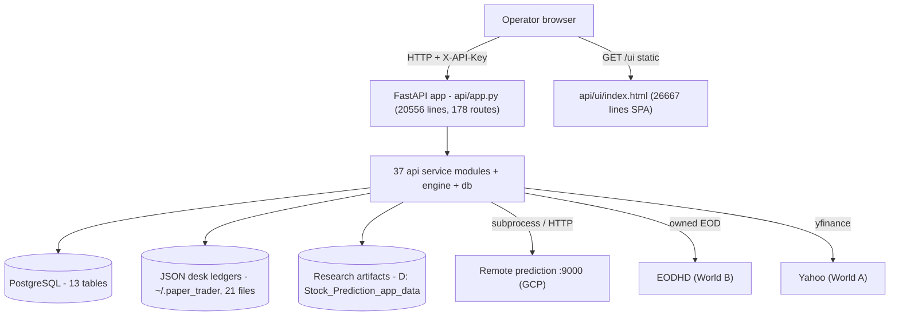
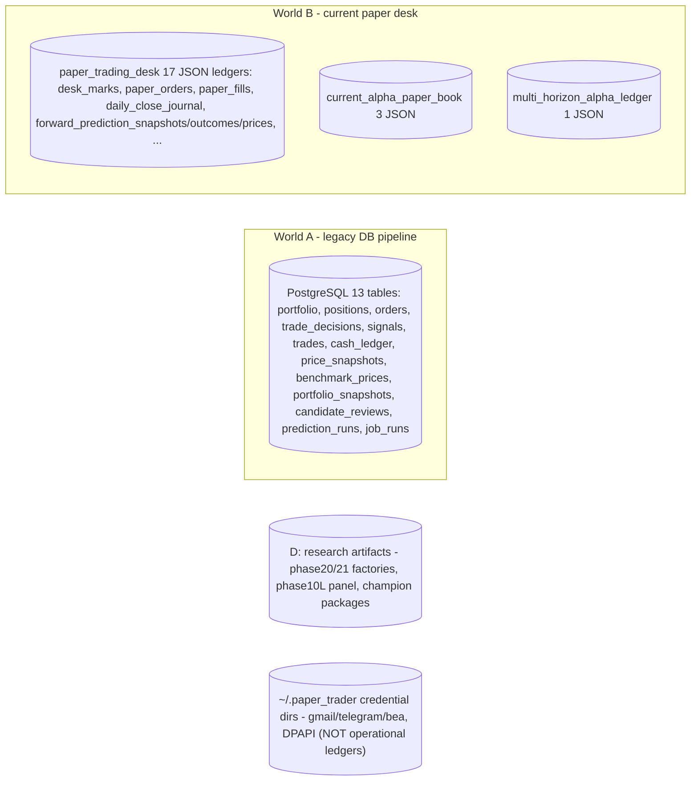
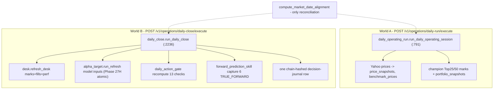
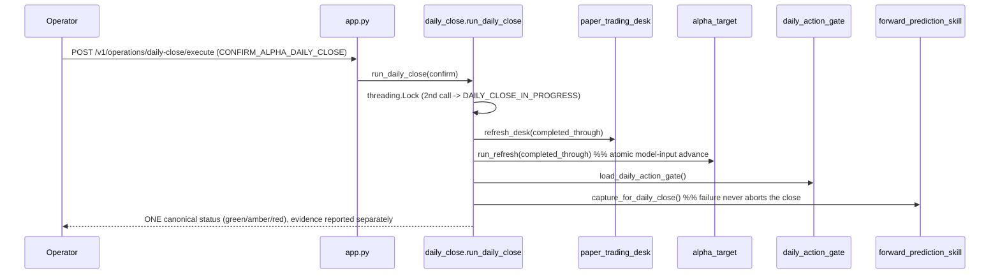
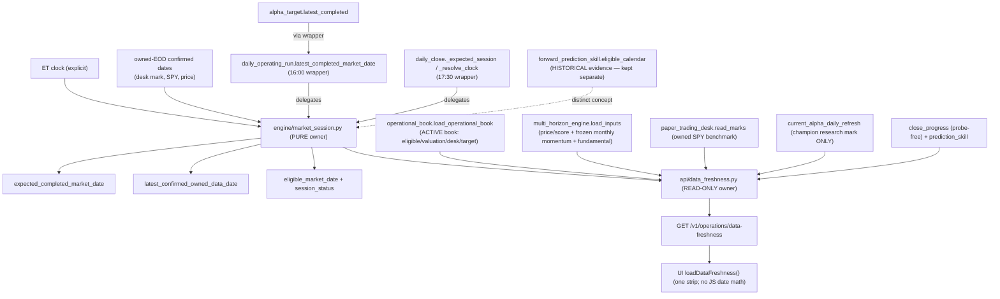
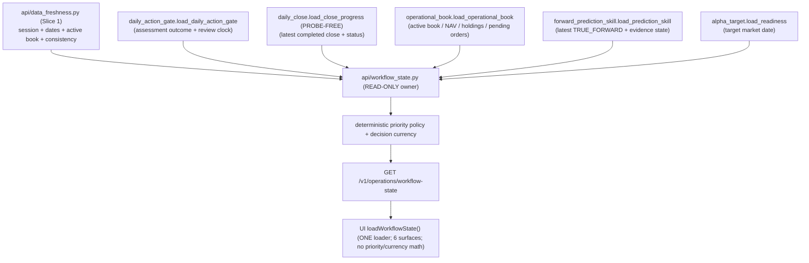

# Paper Trader — Current Architecture (as-built)

> Evidence-based snapshot of the system as it exists at commit `06ed05d`
> (branch `main`). Every non-trivial claim cites `file:line`. This document
> describes **what is**, not what should be — see
> [TARGET_ARCHITECTURE.md](TARGET_ARCHITECTURE.md) for the intended boundaries
> and [CONSOLIDATION_ROADMAP.md](CONSOLIDATION_ROADMAP.md) for the path between
> them. Governing intent: [PROJECT_CHARTER.md](PROJECT_CHARTER.md).
>
> Static analysis does not prove runtime behavior. Findings here were derived by
> reading source and cross-checked with the tests; treat any "dead"/"orphan"
> label as a lead to confirm, never as authorization to delete.

## 1. System context

Paper Trader is a single-operator, **paper-only** research-and-portfolio
workstation. One human runs a local FastAPI backend and drives a single-page
browser cockpit. No live orders, no broker, no automation are enabled anywhere
(charter Safety Boundaries).

| Actor / system | Role | Location |
|---|---|---|
| Operator (browser) | Runs the daily workflow, approves proposals, reads evidence | `http://127.0.0.1:8001/ui/` |
| FastAPI backend | All business logic + 178 routes | `api/app.py` on `:8001` |
| PostgreSQL | Legacy engine state (positions, orders, price snapshots) | `localhost:5432/paper_trader` |
| JSON desk ledgers | Current paper book, marks, fills, forward evidence | `C:\Users\binis\.paper_trader` (21 files) |
| Research artifacts | Frozen panels, factories, champion packages | `D:\Stock_Prediction_app_data` |
| Prediction service | Remote model inference (never local) | `http://127.0.0.1:9000` (GCP tunnel) |
| Market data (owned) | EODHD end-of-day (World B), Yahoo/`yfinance` (World A) | vendor / local files |

## 2. Runtime topology

Key runtime facts:

- **No `startup`/`lifespan` handler exists** (repo-wide search is empty). The app
  object is built at import (`api/app.py:235`); the UI is served by Starlette
  `StaticFiles` (`api/app.py:20551`) with `/` redirecting to `/ui/`
  (`api/app.py:20554`). Editing `api/ui/index.html` requires a **backend restart
  and a `?cb=` cache-buster** to be visible (ETag/Last-Modified caching, no
  `--reload`), which is a real operator prerequisite even though no code caches
  the HTML.
- **Authentication** is one API-key dependency, `_verify_api_key`
  (`api/app.py:242`, `APIKeyHeader("X-API-Key")` at `:230`), attached per-route
  via `dependencies=[Depends(_verify_api_key)]`. Liveness `GET /v1/health`
  (`:4014`) and readiness `GET /v1/ready` (`:4033`, DB `SELECT 1`) plus the
  static `/ui` mount are the operator-facing probes; `/v1/ready` gates on
  **Postgres only** and does not imply owned-EOD or model inputs are ready.

## 3. Module map

171 first-party Python source files. Distribution: `api/` 38, `alpha_agent/` 86,
`engine/` 13, `db/` 11, `scripts/` 20, `workflows/` 2.

**Two monoliths dominate:**

| File | Lines | What it is |
|---|---|---|
| `api/app.py` | 20,556 | The entire HTTP surface — **all 178 routes**, request models, and much orchestration/business logic inline. No `APIRouter` modules exist. |
| `api/ui/index.html` | 26,667 | The entire SPA — 6 views, ~150 loaders, all styling and JS inline. |

**Other modules above the 1,500-line review threshold** (audit
`large_modules`): `alpha_agent/runtime.py` 5,798; `api/daily_close.py` 2,758;
`alpha_agent/tournament.py` 2,590; `alpha_agent/research_director.py` 2,589;
`alpha_agent/telegram_control.py` 2,201; `api/forward_prediction_skill.py`
2,111; `engine/absolute_return_research.py` 2,071; `alpha_agent/analyst_revisions.py`
1,796; `alpha_agent/historical_backfill.py` 1,639; `alpha_agent/research_registry.py`
1,557.

The `api/` service modules cluster into families that mirror the phase history:
`current_alpha_*` (12 modules — champion book/preview/tournament/decision-gate/
performance/revalidation/integrity), `multi_horizon_*` (7 — the scoring engine
and its registry/history/ledger/artifacts), `alpha_*` (registry, factory, book,
target), `daily_*` (operating-run, close, action-gate, workflow-dashboard),
`portfolio_*` (valuation, manager, terminal), `paper_trading_desk`,
`operational_book`, `forward_*` (evidence, prediction-skill). The `alpha_agent/`
package (86 modules) is the autonomous research OS (ingestion → director →
tournament → runtime); it is **shadow-only** and never changes operational
holdings. `engine/` holds the **legacy** DB-backed pipeline
(`scoring`, `strategy`, `portfolio`, `reconciler`, `market_data`,
`market_screener`, `risk`, `universe`).

See the machine-readable classification in
[architecture/system_inventory.json](architecture/system_inventory.json).

## 4. API map

- **178 route decorators, 100% declared in `api/app.py`.** There are **zero
  duplicate `(method, path)` declarations** (audit). Routes group by prefix:
  `/v1/research/*` (champion, factories, tournament, stage11/12, analyst
  revisions), `/v1/operations/*` (daily-action-gate, daily-close, daily-run),
  `/v1/evidence/*` (forward, attribution, prediction-skill, recovery),
  `/v1/paper-desk/*`, `/v1/alpha-book/*`, `/v1/alpha-target/*`,
  `/v1/portfolio-manager/*`, `/v1/operational-book`, `/v1/dashboard/*`.
- The UI references **131** distinct `/v1` endpoints; **43 declared `/v1` routes
  have no UI reference** (orphan-endpoint candidates — mostly legacy Daily-Plan
  preview and research routes), and **1 UI reference is dangling**
  (`/v1/ticker-detail/…`, a parameterized detail route). These are audit
  candidates, not confirmed-dead.
- A confirmed **dead wire**: `current_alpha_tournament.run_current_alpha_tournament_refresh`
  (`api/current_alpha_tournament.py:341`) is imported (`api/app.py:172`) but
  reachable by no route — superseded by the Phase-19 sync.

## 5. UI map

`api/ui/index.html` is a single-source-of-truth cockpit (Phases 27B/27C/28C):

- **6 sidebar views** (`.sidebar-link[data-route]`, hash-routed via
  `applyRoute`): Command Center → `tab-overview`; Portfolio → `tab-portfolio`;
  Daily Workflow → `tab-prediction-cockpit`; Portfolio Manager →
  `tab-portfolio-manager`; Model Target/Alpha Portfolio → `tab-multi-horizon`;
  Research & Audit → `tab-audit-advanced` (with a 9-item sub-nav). A legacy
  4-tab bar remains but is hidden.
- **3 HTTP helpers** (`call()`, `fetchWithTimeout()`, `_mhzGet()`); **152
  `call()` sites**; ~150 `load*/render*` functions.
- **One coalesced single-flight loader**, `loadOperationalBook()` (guard
  `window._obInFlight`), reused at **exactly 10 call sites**; it fans one
  `/v1/operational-book` payload out to every operator surface and chains
  `loadDailyActionGate()` + `loadDailyClose()`. This is the correct
  single-source pattern.
- **Forbidden constructs are absent**: **0** `alert(` / `confirm(` (toasts are
  used), no `setInterval`/polling, no automation/auto-promote, no live-broker
  order execution. Safety badges (`PREVIEW ONLY`, `NO LIVE BROKER ORDERS`,
  `AUTOMATION OFF`, `MANUAL REVIEW`, `CREATES … ONLY`) render across the header,
  Command Center, Daily Workflow, Portfolio Manager and previews.
- **Risk (documented, not changed here):** a legacy **"Create Paper Orders"**
  surface is still live-wired in the pre-27 Daily-Plan flow — it POSTs
  `/v1/review/create-orders` to create **PENDING paper tickets** (no broker, no
  fills), with companion paper fill/cancel steps. It is paper-only by design but
  is a "Create Orders" surface, so it is flagged for the roadmap against the
  CLAUDE.md "do not implement Create Orders" rule.

## 6. Data-store map

- The operational-ledger fingerprint covers the **21 JSON files** under
  `paper_trading_desk\` (17), `current_alpha_paper_book\` (3) and
  `multi_horizon_alpha_ledger\` (1). Credential directories
  (`alpha_agent_email`, `alpha_agent_telegram`, `alpha_agent_bea`) are **not**
  operational ledgers.
- **DB access is clean and single-source:** every consumer goes through
  `db/session.py` (`get_session`/`get_dedicated_session`); there are **zero**
  ad-hoc `Session(...)`/`sessionmaker(...)`/`create_engine(...)` constructions
  outside `db/session.py` (audit `direct_db_sessions = 0`).
- **Ledger access is the opposite — there is no store service:** ~13 modules each
  own a private store (its own DIR env var + default path) and carry **their own
  copy of the atomic-write helper** (`tempfile.mkstemp` + `os.replace`), ~11
  copies across 7 modules (e.g. `paper_trading_desk.py:237`,
  `current_alpha_book.py:271`, `alpha_target.py:667`, `alpha_factory.py:1042`).

## 7. Data lineage

| Concept | Producer(s) | Store | Consumers | PIT / mutability |
|---|---|---|---|---|
| Owned EOD prices (World B) | EODHD transport; `daily_close`/`alpha_target` | `desk_marks.json`, model-input CSVs | desk NAV, gate, close | append/refresh; PIT via completed-through date |
| Yahoo EOD (World A) | `engine/market_data.fetch_latest_prices` | `price_snapshots`, `benchmark_prices` | `portfolio_valuation`, screener | upsert, skip-if-exists per (ticker,date) |
| Universe scores (`composite_sn`) | `multi_horizon_engine.compute_scores/build_current` | in-memory from input CSVs | gate, close, operational book | recomputed per refresh; frozen monthly momentum |
| Confirmed target snapshot | `alpha_target.confirmation_gate` | `forward_prediction_snapshots`/desk snapshot ledger | desk fills, operational book | append-only, first-write-wins |
| Desk marks / fills / perf | `paper_trading_desk.refresh_desk` | desk JSON ledgers | book NAV, close | append-only chain-hashed |
| TRUE_FORWARD evidence | `forward_prediction_skill.capture_for_daily_close` | `forward_prediction_{snapshots,outcomes,prices}.json` | `forward_evidence`, evidence GETs | immutable, no backfill |
| Champion Top25/50 marks | `current_alpha_daily_refresh` (subprocess) | local book JSON + `D:` mark artifact | command-center, model-target view | new-mark-only |
| Challenger factories | `alpha_factory` / `price_alpha_factory` | `D:\…\phase20/21_*` registries | research/audit view | full overwrite per commit |

## 8. Current workflows

Fourteen operator workflows were traced end-to-end. The two that define the
system's shape:

The other twelve (application readiness; market-data refresh; Daily Alpha Run;
Daily Research Cycle; portfolio valuation; forward-evidence capture; evidence
recovery; champion evaluation; challenger research; portfolio review; target
generation; paper-order workflow; Stage 13A) are detailed with triggers,
prerequisites, writes, idempotency keys and failure behavior in
[CONSOLIDATION_ROADMAP.md](CONSOLIDATION_ROADMAP.md) and the inventory.

## 9. Research vs Operations vs Execution boundaries

```mermaid
flowchart LR
  subgraph Research["RESEARCH (shadow-only, never mutates holdings)"]
    R1["alpha_agent/* research OS"]
    R2["alpha_factory / price_alpha_factory"]
    R3["current_alpha_* tournament / revalidation"]
    R4["Stage 13A analyst revisions (Data Expansion)"]
  end
  subgraph Ops["OPERATIONS (paper, token-gated writes)"]
    O1["daily_close / daily_operating_run"]
    O2["paper_trading_desk / operational_book / alpha_book"]
    O3["portfolio_valuation / portfolio_manager"]
  end
  subgraph Exec["EXECUTION (deferred - Milestone 7)"]
    E1["NOT IMPLEMENTED - no broker, no live orders"]
  end
  Research -. "evidence only" .-> Ops
  Ops -. "manual approval" .-> Exec
```

The boundary is largely respected: **no research-only module contains an
order-execution call** (audit `research_execution_terms = 0`), and challenger
research never auto-promotes (`decide_tournament` yields eligibility only). The
**leak to document** is the legacy paper-order "Create Orders" surface (§5) and
the two-worlds operations split (§8).

## 10. Current sources of truth

| Canonical concept | Intended owner | Reality | Verdict |
|---|---|---|---|
| Portfolio NAV / valuation | `portfolio_valuation.load_portfolio_valuation` (`:367`) | **Two authorities**: DB valuation vs ledger `paper_trading_desk.book_nav` (`:518`); UI renders NAV from 3 payloads (daily-close, operational-book, command-center) with no reconciliation; `engine/portfolio.py:262` still writes `cached_total_value`; `portfolio_terminal._collect_positions` re-marks independently | **CONFLICT** |
| Eligible market date | `engine/market_session` (**Slice 1, LANDED**) | Canonical pure owner; `daily_operating_run:171`, `daily_close._expected_session/_resolve_clock` and `alpha_target` now **delegate** (byte-identical parity). Remaining resolvers documented: `paper_trading_desk._required_mark_date`, `current_alpha_tournament_sync`, `market_screener`, the `func.max(PriceSnapshot.market_date)` sites | **RESOLVING (Slice 1)** |
| Cross-source data freshness | `api/data_freshness` (**Slice 1, LANDED**) | One read-only owner classifies every input under its declared cadence and composes the market session; served at `GET /v1/operations/data-freshness`, rendered by the single UI `loadDataFreshness()` | **OK** |
| Universe scoring (`composite_sn`) | `multi_horizon_engine` | Single-sourced for `composite_sn`; but the z-score/rank primitive is reimplemented **≥8×**, and `engine/scoring.py` is a second legacy scoring lineage | **PARTIAL** |
| Target portfolio | `alpha_target` → desk snapshot | Two "book" concepts: operational confirmed snapshot vs frozen champion book (`current_alpha_book`); top-N-sector-cap algorithm duplicated (`multi_horizon_engine:476` vs `multi_horizon_history:117`) | **PARTIAL** |
| Workflow / gate state | `api/workflow_state` (**Slice 2, LANDED**) | Canonical combined-interpretation owner composes the domain facts; the specialized owners (`daily_action_gate.evaluate_daily_action_gate`, `daily_close`, `operational_book.derive_lifecycle_view`) keep their domain facts; the 4 legacy stage vocabularies (`app.py:_build_workflow_state` + `_canonical_daily_stage`, `command_center._derive_stage`, `daily_workflow_dashboard`) remain until Slice-11 quarantine | **RESOLVING (Slice 2)** |
| Forward evidence | `forward_prediction_skill` + `forward_evidence` | Coherent; ACTIVE vs SHADOW never mixed; gaps documented, never fabricated | **OK** |
| DB session | `db/session.py` | Single-source, clean | **OK** |
| Model mark | `paper_trading_desk` desk marks | Coherent within World B; diverges from World A `price_snapshots` | **PARTIAL** |

## 11. Known architectural risks

1. **Two parallel "daily operating" worlds** (World A Yahoo→Postgres vs World B
   owned-EODHD→JSON) with different providers, stores and market-date semantics;
   only `compute_market_date_alignment` reconciles them. This is the root of the
   NAV and date conflicts.
2. **No canonical market-session/date service** — ≥8 date resolvers + 6 `_today()`
   seams can disagree about "today".
3. **NAV has two authorities** and is rendered from three UI payloads without a
   reconciliation point.
4. **Five independent mark/refresh writers**, several with standalone endpoints
   (`desk.refresh_desk`, `alpha_target.run_refresh`) that bypass the atomic
   Daily Close and re-introduce the pre-27H desync.
5. **No ledger/store service** — 13 private stores and ~11 hand-copied atomic
   writers; contrast the clean DB layer.
6. **Very tight private coupling** — 172+ cross-module `alias._private` accesses,
   worst `api/alpha_book.py` → `paper_trading_desk` privates ×80; any refactor of
   desk internals silently breaks callers.
7. **Two monoliths** (`app.py` 20.5k, `index.html` 26.7k) concentrate change risk
   and hide ownership.
8. **Hidden prerequisites** — Daily Close silently needs an ACTIVE book (a full
   prior chain); `ALREADY_PROCESSED` closes never capture TRUE_FORWARD;
   operational close can be green while forward evidence stays amber at a month
   boundary; champion refresh shells into a separate research repo; factories
   need frozen `D:` artifacts; `/v1/ready` only checks Postgres.
9. **Legacy Daily-Plan preview pipeline** (candidate→signal→decision→order, DB
   tables `signals`/`trade_decisions`/`orders`, large regions of `app.py`) is the
   "monthly rotation tool" the charter says the system is **not**, and includes a
   live paper "Create Orders" surface.
10. **Tests coupled to implementation** — 648 `.count(`/`.index(` assertions
    across 49 test files (`test_api.py` alone 436), many pinning UI substrings, so
    consolidation must migrate contracts, not just code.

## 12. Slice 1 — Canonical market session & data freshness (implemented, Phase 29B)

The first consolidation slice landed the date/freshness foundation for Milestone 1.
No runtime was deleted; migrated resolvers became thin delegating wrappers.

- **Canonical owner** `engine/market_session.py`: pure (no IO), distinguishes
  expected vs owned-confirmed vs eligible date; frozen status vocabulary
  (`BEFORE_SESSION_CLOSE`, `EXPECTED_SESSION_COMPLETE`, `WAITING_FOR_OWNED_DATA`,
  `SESSION_READY`, `NO_CONFIRMED_DATA`, `CALENDAR_POLICY_DEGRADED`,
  `INCONSISTENT_FUTURE_DATA`). Owned-provider-confirmed sessions are the
  holiday-safe authority; no exchange-calendar dependency is installed or used.
- **Compatibility wrappers** (unchanged signatures, byte-identical output):
  `daily_operating_run.latest_completed_market_date` (16:00), `daily_close`
  `_expected_session`/`_resolve_clock`/`_walk_back_weekend` (17:30),
  `alpha_target.latest_completed` (via the run wrapper).
- **Freshness owner** `api/data_freshness.py`: read-only, cadence-aware
  (`DAILY`/`MONTHLY`/`QUARTERLY`/`EVENT_DRIVEN`/`STATIC`), frozen vocabulary
  (`FRESH`/`STALE`/`MISSING`/`FUTURE_DATED`/`INCONSISTENT`/`NOT_DUE`/
  `NOT_APPLICABLE`/`UNKNOWN`). Composes existing loaders (probe-free); no provider
  call, no prediction, no write. A month boundary blocks signal refresh /
  TRUE_FORWARD when a monthly input is due, but never invalidates a completed
  operational close (D-7).
- **Consumers:** `GET /v1/operations/data-freshness` (authenticated, GET-only,
  read-only) and one UI `loadDataFreshness()` loader on the Command Center; the
  Daily Operating Run status payload also carries an additive `market_session`
  summary from the same owner.
- **World A vs World B / legacy status:** legacy Yahoo→Postgres availability is
  reported as a *separate* source status and never overrides owned-EODHD/desk
  authority (owned confirmation wins). Provider confirmation remains explicit.
- **Deliberately kept separate:** `forward_prediction_skill.eligible_calendar`
  (historical evidence calendar) and `alpha_agent/source_exhaustion.py` (research
  forward session-roll).
- **Remaining (Slice 1/2/3 follow-ups):** `paper_trading_desk._required_mark_date`
  (desk owner untouched this slice), `current_alpha_tournament_sync`,
  `engine/market_screener`, and the `func.max(PriceSnapshot.market_date)` sites.

### 12.1 Corrective patch — active operational book alignment (Phase 29B.1)

The first Slice 1 build composed every date from
`current_operating_state.load_current_operating_state`, whose
`current_operating_mark` is fed by `portfolio_valuation.load_portfolio_valuation`
— the **dormant legacy/current-alpha research book** ($9,999.52, 2 positions,
`yahoo_finance`, marked `2026-07-20`). Its stale mark leaked in as the *owned-data
confirmation*, so the freshness surface showed `WAITING_FOR_OWNED_DATA` and an
`eligible_market_date` of `2026-07-20` while the ACTIVE operational book
(*Alpha Paper Book #1*, `alpha_paper_book_1`) was already valued, desk-marked and
Daily-Close-complete at `2026-08-04`.

The corrective patch re-owns every concept:

- **Operational dates** (eligible/owned-data confirmation, valuation, desk mark,
  benchmark, target) come ONLY from the **active operational book**
  (`operational_book.load_operational_book` — the authoritative book-selection
  policy) and its owned desk marks (`paper_trading_desk`). A dormant
  legacy/current-alpha research book can never supply operational readiness.
- **Distinct research dates** are resolved from their OWN owners and never
  collapsed into one "research date": the champion research-evaluation mark
  (`current_alpha_daily_refresh`), the latest daily price/score refresh and the
  frozen monthly momentum input (`multi_horizon_engine.load_inputs` —
  `market_as_of_date` and `month_label` respectively), the fundamental panel
  as-of date, and the latest TRUE_FORWARD snapshot.
- **No monthly-input proxy:** the frozen monthly momentum input is read directly
  from its persisted `month_label`; it is NEVER inferred from the target date,
  valuation date, champion mark or expected session, and degrades to
  `MISSING`/`UNKNOWN` when no persisted source exists.
- **Active-book identity** (`active_book_id`/`name`/`status`/authoritative owner /
  operational mark date) is reported; multiple candidates degrade to
  `INCONSISTENT` rather than silently selecting one.
- **Cross-surface consistency validator** (read-only, no provider call) compares
  the freshness contract against the authoritative read models and reports
  `consistency_status` ∈ {`CONSISTENT`,`INCONSISTENT`,`UNKNOWN`} with named
  `consistency_violations`.
- **Corrected live semantics** (same state, no hardcoded dates): `SESSION_READY`,
  `eligible_market_date` = active mark, operational close valid, `weakest_gate`
  names the exact stale **research** source (the due monthly momentum input) —
  never an owned-data lag. The UI Command Center strip renders operational and
  research dates in separate labelled groups from the SINGLE `loadDataFreshness()`
  loader and performs no market-date arithmetic.

## 13. Slice 2 — Canonical workflow / operator state (implemented, Phase 29C)

The second consolidation slice landed the ONE combined-operator-interpretation
owner on top of the Slice-1 freshness foundation. No runtime was deleted; the
specialized modules keep their domain facts and the legacy stage vocabularies
remain (they retire with the legacy Create-Orders surface in Slice 11).

- **Canonical owner** `api/workflow_state.py`: read-only composition; owns the
  frozen overall-state vocabulary (`WAITING_FOR_SESSION_CLOSE`,
  `WAITING_FOR_OWNED_DATA`, `RESEARCH_CYCLE_REQUIRED`,
  `PORTFOLIO_REASSESSMENT_REQUIRED`, `READY_FOR_DAILY_CLOSE`,
  `DAILY_CYCLE_COMPLETE`, `DAILY_CYCLE_COMPLETE_EVIDENCE_GAP`,
  `MANUAL_REVIEW_REQUIRED`, `INCONSISTENT_STATE`), the assessment-currency
  vocabulary (`CURRENT`/`STALE`/`DUE`/`OVERDUE`/`MISSING`/`INCONSISTENT`), the
  action-severity vocabulary (`INFO`/`SUCCESS`/`ATTENTION`/`BLOCKED`/`ERROR`), the
  deterministic priority policy and the decision-currency rule. It performs no
  provider/prediction call, no Daily Close, no research refresh, no reassessment,
  no model promotion and no write.
- **Decision-currency repair:** an older Daily Action Gate result is never
  re-presented as a stale "NO ACTION TODAY" today-conclusion; the historical
  no-change result is preserved (dated) in `completed_summary`, and a stale/overdue
  assessment is reported as "reassessment is due".
- **Separation of concerns (D-7):** a valid completed operational close with a
  documented forward-evidence gap is ATTENTION, never an operational failure;
  research staleness never invalidates the completed close.
- **Consumers:** `GET /v1/operations/workflow-state` (authenticated, GET-only,
  read-only) and ONE UI `loadWorkflowState()` loader that fans the ONE payload to
  the Command Center, Daily Workflow, Portfolio, Portfolio Manager, Research &
  Audit and the Action/Safety panel. The UI derives no workflow priority or
  assessment currency (audit `workflow_state_ownership`).
- **Deliberately kept:** the four legacy stage vocabularies
  (`app.py:_build_workflow_state` + `_canonical_daily_stage`,
  `command_center._derive_stage`, `daily_workflow_dashboard`) and every existing
  endpoint/panel. Slice 2 performs no workflow action; the Persistent Daily
  Research Cycle and portfolio reassessment (Slice 3) are described/routed but not
  executed.
