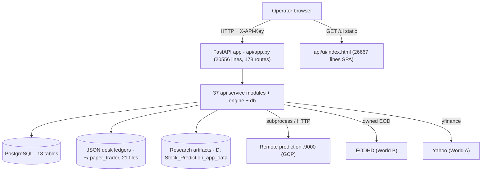
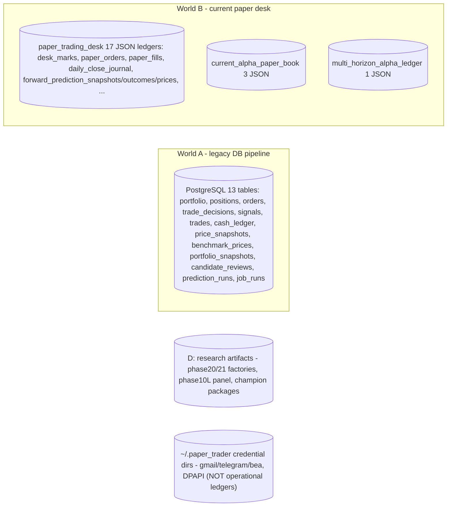
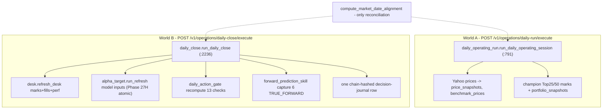
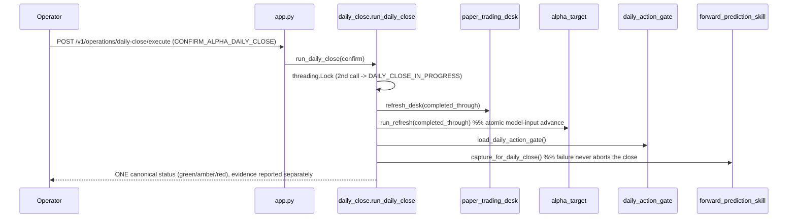
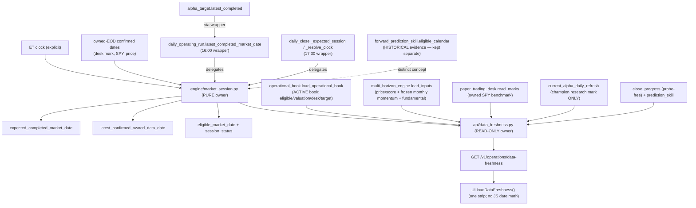
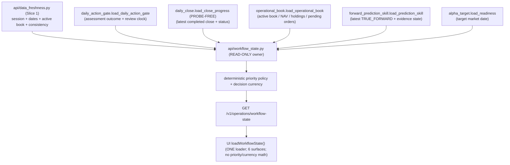
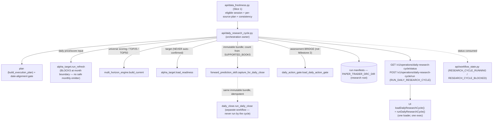
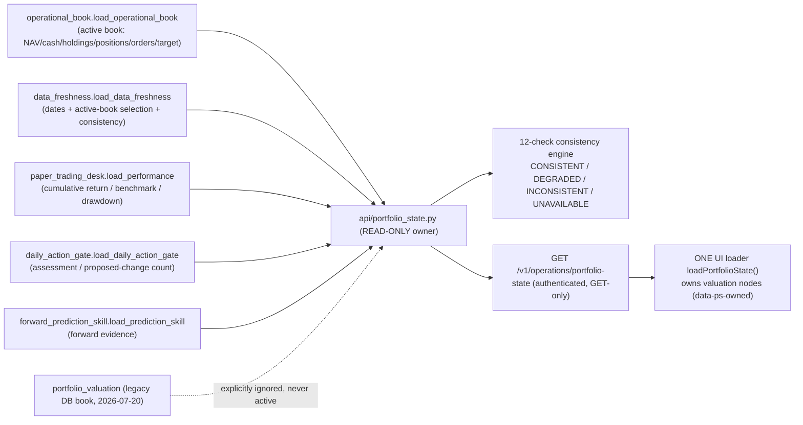

# Paper Trader — Current Architecture (as-built)

> Evidence-based snapshot of the system as it exists at commit `06ed05d`
> (branch `main`). Every non-trivial claim cites `file:line`. This document
> describes **what is**, not what should be — see
> [TARGET_ARCHITECTURE.md](TARGET_ARCHITECTURE.md) for the intended boundaries
> and [CONSOLIDATION_ROADMAP.md](CONSOLIDATION_ROADMAP.md) for the path between
> them. Governing intent: [PROJECT_CHARTER.md](PROJECT_CHARTER.md).
>
> Static analysis does not prove runtime behavior. Findings here were derived by
> reading source and cross-checked with the tests; treat any "dead"/"orphan"
> label as a lead to confirm, never as authorization to delete.

## 1. System context

Paper Trader is a single-operator, **paper-only** research-and-portfolio
workstation. One human runs a local FastAPI backend and drives a single-page
browser cockpit. No live orders, no broker, no automation are enabled anywhere
(charter Safety Boundaries).

| Actor / system | Role | Location |
|---|---|---|
| Operator (browser) | Runs the daily workflow, approves proposals, reads evidence | `http://127.0.0.1:8001/ui/` |
| FastAPI backend | All business logic + 178 routes | `api/app.py` on `:8001` |
| PostgreSQL | Legacy engine state (positions, orders, price snapshots) | `localhost:5432/paper_trader` |
| JSON desk ledgers | Current paper book, marks, fills, forward evidence | `C:\Users\binis\.paper_trader` (21 files) |
| Research artifacts | Frozen panels, factories, champion packages | `D:\Stock_Prediction_app_data` |
| Prediction service | Remote model inference (never local) | `http://127.0.0.1:9000` (GCP tunnel) |
| Market data (owned) | EODHD end-of-day (World B), Yahoo/`yfinance` (World A) | vendor / local files |

## 2. Runtime topology



Key runtime facts:

- **No `startup`/`lifespan` handler exists** (repo-wide search is empty). The app
  object is built at import (`api/app.py:235`); the UI is served by Starlette
  `StaticFiles` (`api/app.py:20551`) with `/` redirecting to `/ui/`. The one piece
  of import-time deployment wiring is `_wire_production_monthly_emitter()` (Phase
  29D.2): it activates the production monthly-momentum emitter resolver in the
  running backend and is GUARDED off under pytest (`"pytest" in sys.modules`) so the
  test suite stays hermetic — it runs no subprocess and imports no numpy/pandas.
  (`api/app.py:20554`). Editing `api/ui/index.html` requires a **backend restart
  and a `?cb=` cache-buster** to be visible (ETag/Last-Modified caching, no
  `--reload`), which is a real operator prerequisite even though no code caches
  the HTML.
- **Authentication** is one API-key dependency, `_verify_api_key`
  (`api/app.py:242`, `APIKeyHeader("X-API-Key")` at `:230`), attached per-route
  via `dependencies=[Depends(_verify_api_key)]`. Liveness `GET /v1/health`
  (`:4014`) and readiness `GET /v1/ready` (`:4033`, DB `SELECT 1`) plus the
  static `/ui` mount are the operator-facing probes; `/v1/ready` gates on
  **Postgres only** and does not imply owned-EOD or model inputs are ready.

## 3. Module map

171 first-party Python source files. Distribution: `api/` 38, `alpha_agent/` 86,
`engine/` 13, `db/` 11, `scripts/` 20, `workflows/` 2.

**Two monoliths dominate:**

| File | Lines | What it is |
|---|---|---|
| `api/app.py` | 20,556 | The entire HTTP surface — **all 178 routes**, request models, and much orchestration/business logic inline. No `APIRouter` modules exist. |
| `api/ui/index.html` | 26,667 | The entire SPA — 6 views, ~150 loaders, all styling and JS inline. |

**Other modules above the 1,500-line review threshold** (audit
`large_modules`): `alpha_agent/runtime.py` 5,798; `api/daily_close.py` 2,758;
`alpha_agent/tournament.py` 2,590; `alpha_agent/research_director.py` 2,589;
`alpha_agent/telegram_control.py` 2,201; `api/forward_prediction_skill.py`
2,111; `engine/absolute_return_research.py` 2,071; `alpha_agent/analyst_revisions.py`
1,796; `alpha_agent/historical_backfill.py` 1,639; `alpha_agent/research_registry.py`
1,557.

The `api/` service modules cluster into families that mirror the phase history:
`current_alpha_*` (12 modules — champion book/preview/tournament/decision-gate/
performance/revalidation/integrity), `multi_horizon_*` (7 — the scoring engine
and its registry/history/ledger/artifacts), `alpha_*` (registry, factory, book,
target), `daily_*` (operating-run, close, action-gate, workflow-dashboard),
`portfolio_*` (valuation, manager, terminal), `paper_trading_desk`,
`operational_book`, `forward_*` (evidence, prediction-skill). The `alpha_agent/`
package (86 modules) is the autonomous research OS (ingestion → director →
tournament → runtime); it is **shadow-only** and never changes operational
holdings. `engine/` holds the **legacy** DB-backed pipeline
(`scoring`, `strategy`, `portfolio`, `reconciler`, `market_data`,
`market_screener`, `risk`, `universe`).

See the machine-readable classification in
[architecture/system_inventory.json](architecture/system_inventory.json).

## 4. API map

- **178 route decorators, 100% declared in `api/app.py`.** There are **zero
  duplicate `(method, path)` declarations** (audit). Routes group by prefix:
  `/v1/research/*` (champion, factories, tournament, stage11/12, analyst
  revisions), `/v1/operations/*` (daily-action-gate, daily-close, daily-run),
  `/v1/evidence/*` (forward, attribution, prediction-skill, recovery),
  `/v1/paper-desk/*`, `/v1/alpha-book/*`, `/v1/alpha-target/*`,
  `/v1/portfolio-manager/*`, `/v1/operational-book`, `/v1/dashboard/*`.
- The UI references **131** distinct `/v1` endpoints; **43 declared `/v1` routes
  have no UI reference** (orphan-endpoint candidates — mostly legacy Daily-Plan
  preview and research routes), and **1 UI reference is dangling**
  (`/v1/ticker-detail/…`, a parameterized detail route). These are audit
  candidates, not confirmed-dead.
- A confirmed **dead wire**: `current_alpha_tournament.run_current_alpha_tournament_refresh`
  (`api/current_alpha_tournament.py:341`) is imported (`api/app.py:172`) but
  reachable by no route — superseded by the Phase-19 sync.

## 5. UI map

`api/ui/index.html` is a single-source-of-truth cockpit (Phases 27B/27C/28C):

- **4 operator-oriented primary areas (Phase 29J.1 OPERATOR UX CONSOLIDATION)**
  (`.sidebar-link[data-route]`, hash-routed via `applyRoute`): **Today** →
  `tab-overview` (default landing; route `command-center`); **Portfolio** →
  `tab-portfolio-manager` (route `portfolio-manager`; the decision surface —
  holdings + Holding Opportunity-Cost + Reallocation Proposal); **Research** →
  `tab-audit-advanced` @section `research-agent` (route `research`); **System ·
  Audit** → `tab-audit-advanced` @section `diagnostics` (route `system-audit`).
  Legacy/detail views (Daily Workflow → `tab-prediction-cockpit`, Model Target →
  `tab-multi-horizon`, Holdings detail → `tab-portfolio`) are DEMOTED under a
  collapsed "Advanced views" disclosure — reachable, not primary. Every old route
  still resolves as an alias (`today`, `command-center`, `portfolio`,
  `research-audit`, `daily-workflow`, `multi-horizon`, `portfolio-manager`,
  `alpha-portfolio`), so no deep link breaks. A legacy 4-tab bar remains hidden.
- **Market Context strip (restored, Phase 29J.1)** on Today, filled by the ONE
  `loadMarketDashboard()` loader from the SINGLE authoritative owner
  `GET /v1/market/indicators` (remote free providers: Yahoo Finance equities/FX/
  commodities, FRED rates). It is REFERENCE CONTEXT ONLY (never an alpha signal,
  never BUY/SELL), current-only with per-tile as-of labels, and renders explicit
  UNAVAILABLE tiles for series with no owned/available source (DXY has no owned
  source; US rates are UNAVAILABLE without a FRED key) — never a fabricated number.
  The UI performs no market math and calls no provider directly.
- **Visual Analytics (Phase 29J.2).** A hand-rolled, theme-aware inline-SVG / CSS-bar
  toolkit (`_va*`, no external chart library) adds compact charts to three surfaces,
  each bound VERBATIM to a read-only payload (the browser aggregates nothing):
  (a) **Today** — a Market Trend sparkline strip + a DESCRIPTIVE Market Regime block,
  filled by `loadMarketContext()` from the ONE new read-only owner
  `GET /v1/market/context` (reuses the same yfinance history helper +
  `_batch_fred_with_prior`; ~1-month trend for S&P 500 / Nasdaq / VIX / WTI / Gold /
  EUR/USD, plus factual equity/volatility/rates/commodities/FX tones — reference only,
  never a signal, forecast, or recommendation, with graceful per-series UNAVAILABLE);
  (b) **Portfolio** — a NAV-vs-SPY cumulative-return line, a cumulative/daily-P&L chart
  (`loadPortfolioAnalytics()` from `/v1/paper-desk/performance` +
  `/v1/evidence/attribution-history`), and the six summary cards rendered as sector /
  concentration / winners / losers / drift / cash-vs-invested visuals;
  (c) **Portfolio Manager** — reallocation review visuals (state/DEGRADED banner with
  data-gap chips, turnover/cost/score KPI tiles, action-mix bars, before→after sector
  paired bars) bound to the same `GET /v1/operations/reallocation-proposal` payload,
  with the full chip metrics retained under a collapsed disclosure. Read-only; paper
  only; no orders; no automation; no new order/broker/promotion path.
- **3 HTTP helpers** (`call()`, `fetchWithTimeout()`, `_mhzGet()`); **152
  `call()` sites**; ~150 `load*/render*` functions.
- **One coalesced single-flight loader**, `loadOperationalBook()` (guard
  `window._obInFlight`), reused at **exactly 10 call sites**; it fans one
  `/v1/operational-book` payload out to every operator surface and chains
  `loadDailyActionGate()` + `loadDailyClose()`. This is the correct
  single-source pattern.
- **Forbidden constructs are absent**: **0** `alert(` / `confirm(` (toasts are
  used), no `setInterval`/polling, no automation/auto-promote, no live-broker
  order execution. Safety badges (`PREVIEW ONLY`, `NO LIVE BROKER ORDERS`,
  `AUTOMATION OFF`, `MANUAL REVIEW`, `CREATES … ONLY`) render across the header,
  Command Center, Daily Workflow, Portfolio Manager and previews.
- **Risk (documented, not changed here):** a legacy **"Create Paper Orders"**
  surface is still live-wired in the pre-27 Daily-Plan flow — it POSTs
  `/v1/review/create-orders` to create **PENDING paper tickets** (no broker, no
  fills), with companion paper fill/cancel steps. It is paper-only by design but
  is a "Create Orders" surface, so it is flagged for the roadmap against the
  CLAUDE.md "do not implement Create Orders" rule.

## 6. Data-store map



- The operational-ledger fingerprint covers the **21 JSON files** under
  `paper_trading_desk\` (17), `current_alpha_paper_book\` (3) and
  `multi_horizon_alpha_ledger\` (1). Credential directories
  (`alpha_agent_email`, `alpha_agent_telegram`, `alpha_agent_bea`) are **not**
  operational ledgers.
- **DB access is clean and single-source:** every consumer goes through
  `db/session.py` (`get_session`/`get_dedicated_session`); there are **zero**
  ad-hoc `Session(...)`/`sessionmaker(...)`/`create_engine(...)` constructions
  outside `db/session.py` (audit `direct_db_sessions = 0`).
- **Ledger access is the opposite — there is no store service:** ~13 modules each
  own a private store (its own DIR env var + default path) and carry **their own
  copy of the atomic-write helper** (`tempfile.mkstemp` + `os.replace`), ~11
  copies across 7 modules (e.g. `paper_trading_desk.py:237`,
  `current_alpha_book.py:271`, `alpha_target.py:667`, `alpha_factory.py:1042`).

## 7. Data lineage

| Concept | Producer(s) | Store | Consumers | PIT / mutability |
|---|---|---|---|---|
| Owned EOD prices (World B) | EODHD transport; `daily_close`/`alpha_target` | `desk_marks.json`, model-input CSVs | desk NAV, gate, close | append/refresh; PIT via completed-through date |
| Yahoo EOD (World A) | `engine/market_data.fetch_latest_prices` | `price_snapshots`, `benchmark_prices` | `portfolio_valuation`, screener | upsert, skip-if-exists per (ticker,date) |
| Universe scores (`composite_sn`) | `multi_horizon_engine.compute_scores/build_current` | in-memory from input CSVs | gate, close, operational book | recomputed per refresh; frozen monthly momentum |
| Confirmed target snapshot | `alpha_target.confirmation_gate` | `forward_prediction_snapshots`/desk snapshot ledger | desk fills, operational book | append-only, first-write-wins |
| Desk marks / fills / perf | `paper_trading_desk.refresh_desk` | desk JSON ledgers | book NAV, close | append-only chain-hashed |
| TRUE_FORWARD evidence | `forward_prediction_skill.capture_for_daily_close` | `forward_prediction_{snapshots,outcomes,prices}.json` | `forward_evidence`, evidence GETs | immutable, no backfill |
| Champion Top25/50 marks | `current_alpha_daily_refresh` (subprocess) | local book JSON + `D:` mark artifact | command-center, model-target view | new-mark-only |
| Challenger factories | `alpha_factory` / `price_alpha_factory` | `D:\…\phase20/21_*` registries | research/audit view | full overwrite per commit |

## 8. Current workflows

Fourteen operator workflows were traced end-to-end. The two that define the
system's shape:





The other twelve (application readiness; market-data refresh; Daily Alpha Run;
Daily Research Cycle; portfolio valuation; forward-evidence capture; evidence
recovery; champion evaluation; challenger research; portfolio review; target
generation; paper-order workflow; Stage 13A) are detailed with triggers,
prerequisites, writes, idempotency keys and failure behavior in
[CONSOLIDATION_ROADMAP.md](CONSOLIDATION_ROADMAP.md) and the inventory.

## 9. Research vs Operations vs Execution boundaries

```mermaid
flowchart LR
  subgraph Research["RESEARCH (shadow-only, never mutates holdings)"]
    R1["alpha_agent/* research OS"]
    R2["alpha_factory / price_alpha_factory"]
    R3["current_alpha_* tournament / revalidation"]
    R4["Stage 13A analyst revisions (Data Expansion)"]
  end
  subgraph Ops["OPERATIONS (paper, token-gated writes)"]
    O1["daily_close / daily_operating_run"]
    O2["paper_trading_desk / operational_book / alpha_book"]
    O3["portfolio_valuation / portfolio_manager"]
  end
  subgraph Exec["EXECUTION (deferred - Milestone 7)"]
    E1["NOT IMPLEMENTED - no broker, no live orders"]
  end
  Research -. "evidence only" .-> Ops
  Ops -. "manual approval" .-> Exec
```



The boundary is largely respected: **no research-only module contains an
order-execution call** (audit `research_execution_terms = 0`), and challenger
research never auto-promotes (`decide_tournament` yields eligibility only). The
**leak to document** is the legacy paper-order "Create Orders" surface (§5) and
the two-worlds operations split (§8).

## 10. Current sources of truth

| Canonical concept | Intended owner | Reality | Verdict |
|---|---|---|---|
| Portfolio NAV / valuation | `api/portfolio_state` (**Slice 5, LANDED**) — READ owner over `paper_trading_desk.book_nav` (`:518`, LIVE authority) + `portfolio_valuation` (legacy DB archive) | Canonical read model of the complete operational portfolio state (active-book identity + selection, dates, capital/NAV/cost basis/P&L/cumulative return/benchmark/drawdown, positions, orders/fills, target/assessment/evidence refs, consistency verdict, stable state hash) at `GET /v1/operations/portfolio-state`; ONE UI `loadPortfolioState()` owns the valuation nodes (no JS NAV/total/active-book/valuation computation). Selects the active Alpha Paper Book #1, never the dormant legacy DB book (`legacy_paper_portfolio`, 2026-07-20); the PM status bar is cut over from the dormant book to the active book. The live NAV authority is `paper_trading_desk.book_nav`; `engine/portfolio.py:262` (`cached_total_value`) and `current_alpha_book`/`absolute_return_research` remain research/legacy writers scoped for Slices 8/11 | **RESOLVING (Slice 5)** |
| Eligible market date | `engine/market_session` (**Slice 1, LANDED**) | Canonical pure owner; `daily_operating_run:171`, `daily_close._expected_session/_resolve_clock` and `alpha_target` now **delegate** (byte-identical parity). Remaining resolvers documented: `paper_trading_desk._required_mark_date`, `current_alpha_tournament_sync`, `market_screener`, the `func.max(PriceSnapshot.market_date)` sites | **RESOLVING (Slice 1)** |
| Cross-source data freshness | `api/data_freshness` (**Slice 1, LANDED**) | One read-only owner classifies every input under its declared cadence and composes the market session; served at `GET /v1/operations/data-freshness`, rendered by the single UI `loadDataFreshness()` | **OK** |
| Universe scoring / rankings | `api/universe_scoring` (**Slice 4, LANDED**) over the `multi_horizon_engine` kernel | Canonical composition & read owner: calls the pure kernel once, deep-copies the cache, and normalises it into ONE frozen contract (identity + content-level `input_contract_hash` + reconciled counts + deterministic ranking + TOP25/TOP50 + exclusions + universe identity + consistency validator) at `GET /v1/research/universe-scoring`; `current-alpha-scores` is a compat wrapper; the DRC and identity re-exports (`alpha_target`, `forward_prediction_skill`) consume it. No operational module duplicates the kernel's combined-score math. `engine/scoring.py` remains the legacy DB screener lineage (retires with Slice 11) | **RESOLVING (Slice 4)** |
| Target portfolio | `alpha_target` → desk snapshot | Two "book" concepts: operational confirmed snapshot vs frozen champion book (`current_alpha_book`); top-N-sector-cap algorithm duplicated (`multi_horizon_engine:476` vs `multi_horizon_history:117`) | **PARTIAL** |
| Holding opportunity cost / recommendation | `engine/holding_opportunity_cost` (kernel) + `api/holding_opportunity_cost` (composition/read) (**Slice 6, LANDED**) | The SOLE per-holding comparison + decision engine (HOLD/REDUCE/EXIT/REPLACE/ADD) over an immutable PIT input contract; reuses `multi_horizon_engine` constants + `paper_trading_desk` cost model, sources owned trailing price/volume from `price_panel`, sources prior rank from the previous eligible artifact (UNAVAILABLE otherwise). Runs inside the Daily Research Cycle; persists immutable artifacts under `PAPER_TRADER_HOC_DIR`; read at `GET /v1/operations/holding-opportunity-cost` (one UI loader, no JS computation); the Daily Action Gate delegates to its summary. Review-only; no target/order/fill/NAV write | **OK** |
| Workflow / gate state | `api/workflow_state` (**Slice 2, LANDED**) | Canonical combined-interpretation owner composes the domain facts; the specialized owners (`daily_action_gate.evaluate_daily_action_gate`, `daily_close`, `operational_book.derive_lifecycle_view`) keep their domain facts; the 4 legacy stage vocabularies (`app.py:_build_workflow_state` + `_canonical_daily_stage`, `command_center._derive_stage`, `daily_workflow_dashboard`) remain until Slice-11 quarantine | **RESOLVING (Slice 2)** |
| Forward evidence | `forward_prediction_skill` + `forward_evidence` | Coherent; ACTIVE vs SHADOW never mixed; gaps documented, never fabricated | **OK** |
| DB session | `db/session.py` | Single-source, clean | **OK** |
| Model mark | `paper_trading_desk` desk marks | Coherent within World B; diverges from World A `price_snapshots` | **PARTIAL** |

## 11. Known architectural risks

1. **Two parallel "daily operating" worlds** (World A Yahoo→Postgres vs World B
   owned-EODHD→JSON) with different providers, stores and market-date semantics;
   only `compute_market_date_alignment` reconciles them. This is the root of the
   NAV and date conflicts.
2. **No canonical market-session/date service** — ≥8 date resolvers + 6 `_today()`
   seams can disagree about "today".
3. **NAV has two authorities** and is rendered from three UI payloads without a
   reconciliation point.
4. **Five independent mark/refresh writers**, several with standalone endpoints
   (`desk.refresh_desk`, `alpha_target.run_refresh`) that bypass the atomic
   Daily Close and re-introduce the pre-27H desync.
5. **No ledger/store service** — 13 private stores and ~11 hand-copied atomic
   writers; contrast the clean DB layer.
6. **Very tight private coupling** — 172+ cross-module `alias._private` accesses,
   worst `api/alpha_book.py` → `paper_trading_desk` privates ×80; any refactor of
   desk internals silently breaks callers.
7. **Two monoliths** (`app.py` 20.5k, `index.html` 26.7k) concentrate change risk
   and hide ownership.
8. **Hidden prerequisites** — Daily Close silently needs an ACTIVE book (a full
   prior chain); `ALREADY_PROCESSED` closes never capture TRUE_FORWARD;
   operational close can be green while forward evidence stays amber at a month
   boundary; champion refresh shells into a separate research repo; factories
   need frozen `D:` artifacts; `/v1/ready` only checks Postgres.
9. **Legacy Daily-Plan preview pipeline** (candidate→signal→decision→order, DB
   tables `signals`/`trade_decisions`/`orders`, large regions of `app.py`) is the
   "monthly rotation tool" the charter says the system is **not**, and includes a
   live paper "Create Orders" surface.
10. **Tests coupled to implementation** — 648 `.count(`/`.index(` assertions
    across 49 test files (`test_api.py` alone 436), many pinning UI substrings, so
    consolidation must migrate contracts, not just code.

## 12. Slice 1 — Canonical market session & data freshness (implemented, Phase 29B)

The first consolidation slice landed the date/freshness foundation for Milestone 1.
No runtime was deleted; migrated resolvers became thin delegating wrappers.



- **Canonical owner** `engine/market_session.py`: pure (no IO), distinguishes
  expected vs owned-confirmed vs eligible date; frozen status vocabulary
  (`BEFORE_SESSION_CLOSE`, `EXPECTED_SESSION_COMPLETE`, `WAITING_FOR_OWNED_DATA`,
  `SESSION_READY`, `NO_CONFIRMED_DATA`, `CALENDAR_POLICY_DEGRADED`,
  `INCONSISTENT_FUTURE_DATA`). Owned-provider-confirmed sessions are the
  holiday-safe authority; no exchange-calendar dependency is installed or used.
- **Compatibility wrappers** (unchanged signatures, byte-identical output):
  `daily_operating_run.latest_completed_market_date` (16:00), `daily_close`
  `_expected_session`/`_resolve_clock`/`_walk_back_weekend` (17:30),
  `alpha_target.latest_completed` (via the run wrapper).
- **Freshness owner** `api/data_freshness.py`: read-only, cadence-aware
  (`DAILY`/`MONTHLY`/`QUARTERLY`/`EVENT_DRIVEN`/`STATIC`), frozen vocabulary
  (`FRESH`/`STALE`/`MISSING`/`FUTURE_DATED`/`INCONSISTENT`/`NOT_DUE`/
  `NOT_APPLICABLE`/`UNKNOWN`). Composes existing loaders (probe-free); no provider
  call, no prediction, no write. A month boundary blocks signal refresh /
  TRUE_FORWARD when a monthly input is due, but never invalidates a completed
  operational close (D-7).
- **Consumers:** `GET /v1/operations/data-freshness` (authenticated, GET-only,
  read-only) and one UI `loadDataFreshness()` loader on the Command Center; the
  Daily Operating Run status payload also carries an additive `market_session`
  summary from the same owner.
- **World A vs World B / legacy status:** legacy Yahoo→Postgres availability is
  reported as a *separate* source status and never overrides owned-EODHD/desk
  authority (owned confirmation wins). Provider confirmation remains explicit.
- **Deliberately kept separate:** `forward_prediction_skill.eligible_calendar`
  (historical evidence calendar) and `alpha_agent/source_exhaustion.py` (research
  forward session-roll).
- **Remaining (Slice 1/2/3 follow-ups):** `paper_trading_desk._required_mark_date`
  (desk owner untouched this slice), `current_alpha_tournament_sync`,
  `engine/market_screener`, and the `func.max(PriceSnapshot.market_date)` sites.

### 12.1 Corrective patch — active operational book alignment (Phase 29B.1)

The first Slice 1 build composed every date from
`current_operating_state.load_current_operating_state`, whose
`current_operating_mark` is fed by `portfolio_valuation.load_portfolio_valuation`
— the **dormant legacy/current-alpha research book** ($9,999.52, 2 positions,
`yahoo_finance`, marked `2026-07-20`). Its stale mark leaked in as the *owned-data
confirmation*, so the freshness surface showed `WAITING_FOR_OWNED_DATA` and an
`eligible_market_date` of `2026-07-20` while the ACTIVE operational book
(*Alpha Paper Book #1*, `alpha_paper_book_1`) was already valued, desk-marked and
Daily-Close-complete at `2026-08-04`.

The corrective patch re-owns every concept:

- **Operational dates** (eligible/owned-data confirmation, valuation, desk mark,
  benchmark, target) come ONLY from the **active operational book**
  (`operational_book.load_operational_book` — the authoritative book-selection
  policy) and its owned desk marks (`paper_trading_desk`). A dormant
  legacy/current-alpha research book can never supply operational readiness.
- **Distinct research dates** are resolved from their OWN owners and never
  collapsed into one "research date": the champion research-evaluation mark
  (`current_alpha_daily_refresh`), the latest daily price/score refresh and the
  frozen monthly momentum input (`multi_horizon_engine.load_inputs` —
  `market_as_of_date` and `month_label` respectively), the fundamental panel
  as-of date, and the latest TRUE_FORWARD snapshot.
- **No monthly-input proxy:** the frozen monthly momentum input is read directly
  from its persisted `month_label`; it is NEVER inferred from the target date,
  valuation date, champion mark or expected session, and degrades to
  `MISSING`/`UNKNOWN` when no persisted source exists.
- **Active-book identity** (`active_book_id`/`name`/`status`/authoritative owner /
  operational mark date) is reported; multiple candidates degrade to
  `INCONSISTENT` rather than silently selecting one.
- **Cross-surface consistency validator** (read-only, no provider call) compares
  the freshness contract against the authoritative read models and reports
  `consistency_status` ∈ {`CONSISTENT`,`INCONSISTENT`,`UNKNOWN`} with named
  `consistency_violations`.
- **Corrected live semantics** (same state, no hardcoded dates): `SESSION_READY`,
  `eligible_market_date` = active mark, operational close valid, `weakest_gate`
  names the exact stale **research** source (the due monthly momentum input) —
  never an owned-data lag. The UI Command Center strip renders operational and
  research dates in separate labelled groups from the SINGLE `loadDataFreshness()`
  loader and performs no market-date arithmetic.

## 13. Slice 2 — Canonical workflow / operator state (implemented, Phase 29C)

The second consolidation slice landed the ONE combined-operator-interpretation
owner on top of the Slice-1 freshness foundation. No runtime was deleted; the
specialized modules keep their domain facts and the legacy stage vocabularies
remain (they retire with the legacy Create-Orders surface in Slice 11).



- **Canonical owner** `api/workflow_state.py`: read-only composition; owns the
  frozen overall-state vocabulary (`WAITING_FOR_SESSION_CLOSE`,
  `WAITING_FOR_OWNED_DATA`, `RESEARCH_CYCLE_REQUIRED`,
  `PORTFOLIO_REASSESSMENT_REQUIRED`, `READY_FOR_DAILY_CLOSE`,
  `DAILY_CYCLE_COMPLETE`, `DAILY_CYCLE_COMPLETE_EVIDENCE_GAP`,
  `MANUAL_REVIEW_REQUIRED`, `INCONSISTENT_STATE`), the assessment-currency
  vocabulary (`CURRENT`/`STALE`/`DUE`/`OVERDUE`/`MISSING`/`INCONSISTENT`), the
  action-severity vocabulary (`INFO`/`SUCCESS`/`ATTENTION`/`BLOCKED`/`ERROR`), the
  deterministic priority policy and the decision-currency rule. It performs no
  provider/prediction call, no Daily Close, no research refresh, no reassessment,
  no model promotion and no write.
- **Decision-currency repair:** an older Daily Action Gate result is never
  re-presented as a stale "NO ACTION TODAY" today-conclusion; the historical
  no-change result is preserved (dated) in `completed_summary`, and a stale/overdue
  assessment is reported as "reassessment is due".
- **Separation of concerns (D-7):** a valid completed operational close with a
  documented forward-evidence gap is ATTENTION, never an operational failure;
  research staleness never invalidates the completed close.
- **Consumers:** `GET /v1/operations/workflow-state` (authenticated, GET-only,
  read-only) and ONE UI `loadWorkflowState()` loader that fans the ONE payload to
  the Command Center, Daily Workflow, Portfolio, Portfolio Manager, Research &
  Audit and the Action/Safety panel. The UI derives no workflow priority or
  assessment currency (audit `workflow_state_ownership`).
- **UI hard cutover (Phase 29C.1):** `api/workflow_state.py` adds two additive
  backend presentation blocks — `assessment_presentation` (a DATED historical
  result with its canonical currency; "today" wording only when current) and
  `evidence_presentation` (the still-open current session kept distinct from the
  completed close's documented, attention-level forward-evidence gap) — and
  `renderWorkflowState` becomes the EXCLUSIVE owner of every visible primary
  interpretation: the workflow banners, the right Action/Safety panel (task / next
  action / primary button / factual close chip / assessment-currency chip) and the
  reframed Daily-Action-Gate card TITLE / currency BADGE / HEADLINE / EXPLANATION.
  Ownership is enforced by a STATIC guard in the shared setters
  (`_dcSet`/`_dagSet`/`_obSet` refuse canonical nodes) plus a `data-wf-owned` stamp,
  so the final visible state is independent of async completion order (the canonical
  value wins by ownership, not timing — proven by an in-process DOM harness). The
  specialized loaders keep DETAIL only; the raw Daily Action Gate endpoint retains
  its `NO_ACTION_TODAY` outcome code (see [ARCHITECTURE_DECISIONS.md](ARCHITECTURE_DECISIONS.md) D-12.1).
- **Deliberately kept:** the four legacy stage vocabularies
  (`app.py:_build_workflow_state` + `_canonical_daily_stage`,
  `command_center._derive_stage`, `daily_workflow_dashboard`) and every existing
  endpoint/panel. Slice 2 performs no workflow action; the Persistent Daily
  Research Cycle and portfolio reassessment (Slice 3) are described/routed but not
  executed.

## 14. Slice 3 — Persistent Daily Research Cycle (implemented, Phase 29D)

The third consolidation slice landed the ONE orchestration path for the daily
research-and-reassessment pass (Milestone 1) with no hidden operator prerequisite.
It composes the existing authoritative owners through adapters; no runtime was
deleted and no owner's business logic was re-implemented.



- **Canonical owner** `api/daily_research_cycle.py`: frozen 16-state machine
  (`NOT_STARTED` / `WAITING_FOR_SESSION_CLOSE` / `WAITING_FOR_OWNED_DATA` /
  `PLANNING` / `REFRESHING_REQUIRED_INPUTS` / `VALIDATING_INPUT_ALIGNMENT` /
  `SCORING_UNIVERSE` / `PREPARING_TARGET` / `CAPTURING_FORWARD_EVIDENCE` /
  `RUNNING_PORTFOLIO_ASSESSMENT` / `COMPLETE` / `COMPLETE_WITH_EVIDENCE_GAP` /
  `BLOCKED` / `FAILED` / `INCONSISTENT` / `RUN_IN_PROGRESS`) and a full per-step
  audit contract. Read-only status plans deterministically; execution is token-gated
  (`RUN_DAILY_RESEARCH_CYCLE`) and every provider/write boundary is an injectable
  seam.
- **Idempotency / concurrency / resume:** key = `sha256(eligible date | active book
  | strategy version | universe | input-contract hash)`; completed runs are reused,
  safe incomplete runs resume, a conflicting concurrent contract is `INCONSISTENT`,
  a stale lock is classified/recovered, and a different contract for the same date
  never overwrites the immutable evidence bundle.
- **Month boundary made explicit:** the frozen monthly momentum input has a DECLARED
  canonical in-repo adapter owner (`api/monthly_momentum_input.py`, Phase 29D.1) that
  wraps an injectable emitter seam and owns the safe contract (due-ness / schema /
  period / provenance validation / idempotency / atomic persist / reuse-or-reject). It
  computes no `mom_6_1` and never approximates it intramonth. **Phase 29D.2** wires
  the production PRODUCER behind that seam — the pure-stdlib subprocess bridge
  `api/monthly_momentum_emitter.py`, activated by the `api/app.py` import-time wiring —
  so when momentum_monthly is due, ONE `RUN DAILY RESEARCH CYCLE` action resolves it
  with no separate command / button / restart / manual file operation. The bridge
  inspects the owned Phase-24 panel's coverage, runs the Phase-25 mathematics in an
  isolated temp dir through an explicit subprocess argument array, validates the
  outputs (schema / unique tickers / produced month == eligible month / produced date
  == eligible / no future data / provenance / source-panel fingerprint / no intramonth
  approximation) and hands them back for the adapter to promote atomically (old/new-hash
  promotion manifest; scoring cache cleared only after a validated promotion). Phase 24
  supports no safe incremental extension, so a behind / future / unverifiable panel is
  an explicit DATA_HOLD blocker rather than an uncontrolled full rebuild. A due month
  still blocks HONESTLY (`RUN_RESEARCH_MONTHLY_INPUT_EMITTER`, never `NO_REFRESH_OWNER`
  and never a separate operator button) when the production environment or owned panel
  is unavailable — the documented "August evidence gap" is removed on the normal path.
- **Consumers:** `GET /v1/operations/daily-research-cycle/status` (read-only) +
  `POST /v1/operations/daily-research-cycle/run`; one UI status loader
  (`loadDailyResearchCycle()`) + one execution function (`runDailyResearchCycle()`)
  render the canonical Daily-Research-Cycle card (the shell "Daily Alpha Refresh" is
  demoted to a champion-mark research detail). `api/workflow_state` composes the
  cycle status and adds the `RESEARCH_CYCLE_RUNNING` / `RESEARCH_CYCLE_BLOCKED`
  overall states + a `research_cycle_state` block; the research primary action is now
  executable.
- **Deliberately kept separate:** the operational Daily Close (a separate workflow
  that idempotently reuses the SAME immutable fps bundle — the cycle never runs it),
  the champion daily-refresh subprocess (research detail), and universe scoring /
  portfolio state (Slices 4/5). The assessment is a compatibility BRIDGE to the Daily
  Action Gate, explicitly not the Milestone-2 opportunity-cost engine.
- **Static guard:** `scripts/audit_architecture.py:check_daily_research_cycle_ownership`
  enforces the sole orchestration owner, full delegation, no forbidden execution
  calls, one UI loader + one execution function, no UI planning, and the endpoints;
  inventory drift = 0.
- **Live-acceptance completion (Phase 29D.1).** The first real post-close live
  acceptance (2026-08-05, after the 17:30 ET cutoff, owned data only through
  2026-08-04) exposed a false-holiday inference in `engine/market_session` (the desk
  marks and the SPY benchmark share one owned provider and lag together on a normal
  publish delay), which cascaded into a `RESEARCH_CYCLE_BLOCKED` workflow state and a
  `target_calculation — NO_REFRESH_OWNER` blocker. Corrected: a weekday is a
  `NON_SESSION` ONLY through an authoritative exchange calendar or a provider-confirmed
  contract; otherwise the expected weekday stays `WAITING_FOR_OWNED_DATA` with a
  `calendar_policy_degraded` flag (the prior valid close unchanged), and the session
  is confirmed only when BOTH owned market marks AND the benchmark reach the expected
  date. `WAITING_FOR_OWNED_DATA` strictly outranks any research blocker.
  `target_calculation` is a DECLARED prepared-downstream owner
  (`alpha_target.load_readiness`) — never `NO_REFRESH_OWNER`. The monthly momentum
  input is the declared adapter above. Static guard
  `check_slice3_live_acceptance_ownership`; the DRC badge is corrected to
  `CREATES RESEARCH EVIDENCE ONLY`. Slice 5 remains not started; cadence disabled.
- **Production monthly emitter bridge (Phase 29D.2).** The first real Daily Research
  Cycle and Daily Close (2026-08-05) succeeded, but only after a MANUAL external
  monthly-input workflow (running the owned Phase-24 panel + Phase-25 emitter outside
  Paper Trader and restarting the backend), because the released adapter's production
  emitter was unwired — the cycle returned `momentum_monthly — RUN_RESEARCH_MONTHLY_INPUT_EMITTER`.
  Successful live results: eligible session 2026-08-05, full universe scored 234, target
  `READY_TO_CONFIRM`, portfolio assessment `PROPOSAL_READY`, TRUE_FORWARD 6/6,
  `FORWARD_EVIDENCE_COMPLETE`, Daily Close `VALID — 2026-08-05`, 0 pending orders, 25
  holdings. Those artifacts are now the authoritative starting state. Phase 29D.2 wires
  ONE safe production monthly-momentum owner (`api/monthly_momentum_emitter.py`) into the
  canonical cycle so no hidden prerequisite command / button / restart / file operation
  remains: it resolves the external repo + Python, inspects the owned panel, runs the
  authoritative Phase-25 calculation in an isolated temp dir, validates the artifacts,
  atomically promotes through `api/monthly_momentum_input.py`, clears the scoring cache,
  and continues the SAME run through input alignment → scoring → target → TRUE_FORWARD
  evidence → assessment. Ownership boundaries unchanged (Phase 24 = source panel, Phase
  25 = mathematics, `monthly_momentum_input` = adapter/validation/promotion,
  `daily_research_cycle` = orchestration, `universe_scoring` = scoring interpretation);
  no second monthly formula exists in Paper Trader. Point-in-time safeguards: no
  future-dated rows, no current-constituent substitution into historical dates, no
  survivorship reconstruction, no duplicate ticker/date rows, provenance preserved.
  Static guard `check_monthly_emitter_bridge_ownership`; inventory drift = 0. Slice 5
  (portfolio state / one-NAV) remains next; the Persistent Alpha Research Agent remains
  a future milestone (Slice 8 / Milestone 4); cadence remains disabled.

### Canonical operational portfolio state (Slice 5, LANDED — Phase 29F)



- **Canonical owner** `api/portfolio_state.py`: read-only composition; the ONE
  authoritative complete operational portfolio-state of the active Alpha Paper Book
  (active-book identity + selection, dates, capital/NAV/cost basis/P&L/cumulative
  return/benchmark/drawdown, per-holding positions, order/fill summaries, target /
  assessment / evidence references, safety mode, a deterministic consistency verdict,
  a stable `state_hash` with `generated_at` excluded). It re-implements no business
  calculation; the LIVE NAV authority is `paper_trading_desk.book_nav` (ledger replay).
- **Active-book selection:** selects the active Alpha Paper Book #1 through the
  authoritative `operational_book` policy; the dormant legacy DB book
  (`legacy_paper_portfolio`, 2026-07-20) is NEVER selected and is reported only as an
  ignored archive. The Portfolio-Manager status bar is cut over from the dormant book
  ($9,999.52 / 2026-07-20 / 2 positions) to the active book ($100,327.99 / 2026-08-05 /
  25 holdings).
- **Consistency engine:** 12 read-only cross-source checks (Decimal-safe ±$0.01 NAV
  reconciliation) returning `CONSISTENT` / `DEGRADED` / `INCONSISTENT` / `UNAVAILABLE`
  with exact reason codes; never silently repairs; the endpoint stays available while
  degraded.
- **Consumers:** `GET /v1/operations/portfolio-state` (authenticated, GET-only,
  read-only) rendered by ONE UI `loadPortfolioState()` + `renderPortfolioState()` that
  own the operational valuation nodes across the Command Center card, the Portfolio
  header / performance KPIs / active holdings table, the right panel, the Daily-Plan
  summary and the PM active-book summary (STAMPED `data-ps-owned`; `_obSet` and
  `renderPmStatusbar` hard-refuse them). The UI computes no NAV/total/active-book
  selection/valuation date/pending count.
- **Preliminary proposal:** the reassessment proposal (the August 17 proposed changes)
  is review-only and unapproved, labelled `REALLOCATION PROPOSAL — MANUAL REVIEW
  REQUIRED (REVIEW ONLY, NO ORDERS)`; no confirmation / order-creation path exists
  (the Slice 6 Opportunity-Cost review and the Slice 7 Reallocation Proposal are
  implemented and review-only).
- **Static guard:** `scripts/audit_architecture.py:check_portfolio_state_ownership`
  enforces the sole owner, full delegation, no second owner, no writer, the
  dormant-legacy rejection, the GET-only route, ONE UI loader + renderer with no UI
  NAV/total/active-book/valuation computation; inventory drift = 0. Read-only: no
  provider / prediction call, no Daily Close, no research refresh, no reassessment, no
  write, no order/fill. Slice 6 (Holding Opportunity-Cost engine) remains next; cadence
  remains disabled.

### Canonical Holding Opportunity-Cost engine (Slice 6, LANDED — Phase 29G, Milestone 2)

- **Owners:** the pure deterministic calculation kernel
  `engine/holding_opportunity_cost.py` (`build_assessment`, no I/O) is the SOLE holding
  comparison + decision engine; `api/holding_opportunity_cost.py`
  (`load_holding_opportunity_cost` / `run_and_persist` / `persist_assessment`) is the
  SOLE composition / validation / immutable-artifact / read owner.
- **Input contract (PIT):** ONE immutable assessment-input contract sourced as of the
  portfolio-state eligible market date from `api.portfolio_state` (holdings / weights /
  NAV / cash / sectors / `state_hash`), `api.universe_scoring` (rank / score /
  eligibility / adv_dollar / `output_hash`), `api.price_panel` (owned trailing close +
  `dollar_vol` + `trailing_median_dollar_volume`), `engine.market_session`
  (`previous_trading_day`) and the previous eligible date's persisted artifact (prior
  rank). It reuses the `api.multi_horizon_engine` construction constants and
  `api.paper_trading_desk.COST_RATE_PER_SIDE` (never forked) via one versioned decision
  policy `hoc_decision_policy.v1`.
- **Per-holding measures:** current / previous rank + rank change (previous rank
  UNAVAILABLE when no prior artifact — no owner stored ranks before this slice), signal
  strength + deterioration, trailing returns (5/20/60), realized volatility (20/60),
  max drawdown (60), covariance risk contribution (`w_i (Σw)_i / portfolio variance`
  from date-aligned owned returns; explicit lookback / min-obs / variance floor;
  UNAVAILABLE when insufficient), concentration, liquidity (median dollar volume →
  days-to-liquidate; UNAVAILABLE when owned volume absent), the strongest eligible
  NON-ALLOCATED replacement candidate, switching cost (reused desk model), gross /
  risk-adjusted / net improvement (a SCORE comparison; `expected_return_delta` always
  null / UNAVAILABLE), and a recommendation from the frozen vocabulary HOLD / REDUCE /
  EXIT / REPLACE / ADD, plus non-held ADD candidates. Deterministic `assessment_hash`
  (`generated_at` excluded).
- **Execution path:** the sole normal path is the Daily Research Cycle — a new
  `ASSESS_HOLDING_OPPORTUNITY_COST` step runs after canonical scoring and before the
  portfolio-assessment step, persisting an immutable artifact under `PAPER_TRADER_HOC_DIR`
  (atomic, indexed, idempotent, conflict-rejected, interrupted-write recoverable — never
  the operational ledger / PostgreSQL / order / fill / holding / cash / NAV) and feeding
  its summary into the Daily Action Gate. NO separate manual execution endpoint exists.
- **Consumers:** `GET /v1/operations/holding-opportunity-cost` (authenticated, GET-only,
  read-only; readable in DEGRADED / BLOCKED / NOT_RUN) rendered by ONE UI
  `loadHoldingOpportunityCost()` (single-flight; no JS recommendation / rank / risk /
  cost / total computation) — summary + sortable holding table with ALL / HOLD / REDUCE
  / EXIT / REPLACE filters + a separate ADD-candidate section. The Daily Action Gate
  delegates to the opportunity-cost summary (`opportunity_cost_*`) and the review-only
  banner reads `REALLOCATION PROPOSAL — MANUAL REVIEW REQUIRED (REVIEW ONLY, NO ORDERS)`
  (Slice 7 Reallocation Proposal landed; the gate reports
  `reallocation_engine_implemented = True`).
- **Static guard:** `scripts/audit_architecture.py:check_holding_opportunity_cost_ownership`
  enforces the sole calculation + API owners, delegation, the GET-only route, no separate
  manual execution endpoint, no second recommendation engine, no order / fill /
  target-weight / NAV / universe-score in either owner, kernel purity, ONE UI loader with
  no computation, the gate delegation, and that no second/unified model registry exists;
  inventory drift = 0. Review-only, preview-first, paper-only: confirms no target, creates
  no order / fill, changes no holding / cash / NAV, promotes no model. Its assessment feeds
  the Reallocation Proposal engine (Slice 7, LANDED); the Persistent Alpha Research Agent
  (Slice 8 / Milestone 4) has LANDED (Phase 29I); cadence remains disabled.

### Canonical Reallocation Proposal engine (Slice 7, LANDED — Phase 29H, Milestone 3)
- **Two owners.** The pure deterministic calculation kernel
  `engine/reallocation_proposal.py` (`build_proposal`, no I/O) is the SOLE allocation-math
  owner; `api/reallocation_proposal.py` (`load_reallocation_proposal` / `run_and_persist` /
  `persist_proposal` / `load_proposal_summary`) is the SOLE composition / validation /
  immutable-artifact / read owner. From the current portfolio state (`api.portfolio_state`)
  and the Slice 6 Holding Opportunity-Cost assessment (`api.holding_opportunity_cost`) —
  plus the eligible universe ranking (`api.universe_scoring`) and owned returns
  (`api.price_panel`) — it builds ONE coherent paper-only proposed target portfolio.
- **Deterministic allocation.** HOLD/REDUCE retained, EXIT zeroed, each REPLACE swapped to
  a traceable eligible non-held candidate clearing the net-of-cost hurdle (unmatched
  REPLACEs retained, never a silent exit-to-cash), ADD candidates filling remaining slots by
  rank; equal-weight `min(1/N, name_cap)`, residual as cash, sector count-cap. Reuses (never
  forks) the `multi_horizon_engine` constants + `paper_trading_desk` cost model via one
  versioned policy (`reallocation_allocation_policy.v1`) and the Slice-6 covariance
  primitive. Emits per-ticker actions (RETAIN/INCREASE/REDUCE/EXIT/ADD/REPLACE_OUT/
  REPLACE_IN), turnover, transaction + switching cost, before/after portfolio SCORE
  (expected return NEVER fabricated — null/`NOT_CALIBRATED`), concentration and volatility
  before/after, and hard-constraint validation; states READY/DEGRADED/BLOCKED/NO_ACTIVE_BOOK
  (read layer adds NOT_RUN/UNAVAILABLE).
- **Orchestration.** The sole execution path is the Daily Research Cycle's
  `BUILD_REALLOCATION_PROPOSAL` step (after `ASSESS_HOLDING_OPPORTUNITY_COST`), persisting
  an immutable artifact under `PAPER_TRADER_REALLOC_DIR` (atomic, indexed, idempotent
  identical rerun; a different source HOC hash for the same date supersedes, never silently
  reuses). `GET /v1/operations/reallocation-proposal` is GET-only (NOT_RUN before a proposal
  exists); ONE UI loader `loadReallocationProposal()` renders a first-class Portfolio-Manager
  card plus concise Command Center / Daily Workflow status with no JS allocation math. The
  Daily Action Gate delegates to `load_proposal_summary`; `api.workflow_state` exposes the
  proposal state as an informational review action that never gates the (independent) Daily
  Close.
- **Static guard:** `scripts/audit_architecture.py:check_reallocation_proposal_ownership`
  enforces the sole calculation + API owners, delegation, the GET-only route, no create/
  apply/confirm-target/rebalance/order route, the DRC as the sole execution path, no order /
  fill / target / NAV / holdings mutation, kernel purity, ONE UI loader with no allocation
  computation, immutable/idempotent artifacts, and that no second/unified model registry
  exists; inventory drift = 0. Review-only, preview-first, paper-only, manual review
  mandatory. The Persistent Alpha Research Agent (Slice 8 / Milestone 4) has LANDED (below).

### Canonical Persistent Alpha Research Agent (Slice 8, LANDED — Phase 29I, Milestone 4)
- **Two owners.** The pure deterministic evaluation kernel `engine/research_agent.py`
  (`evaluate`, no I/O) is the SOLE research-state calculation owner; `api/research_agent.py`
  (`load_research_agent` / `run_and_persist` / `persist_assessment` / `load_research_agent_summary`)
  is the SOLE composition / persistence / read owner. It continuously answers *whether the
  current research/model stack remains trustworthy and whether bounded research experiments
  should be run*.
- **Reused evidence (never forked).** The API owner assembles one immutable point-in-time
  research-evidence contract by READING each metric from its existing owner: champion /
  challenger identity (`api.universe_scoring` / `api.current_alpha_tournament`), matured
  TRUE_FORWARD rank IC / decile spread / observation counts (`api.forward_prediction_skill`),
  realized benchmark-relative return / drawdown / turnover / cost (`api.paper_trading_desk` +
  `api.forward_evidence`), the minimum-forward-observation threshold
  (`api.current_alpha_decision_gate.MIN_FORWARD_OBS`, injected so no threshold is forked), the
  Slice-6 HOC and Slice-7 reallocation immutable artifact histories (enumerated from each
  `index.json` — a pure evidence read), and the active book / eligible session / sector
  (`api.portfolio_state`). It does NOT create a second/unified model registry and never moves
  champion-promotion authority.
- **Evaluation.** Evidence sufficiency (a short negative live P&L run yields
  INSUFFICIENT_EVIDENCE / WATCH, never a premature RECALIBRATION_DUE), explained
  champion-health components with reason codes (never one opaque score), model-degradation
  categories (PERFORMANCE_WEAKNESS / SIGNAL_DEGRADATION / RANKING_DEGRADATION / REGIME_DRIFT /
  SECTOR_INSTABILITY / TURNOVER_INEFFICIENCY / PORTFOLIO_STALENESS / DATA_QUALITY_DEGRADATION /
  INSUFFICIENT_EVIDENCE), HOC + reallocation diagnostic feedback (distinguishing portfolio
  staleness / governance latency from model weakness), challenger classification (NOT_EVALUATED
  / INSUFFICIENT_EVIDENCE / UNDERPERFORMING / COMPETITIVE / PROMISING / SUPERIOR_CANDIDATE —
  never PROMOTED), a controlled recalibration recommendation gated on evidence, and a
  deterministic ranked queue of bounded research opportunities with fully-specified SHADOW-only
  experiments. Thresholds are one versioned policy (`research_agent_policy.v1`). Research state:
  HEALTHY / WATCH / INVESTIGATE / RECALIBRATION_DUE / CHALLENGER_PROMISING /
  INSUFFICIENT_EVIDENCE / BLOCKED (read layer adds NOT_RUN / NO_ACTIVE_BOOK / UNAVAILABLE).
- **Orchestration.** The sole execution path is the Daily Research Cycle's
  `RUN_RESEARCH_AGENT` step (after `BUILD_REALLOCATION_PROPOSAL`, before the
  portfolio-assessment step), persisting an immutable artifact under
  `PAPER_TRADER_RESEARCH_AGENT_DIR` (atomic, indexed, idempotent identical rerun; a different
  evidence hash for the same date supersedes, never silently reuses). `GET
  /v1/research/research-agent` is GET-only (NOT_RUN before an assessment exists); ONE UI loader
  `loadResearchAgent()` renders a first-class Research Agent panel in the Research & Audit
  workspace with no JS research math. The step is non-blocking — research recommendation !=
  operational action; the Daily Close stays independent.
- **Static guard:** `scripts/audit_architecture.py:check_research_agent_ownership` enforces the
  sole calculation + API owners, delegation, the GET-only route, no promote/recalibrate/
  retrain/apply route, the DRC as the sole execution path, no champion-pointer / order / fill /
  target / NAV / holdings mutation, kernel purity, ONE UI loader with no research computation,
  immutable/idempotent artifacts, no second/unified model registry, and that no paid-data
  registry fork exists (Slice 9 landed as a purchase gate, not a registry); inventory drift = 0.
  Research governance only, manual approval mandatory: promotes / recalibrates / retrains /
  replaces no model, writes no champion pointer, confirms no target, creates no order / fill,
  changes no holding / cash / NAV, executes no experiment, enables no cadence. Slice 10
  (Intraday / near-real-time, Milestone 6) is next; cadence remains disabled.

### Data Expansion / Purchase-Gate (Slice 9, Phase 29J, Milestone 5)

- **Two canonical owners:** the pure deterministic evaluation kernel
  `engine/data_expansion_gate.py` (the SOLE dataset purchase/integration-gate calculation owner;
  `evaluate_dataset`) and `api/data_expansion.py` (the SOLE dataset-catalog / composition /
  persistence / read owner). Given an external-dataset candidate's metadata, the intended
  research requirements and the MEASURED research evidence from the existing experiment/evidence
  owners, the gate decides across sixteen explicit dimensions (point-in-time integrity,
  historical depth, inactive/delisted coverage, universe breadth, effective sample, revision
  history, freshness, identifier quality, survivorship risk, restatement/backfill, licensing,
  cost, incremental information, measured lift, implementation complexity, operational
  reliability) whether the dataset is worth acquiring/integrating, separating hard blockers from
  soft visible gaps, and returns ONE explicit recommendation (`REJECT` / `INSUFFICIENT_EVIDENCE`
  / `RESEARCH_ONLY` / `CANDIDATE` / `PURCHASE_RECOMMENDED` / `INTEGRATION_RECOMMENDED`). It never
  fabricates a score when required data is absent, and never recommends a purchase on
  in-sample-only evidence or on current/live P&L.
- **Two decision contexts on the ONE calculation owner (Release 37.1):** the gate answers both
  acquisition questions, selected by an explicit `decision_context` argument.
  `POST_ACQUISITION_VALUE` — *"did the measured evidence earn continued purchase?"* — is the
  behaviour described above and remains the **DEFAULT**, so no existing caller changed meaning.
  `RESEARCH_ACQUISITION` — *"is this worth paying to LEARN?"* — applies BEFORE any lift can be
  measured: it requires no measured lift (requiring it would be circular), adds two
  caller-declared dimensions (`capability_unlocked`, `expected_incremental_distinctness`), keeps
  every other gate binding exactly as hard, and returns `REJECT` / `INSUFFICIENT_EVIDENCE` /
  `CANDIDATE` / `RESEARCH_ACQUISITION_RECOMMENDED` / `NO_ACQUISITION_REQUIRED_ALREADY_ENTITLED`.
  The two states are deliberately distinct from `PURCHASE_RECOMMENDED` so a pre-research
  judgement can never be read as post-research proof; both require manual approval and neither
  is purchasing authority. Evaluations persist under separate index keys per context (the legacy
  key shape is unchanged), and the read contract exposes both side by side.
- **First measured Stage-B feed (Release 38):** after the operator's manual World Futures
  purchase, `alpha_agent/r38/campaign.py` is the first caller to ask `POST_ACQUISITION_VALUE`
  with MEASURED facts — the delivered market/contract census, structural quality states, the
  recomputed R36 cell unlocks and the frozen-design research outcomes — through
  `api.data_expansion.run_evaluation` with an `evidence_override`. The kernel result is recorded
  verbatim in the R38 research artifacts and is NOT persisted to the Slice-9 store; renewal
  remains a manual operator decision and no Release-38 state carries purchase authority.
- **Reuses (never forks) the existing owners:** `alpha_agent/source_contracts` (provider /
  provenance), `api/data_freshness` (freshness), `alpha_agent/experiment_contracts` (evidence
  gates), `alpha_agent/analyst_revisions` (Stage 13A analyst-revisions candidate), and
  `engine/research_agent` (Slice 8 DATA opportunities).
- **Read surface:** `GET /v1/research/data-expansion` and
  `GET /v1/research/data-expansion/{dataset_id}` return the catalog + latest immutable
  evaluations (`NOT_RUN` before an evaluation exists; no GET recomputes a research study). ONE
  UI loader `loadDataExpansion()` renders a first-class Data Expansion panel in the Research &
  Audit workspace with no JS gate math. Immutable idempotent artifacts under
  `PAPER_TRADER_DATA_EXPANSION_DIR` (different metadata/evidence/policy SUPERSEDES, never
  silently reuses). There is deliberately NO purchase / subscribe / activate-provider / integrate
  / enable-paid-data endpoint — the gate has no purchasing authority.
- **Cadence DISABLED** (`CADENCE_ENABLED = False`): a full purchase-gate evaluation is never a
  daily job — it runs only on candidate add / metadata change / sufficient new evidence / a
  review checkpoint / an explicit operator request; the Daily Research Cycle may only READ the
  latest status.
- **Static guard:** `scripts/audit_architecture.py:check_data_expansion_ownership` enforces the
  sole calculation + API owners, the reuse (never forking) of the existing provider/data/evidence
  owners, the two GET-only routes, no purchase/subscribe/activate/integrate route, no
  secret/credential ownership, ONE UI loader with no gate computation, immutable/idempotent
  artifacts, cadence disabled, that the gate is never a DRC daily job, and that Slice 10
  (Intraday) remains future; inventory drift = 0. Research governance only, manual purchase
  approval mandatory: no dataset purchased, no provider activated, no paid API called, no
  credential altered, no portfolio mutation, no model promotion, no order/fill, no cadence. No
  paid provider is ever called during implementation/tests (fixtures only).

### Operator UX Consolidation (Phase 29J.1)

- **Task-oriented information architecture.** The primary navigation is FOUR
  operator-oriented areas — **Today / Portfolio / Research / System · Audit** —
  instead of six architecture-centric views. The UI now answers, in order: what is
  the market doing → what is my portfolio doing → is anything abnormal → what does
  the system recommend → what do I do next. Legacy/detail views (Daily Workflow,
  Model Target, Holdings detail) are demoted under a collapsed "Advanced views"
  disclosure; every old route is preserved as an alias (no dead links). No backend
  authority moved: the UI still READS the canonical owners (`workflow_state`,
  `portfolio_state`, `holding_opportunity_cost`, `reallocation_proposal`,
  `research_agent`, `data_freshness`, `market/indicators`) and duplicates no
  NAV / workflow / market / HOC / reallocation / research computation in JS.
- **Today (default landing).** Ordered as MARKET CONTEXT → portfolio performance →
  concise system status → what changed → the ONE dominant next action (rendered
  from `workflow_state.primary_action`; the UI invents no priority). Diagnostics sit
  behind progressive disclosure.
- **Market Context restored.** The strip was fully built (CSS + `loadMarketDashboard`
  + `GET /v1/market/indicators`) but its DOM markup had been deleted, so it rendered
  nothing. Phase 29J.1 re-adds the `.ov-market-card` grid against the SINGLE
  authoritative owner — no new market-data owner, no new provider, no provider call
  from JS. Series with no owned/available source render explicit UNAVAILABLE tiles
  (DXY; US rates without a FRED key). It is reference context, never an alpha signal.
  There is no live server-side market-regime classifier, so no regime badge is shown.
- **Portfolio decision first-class.** The Holding Opportunity-Cost review and the
  Reallocation Proposal (previously buried in a collapsed Advanced block) are OPEN by
  default on the Portfolio screen, so "Review the reallocation proposal" deep-links to
  a VISIBLE card; the legacy archived-book KPI strip is tucked into its own nested
  collapsed disclosure. No APPLY / EXECUTE / CREATE ORDERS / CONFIRM TARGET is added.
- **Safety consolidation.** One persistent compact safety strip (`PAPER ONLY ·
  MANUAL REVIEW · AUTOMATION OFF · NO BROKER EXECUTION · NO LIVE BROKER ORDERS · NO
  MODEL PROMOTION`); backend safety contracts are unchanged.
- **Static guard:** `scripts/audit_architecture.py:check_operator_ux_consolidation_ownership`
  proves the four primary areas exist, legacy views are demoted, every route alias
  resolves, the market strip uses the single authoritative owner (one loader, GET-only,
  no direct provider host / market math in JS, reference-only label), the one canonical
  next-action renderer is unchanged, the safety strip carries the canonical set, and
  this phase introduces no purchase/order/model-promotion route; cadence stays disabled;
  inventory drift = 0. No intraday functionality is added (Slice 10 remains future).

### Service vs workflow readiness + Slice 6 operator workflow (Phase 29G.1)

- **Service readiness (owner `GET /v1/ready`):** a lightweight DB connectivity probe
  answering "can the backend serve authenticated operational reads?". Returns 200 with
  `ready=true`, `readiness_kind="service"`, `database="ok"`; on a genuine dependency
  failure it returns 503 with an EXACT `reason` (never masked). It is deliberately
  independent of market-session timing and of the daily-workflow state. `GET /v1/health`
  is the liveness probe.
- **Workflow readiness (owner `api.workflow_state`):** answers "can today's daily
  workflow action execute now?" (`WAITING_FOR_SESSION_CLOSE`, `RESEARCH_CYCLE_REQUIRED`,
  `READY_FOR_DAILY_CLOSE`, …). A valid `WAITING_FOR_SESSION_CLOSE` state never makes the
  service report unready. Command Center `backend_ready` is a SERVICE signal (DB reach),
  consistent with `/v1/ready`.
- **UI:** the header shows the two indicators SEPARATELY ("Service:" from
  `/v1/health` + `/v1/ready` with the exact reason on failure; "Workflow:" rendered
  verbatim from the workflow-state owner). No surface conflates the two.
- **Operator workflow:** the sole execution path is `POST
  /v1/operations/daily-research-cycle/run`; the reassessment (its
  `ASSESS_HOLDING_OPPORTUNITY_COST` step) runs inside it — there is no separate
  reassessment control and no "Slice 3 — not yet implemented" placeholder. The canonical
  next actions are: wait for the market session to close → run the Daily Research Cycle →
  review the Holding Opportunity-Cost assessment → run the Daily Close.
- **Legacy comparison:** the old rank-membership comparison is a read-only **LEGACY
  MEMBERSHIP-COMPARISON SUMMARY (compatibility-only)** — never a "Rebalance Proposal
  Ready" primary card. The Holding Opportunity-Cost review is the PRIMARY portfolio
  decision card, rendered in every state (NOT_RUN / WAITING / BLOCKED / DEGRADED /
  completed) by the ONE single-flight loader with no fabricated recommendation counts
  before a production artifact exists (the DRC creates the first one).
- **Static guard:** `scripts/audit_architecture.py:check_slice6_live_acceptance_ownership`
  enforces all of the above; no target / rebalance / order / target-confirmation route is
  added; Slice 7 remains next; the Persistent Alpha Research Agent (Slice 8 / Milestone 4)
  remains planned; cadence remains disabled.

### Slice 6 residual hard cutover + first-live operator gates (Phase 29G.2)

- **Defect closed:** Phase 29G.1 reclassified the FIRST compatibility card (the Daily
  Close card) but a SECOND renderer — the Daily Action Gate card (`cc/dw/pm-dag-card`) on
  the Command Center, Daily Workflow and Portfolio Manager — still presented the legacy
  rank-membership comparison as a PRIMARY decision ("LATEST PORTFOLIO ASSESSMENT",
  "PROPOSAL READY — MANUAL REVIEW REQUIRED", "PORTFOLIO CHANGES PROPOSED", a "Review
  Proposed Changes" button, the 17-name Add/Remove list). Two conflicting interpretations
  of the same portfolio decision remained visible.
- **One primary decision:** the Daily Action Gate card on all three surfaces now presents
  the canonical **Holding Opportunity-Cost Review**. Its title / badge / headline /
  explanation are owned by `renderWorkflowState` from `workflow_state.assessment_presentation`
  (an alias of `holding_opportunity_cost_presentation`). Before the first production
  artifact the canonical operator state is `HOLDING_OPPORTUNITY_COST_NOT_RUN` and the card
  shows "NONE YET" with no fabricated HOLD/REDUCE/EXIT/REPLACE/ADD counts. `workflow_state`
  reads the HOC summary from the gate's delegated `opportunity_cost_*` fields (one
  documented shared state path — no second HOC loader).
- **Legacy comparison (compatibility-only, collapsed):** the rank-membership comparison is
  a COLLAPSED `<details>` "LEGACY MEMBERSHIP-COMPARISON SUMMARY — COMPATIBILITY ONLY" on
  each surface (a "View Legacy Membership Comparison" affordance), explicitly not a
  portfolio proposal and creating no orders. `daily_action_gate.load_daily_action_gate`
  carries an explicit classification (`compatibility_only=true`, `decision_authority=NONE`,
  `execution_available=false`, `canonical_decision_owner=api.holding_opportunity_cost`,
  `legacy_membership_comparison=true`) plus a `legacy_membership_comparison_presentation`
  block; the raw gate outcome / target-state vocabulary is PRESERVED for historical
  consumers but never presented as a primary decision.
- **First-live operator gates:** two read-only GET-only PowerShell scripts
  (`Invoke-RestMethod`, no `.NET` HTTP client, no write request) —
  `pre_drc_readiness.ps1` (`READY_TO_RUN_DAILY_RESEARCH_CYCLE` / `DO_NOT_RUN_…`) and
  `post_drc_acceptance.ps1` (`READY_TO_RUN_DAILY_CLOSE` / `DO_NOT_RUN_…`) — gate the first
  live cycle and the Daily Close.
- **Static guard:** `scripts/audit_architecture.py:check_slice6_residual_cutover_ownership`
  proves no primary "Portfolio Changes Proposed" / "Proposal Ready" presentation and no
  "Review Proposed Changes" / "Review Rebalance Proposal" button remain, the legacy
  comparison is compatibility-only and collapsed, HOC is the sole primary card that all
  three surfaces use, exactly one HOC loader, no JS recommendation/cost computation, the
  DRC is the sole execution path, and no reassessment/rebalance/order route exists. Slice 7
  remains next; the Persistent Alpha Research Agent (Slice 8 / Milestone 4) remains
  planned; cadence remains disabled.

### First-live DRC terminal-manifest persistence + pre-close consistency (Phase 29G.3)

- **First real Slice 6 run (2026-08-06).** The first live Daily Research Cycle for
  2026-08-06 produced authoritative downstream artifacts — an eligible-date scoring, a
  target calculation, a TRUE_FORWARD evidence snapshot, and an immutable Holding
  Opportunity-Cost artifact (`hoc_2026-08-06_alpha_paper_book_1_5b12669a330f`, 25 holdings
  evaluated, DEGRADED). It also persisted a COMPLETE run manifest and index entry
  (`drc_2026-08-06_b85134043b87`).
- **Defect (status/downstream split-brain).** `GET .../daily-research-cycle/status` returned
  `NOT_STARTED` even though the COMPLETE manifest existed. Root cause: the status reader
  loaded the run by eligible date but gated "reuse a completed run" on
  `input_contract_hash` equality. That hash is derived from the current input as-of dates,
  including the FAST daily inputs the cycle itself refreshes (`price_score_refresh`,
  `target_calc`) to the eligible session — so a status read AFTER the run's refresh
  recomputed a DIFFERENT hash than was persisted, the completed manifest was skipped, and
  the reader fell through to `NOT_STARTED`. The portfolio state was separately marked
  `INCONSISTENT` solely because the valuation (2026-08-06) sat one eligible session ahead
  of the latest Daily Close (2026-08-05) before the August 6 close.
- **Terminal persistence / read-back contract.** A terminal `COMPLETE` /
  `COMPLETE_WITH_EVIDENCE_GAP` now REQUIRES: the manifest contract is validated (all
  identity / step / opportunity-cost-artifact fields present), the manifest and run index
  are atomically persisted, and the SAME record is READ BACK and verified before the
  terminal response is returned. A validation or read-back failure NEVER returns COMPLETE —
  it downgrades to `INCONSISTENT` (`MANIFEST_CONTRACT_INCOMPLETE` /
  `MANIFEST_PERSISTENCE_UNVERIFIED`) while PRESERVING the durable downstream references
  (scoring / target / evidence / HOC artifact) for recovery.
- **Status reader (never NOT_STARTED over a terminal manifest).** A persisted terminal
  manifest for the eligible session is now REFLECTED verbatim (`_reflect_completed_run`)
  regardless of a benign recomputed-hash drift; the stored run id / idempotency key / hashes
  / HOC artifact reference are surfaced as-is. When downstream terminal artifacts exist for
  the session but the run manifest is missing, status returns `INCONSISTENT` with reason
  `TERMINAL_DOWNSTREAM_ARTIFACTS_WITHOUT_DRC_MANIFEST` and a safe idempotent recovery action
  — it never synthesises COMPLETE from downstream artifacts and never says "NOT_STARTED".
- **Safe idempotent recovery (session-stable identity).** A new `session_contract_hash`
  keys reuse/recovery on the identity that is INVARIANT across the cycle's own refresh
  (eligible date + active book + strategy + universe + the slow monthly / fundamental
  inputs). A same-date rerun through the normal `POST .../daily-research-cycle/run` REUSES
  the existing COMPLETE manifest and its immutable outputs (no re-scoring, no duplicate
  evidence / HOC artifact, no order / fill / target confirmation / operational-ledger
  mutation; `reused_existing_run=true`), while a genuinely DIFFERENT slow-input contract for
  the same date is still refused (`DIFFERENT_CONTRACT_SAME_DATE`). The raw
  `input_contract_hash` is unchanged, preserving the concurrency contract.
- **Pre-close portfolio consistency.** `portfolio_state` now classifies a valuation exactly
  one eligible session ahead of the latest Daily Close — with the current session
  SESSION_READY and its close due-but-not-run — as `PENDING_DAILY_CLOSE` /
  `EXPECTED_PRE_CLOSE_GAP` (state `PORTFOLIO_STATE_READY_WITH_PENDING_CLOSE`), not a
  corruption. Genuine gaps are still protected as `INCONSISTENT`: a gap larger than one
  session, a future-dated valuation, a valuation behind the close, and NAV / benchmark /
  active-book mismatches. After the August 6 Daily Close, valuation and latest close align
  and the state returns `CONSISTENT` / `READY`.
- **Workflow + HOC.** A completed cycle plus a current Holding Opportunity-Cost assessment
  SATISFIES the portfolio reassessment (overall `READY_FOR_DAILY_CLOSE`, queued
  `REVIEW_HOLDING_OPPORTUNITY_COST`, no separate reassessment control) even when the legacy
  Daily-Action-Gate assessment date lags the pending close. A DRC status of `INCONSISTENT`
  surfaces an explicit recovery blocker (never "the assessment has not run"). The honest HOC
  `DEGRADED` state and its documented gaps (`PRIOR_RANK_UNAVAILABLE`,
  `LIQUIDITY_UNAVAILABLE`) remain visible and are never upgraded to pass a gate.
- **Static guard:** `scripts/audit_architecture.py:check_drc_manifest_recovery` proves the
  sole DRC orchestrator, the terminal persistence + read-back tokens, that no "mark
  complete" endpoint/function or separate recovery entry exists, a single configured
  artifact root, the status reflection / recovery-code tokens, no order / target-confirm /
  Daily-Close call path, the pre-close and genuine-inconsistency classification tokens,
  explicit HOC data gaps, Slice 7 absent, Slice 8 (Persistent Alpha Research Agent) planned,
  and cadence disabled. No evidence is fabricated and no order / target authority is added.

---

## Stage 19.3 — Operator workflow & atomic post-close consolidation

### Ownership matrix (after this slice)

| # | Business concept | Canonical owner | Notes |
|---|---|---|---|
| 1 | Market session / clock | `engine.market_session` (+ `daily_close._resolve_clock`) | ET cutoff 17:30; unchanged |
| 2 | Daily Close state + execution | `api.daily_close` | ONE operator write path for the completed session |
| 3 | Workflow state / primary action | `api.workflow_state` | ONE combined operator interpretation |
| 4 | Operator command ("what do I do now?") | `api.workflow_state.build_operator_command` | NEW — projection only; decides nothing |
| 5 | Owned desk marks | `api.paper_trading_desk.sync_marks` / `refresh_desk` | unchanged; now reached THROUGH the close |
| 6 | NEXT_CLOSE settlement | `api.paper_trading_desk.settle_due_orders` | unchanged; sole fill simulator |
| 7 | Order ledger | `api.paper_trading_desk` (`paper_orders.json`) | append-only, chain-hashed |
| 8 | Fill ledger | `api.paper_trading_desk` (`paper_fills.json`) | append-only, immutable |
| 9 | Operational NAV / holdings | `api.operational_book` | ledger replay; the close READS it |
| 10 | Current-rebalance lineage | `api.operational_book.current_rebalance_lineage` + `api.rebalance_execution.build_execution_summary` | NEW — lineage-scoped counts |
| 11 | Rebalance lifecycle | `api.rebalance_execution` | Stage 19 / 19.1 / 19.2 unchanged |
| 12 | Corporate actions | `api.corporate_actions` | Stage 19.1 unchanged |

**Callers of `paper_trading_desk.refresh_desk`:** `api.daily_close` (step 4 of the
close — the normal path), `api.rebalance_execution.refresh_target_marks` (Stage 19.2
approved-target hydration), and `POST /v1/paper-desk/refresh` (maintenance / recovery
only). There is exactly one desk-refresh POST route.

### Root cause of the competing post-close paths

`resolve_daily_close_status` opened with an unconditional
`if pending_orders: return PAPER_ORDERS_SUBMITTED`, and `_run_daily_close_locked`
returned a no-write `PAPER_ORDERS_SUBMITTED` whenever `book["pending_orders"]` was
non-zero. Because `book_active` was defined as `forward_tracking and not pending`, a
live book carrying working orders also read as inactive. Together these made the
standalone Paper Desk refresh a de-facto prerequisite of the Daily Close — even though
the close already COMPOSES that same owner.

### Resolved orchestration

```
operator                      canonical Daily Close (ONE write path)
   |                                   |
   +-- RUN DAILY CLOSE --------------> 1. resolve latest eligible completed session
                                       2. idempotency (one row per book_id + date)
                                       3. server-side provider revalidation
                                       4. desk.refresh_desk  ----------------------+
                                            owned EOD marks                        |
                                            settle_due_orders (NEXT_CLOSE)         | EXISTING
                                            immutable fill append                  | Paper Desk
                                            transaction cost (once, at fill)       | owner
                                            append_performance  -------------------+
                                       4b. alpha_target.run_refresh (model inputs)
                                       5. fail closed -> DATA_BLOCKED (no decision row)
                                       6. frozen-model target + daily checks
                                       7. ONE decision-journal row (+ settlement provenance)
                                       8. TRUE_FORWARD evidence capture
                                       9. final state
```

### Daily-close precedence — before / after

| Situation | Before | After |
|---|---|---|
| Pending orders, no newly eligible close | `PAPER_ORDERS_SUBMITTED` | `PAPER_ORDERS_SUBMITTED` (unchanged) |
| Pending orders + newly eligible close | `PAPER_ORDERS_SUBMITTED`, close NOT runnable | `DAILY_CLOSE_DUE`, close runnable, settles the orders |
| No pending orders + newly eligible close | `DAILY_CLOSE_DUE` | `DAILY_CLOSE_DUE` (unchanged) |
| Owned data cannot reach the eligible date | `DATA_BLOCKED` / `WAITING_FOR_MARKET_DATA` | unchanged (fail-closed preserved) |
| Eligible date already processed | `ALREADY_PROCESSED` | unchanged (idempotent) |
| Initial implementation working, no fills | `PAPER_ORDERS_SUBMITTED` | unchanged (no forward-tracking book to close) |

### Failure / idempotency guarantees

- A blocked or raising `refresh_desk` yields `DATA_BLOCKED`, records NO decision-journal
  row, and stays retryable — a later successful run records exactly one row for that date.
- A rerun of a processed date returns `ALREADY_PROCESSED`, calls the settlement owner
  zero additional times, and appends no duplicate fill, performance or decision row.
- Settlement, cost and fills remain owned solely by `paper_trading_desk`
  (`COST_RATE_PER_SIDE` appears in no other module); the no-hindsight guard
  (`marks_latest_at_approval` / `strictly_after_store`) is unchanged, so an order
  approved on 2026-08-13 can fill no earlier than the 2026-08-13 close.
- Atomicity across append-only files uses the existing pattern: the durable decision row
  is written only after marks + fills + performance succeeded, and everything after it
  (forward-evidence capture) is idempotent and never invalidates the close.

### Operator command contract (`GET /v1/operations/workflow-state` -> `operator_command`)

`state`, `state_label`, `task`, `why`, `next_text`, `supporting_text`,
`primary_action_available`, `primary_action_label`, `primary_action_code`,
`primary_action_kind`, `confirmation_required`, `destination`, `focus`, `severity`,
`passive`, `mutation_controls_allowed`, `maintenance_execution_kinds`,
`eligible_market_date`, `latest_completed_close_date`.

`primary_action_available` is the single authority for whether any normal-path mutation
control may render anywhere, on any page.

### UX action hierarchy

- **Command bar** (`#operator-command`, directly below the safety header) — the ONE
  execution surface; at most one CTA.
- **Right action rail** — the ONE sanctioned mirror; identical label, same dispatcher.
- **Page panels** — status only. The Today hero, the workflow banners and
  `cc-dc-btn` / `dw-dc-btn` / `pm-dc-btn` / `dc-perf-btn` defer via
  `_wsCommandOwnsExecution()`; navigation links are retained (routing is not a write).
- **Advanced Order & Execution Details** (collapsed) — target review, order plan, raw
  paper desk, order / fill history.
- **`#pd-maintenance`** (collapsed, inside the collapsed advanced band) — the
  `Recovery: Refresh Desk Data` control, marked EXCEPTIONAL USE ONLY.
- **SYSTEM / MAINTENANCE sidebar** — generic `Refresh Status` / `Full Refresh`.
- **Emergency `Cancel Submitted Orders`** — visually secondary / destructive, separated
  from the workflow, never the canonical primary action.

### Current-rebalance lineage (the August-13 ambiguity)

The live book simultaneously held three unrelated cohorts:

| Cohort | Count | Presented as |
|---|---|---|
| Historical initial implementation (no lineage) | 25 FILLED | `Existing operational holdings — Historical fills 25` |
| Defective plan `...5bf9c6c20f8a` | 22 CANCELLED | superseded; execution history only |
| Repaired plan `...1a198f560cca` | 29 SUBMITTED (15 BUY / 14 SELL) | `Current rebalance: 29 submitted / 0 filled` |

`Submitted 29` beside `Filled 25` read as a partially-filled current rebalance. Every
current-state count is now filtered by the current order-plan lineage, and
`PARTIALLY_FILLED` means "the CURRENT rebalance is part-filled", not "this book has ever
filled anything".

### Static guard

`scripts/audit_architecture.py:check_operator_atomic_close_ownership` — 33 blocking
invariants covering close precedence, fail-closed preservation, close-composes-desk,
absence of a second settlement / mark / ledger / NAV owner, no-hindsight enforcement,
once-only settlement provenance, maintenance classification of the desk refresh, the
single operator-command owner, the single UI execution surface and ownership helper,
lineage-scoped counts in both owners and the UI, and no broker / automation / automatic
rebalance / automatic promotion / model recalibration.

---

## Stage 20 — Continuous Active Portfolio Reassessment & Proposal Cycle

### The structural gap this closed

Before Stage 20 the Daily Research Cycle ran, unconditionally:

```
ASSESS_HOLDING_OPPORTUNITY_COST  ->  BUILD_REALLOCATION_PROPOSAL
```

Every signal refresh therefore produced a change target, and the only "should we act at
all?" judgement happened downstream in Stage 18 — derived from the action counts of a
target the allocation engine had **already built**. In other words the system
rebalanced-by-default and asked the operator to say no. There was no portfolio-level
economic gate, no turnover budget, no churn/whipsaw protection, and no durable record of
the decision *not* to act.

Stage 20 inserts the missing owner between them:

```
signal refresh -> ASSESS_HOLDING_OPPORTUNITY_COST
              -> REASSESS_PORTFOLIO            (is change economically justified?)
              -> BUILD_REALLOCATION_PROPOSAL   (only when PROPOSAL_READY)
              -> STAGE-18 MANUAL APPROVAL
              -> STAGE-19 ORDER-PLAN CONFIRMATION -> paper orders
```

### Ownership

| Concept | ONE owner |
|---|---|
| eligible market session | `engine/market_session.py` via `api/data_freshness.py` |
| signal snapshot / full-universe rank | `api/universe_scoring.py` over `api/multi_horizon_engine.py` |
| current portfolio | `api/portfolio_state.py` over `api/operational_book.py` |
| opportunity-cost assessment (per holding) | `api/holding_opportunity_cost.py` over `engine/holding_opportunity_cost.py` |
| **reassessment trigger** | **`api/daily_research_cycle.py` — the `REASSESS_PORTFOLIO` step** |
| **portfolio-level action decision** | **`api/portfolio_reassessment.py` over `engine/portfolio_reassessment.py`** |
| proposal (target portfolio) | `api/reallocation_proposal.py` over `engine/reallocation_proposal.py` |
| manual approval | `api/portfolio_decision.py` (Stage 18) |
| execution authorization | `api/rebalance_execution.py` (Stage 19) |
| operational workflow state | `api/workflow_state.py` |
| model recalibration governance | `api/research_agent.py` — **deliberately a separate cycle** |

The reassessment kernel **never** recomputes a rank, a holding comparison, a switching
cost or a covariance risk contribution (all Slice-6), and **never** builds a target
portfolio or assigns capital to a candidate (Slice-7 alone). Its concentration arithmetic
renormalises only the RETAINED incumbents — the unavoidable consequence of an exit, not an
allocation.

### The economic change gate

Deterministic precedence; every reason code is explicit in the artifact:

1. `NOT_READY` — no active book / no eligible date / no Slice-6 assessment.
2. `BLOCKED_EVIDENCE` — a corporate action was registered after the assessment, the
   portfolio-state hash moved, or the assessment's eligible date does not match.
3. `BLOCKED_DATA` — a REQUIRED input is unavailable / point-in-time gapped /
   provider-blocked, the Slice-6 assessment is BLOCKED, or fewer than
   `min_holdings_data_complete_fraction` of holdings have complete analytics.
4. Risk / constraint vetoes (each can reject a nominal score improvement): concentration
   deterioration, sector-cap deterioration, illiquidity, turnover budget.
5. Churn controls: cooldown, reversal protection, minimum actionable weight.
6. `CURRENT_NO_CHANGE` — no actionable holding, or the net improvement is not positive
   after cost.
7. `CHANGE_CANDIDATE` — positive but below the portfolio hurdle, or blocked above.
8. `PROPOSAL_READY` — clears the hurdle, or a MANDATORY EXIT of an ineligible holding.

Improvements are **signal-score percentile points**. There is no validated
expected-return model anywhere in the system, so expected return stays
`EXPECTED_RETURN_NOT_CALIBRATED` and is never fabricated. Switching cost IS genuinely
known (the canonical desk cost model) and is therefore stated in basis points and dollars.
Transaction cost is counted exactly once, with the same two-way formula the Slice-7 signal
block uses, so the two artifacts can never disagree.

### Churn / whipsaw controls

Reused (never forked): `min_gross_score_improvement`, `min_net_improvement`,
`score_points_per_cost_bp`, `risk_penalty_weight`, `reduce_fraction`,
`material_weight_delta`, `deterioration_rank_worsen_threshold`, plus the
`multi_horizon_engine` construction constants and the `paper_trading_desk` cost model.

Genuinely new, versioned by `portfolio_reassessment_policy.v1` /
`portfolio_reassessment_churn_policy.v1`, each documented with an economic rationale in
`engine/portfolio_reassessment.default_policy()`, folded into the reassessment hash,
boundary-tested, and manually configurable through `PAPER_TRADER_REASSESSMENT_POLICY`:

| Threshold | Value | Rationale |
|---|---|---|
| `min_portfolio_net_improvement` | 0.05 | a multi-name change must clear at least the bar a single name must clear |
| `max_one_way_turnover_per_reassessment` | 0.35 | more than a third of a 25-name book in one pass is a regime change, not a reallocation |
| `churn_cooldown_trading_days` | 5 | the shortest window the model's own signal is measured over |
| `reversal_lookback_reassessments` | 10 | about two cooldown windows — catches a buy-then-sell whipsaw |
| `min_holdings_data_complete_fraction` | 0.80 | below it the aggregate is extrapolation, not measurement |
| `max_concentration_increase` | 0.01 | at HHI about 0.04, a +0.01 rise is roughly 25% more concentrated |
| `min_actionable_weight` | 0.01 | residual dust must not manufacture turnover |
| `strongest_alternatives_max` | 10 | report-only cap; assigns no capital |

Both risk vetoes test **deterioration**, not a pre-existing breach: a book already above a
cap is a standing condition the operator owns, and must not permanently freeze every
future reallocation.

### Point-in-time behaviour

Input classification is built on the canonical `api/data_freshness.py` verdict — including
its own `required_for_portfolio_reassessment` flag; Stage 20 invents no cadence rule. Each
input is reported as FRESH / STALE_BUT_VALID / UNAVAILABLE / POINT_IN_TIME_GAP /
PROVIDER_BLOCKED with a usage of REFRESHED_THIS_RUN / REUSED / STALE / MISSING / BLOCKED.
A slower-cadence input going stale DEGRADES the run; only a REQUIRED input in a fatal
classification blocks it. No current snapshot is ever substituted into historical
evidence.

### Artifacts, history and forward evidence

Immutable artifacts + index under `PAPER_TRADER_REASSESSMENT_DIR` (default
`D:\Stock_Prediction_app_data\portfolio_reassessments`), atomically written, idempotent on
an identical rerun, and conflict-rejected when the bound state differs for the same
(book, eligible date). Each first write appends exactly ONE row to an append-only
`recommendation_history.json`.

`GET /v1/operations/portfolio-reassessment/attribution` links prior recommendations to
realized outcomes (incumbent vs replacement forward return, realized spread, weighted
portfolio impact, action taken vs withheld and by which control). Outcomes are measured
ONLY where genuine owned closes exist after the recommendation date; a missing outcome
stays PENDING and is never zero-filled or back-dated. **Nothing is back-filled**: eligible
sessions before Stage 20 landed have no history row, and that gap is reported honestly as
a documented limitation. This evidence changes no model, threshold, champion or portfolio.

### Stage-19 precedence (the live-state invariant)

A reassessment is EVIDENCE; a confirmed order plan is a COMMITMENT. While paper orders
from a confirmed plan await their NEXT_CLOSE settlement (`execution_precedence`), the
reassessment's own primary action is SUPPRESSED in both the workflow owner and the UI, so
a freshly produced proposal can never overwrite, obscure or compete with the in-flight
execution lifecycle. The reassessment stays fully readable as evidence.

### Operator surface

The Portfolio route opens with ACTIVE PORTFOLIO ASSESSMENT: decision headline, the
deterministic explanation, dates/identity, six KPIs (decision, expected net improvement vs
hurdle, expected turnover vs budget, estimated cost, holdings needing attention, strongest
opportunity), and at most ONE operator action. Then, exception-first and hidden entirely
when empty: HOLDINGS REQUIRING ATTENTION (REDUCE / EXIT / REPLACE only), STRONGEST
ALTERNATIVES (promoted only when something needs attention or a candidate is competing for
a slot), and a collapsed ALL HOLDINGS / AUDIT DETAIL carrying the point-in-time input
classification. Twenty-five holdings are never shown as twenty-five equally prominent
cards. Every value is read verbatim from the canonical contract; the browser performs no
assessment, ranking, cost, risk, concentration or NAV computation.

### Explainability

Every holding carries a deterministic generated sentence built solely from the canonical
assessment fields — never a model, never an LLM, never realized P&L. For example:

```
HOLD — MRNA is rank 58/503 (rank fell 44 places), signal DETERIORATING; a change is
withheld by churn control (CHURN_COOLDOWN_ACTIVE, REVERSAL_PROTECTION_ACTIVE): the name
moved within the last 5 eligible sessions, so acting now would trade faster than the
signal can be evaluated.
```

### Routes and safety

`GET /v1/operations/portfolio-reassessment`, `/history`, `/attribution` — all read-only.
There is deliberately **no** manual reassessment execution / apply / approve / rebalance
route, **no** scheduler and **no** cadence: the reassessment is system ORCHESTRATION
inside the Daily Research Cycle, never automatic execution. Automatic proposal GENERATION
is allowed; automatic approval, order-plan confirmation, order creation and fills are not.

### Static guard

`scripts/audit_architecture.py:check_portfolio_reassessment_ownership` — 30 blocking
invariants covering one calculation owner, one composition owner, one target engine, no
forked HOC/scoring math, no second cost/risk/NAV/portfolio-state owner, GET-only routes,
no automatic rebalance, the signal-refresh to reassessment linkage, proposal gating and
step ordering, Stage-19 precedence, workflow delegation with no second economic gate,
recalibration separation, atomic/idempotent persistence, append-only never-back-filled
history, exactly one UI loader with no client-side assessment logic, and no automatic
promotion / approval / cadence.

## Stage 20.1 — Cross-panel state consistency of the hermetic acceptance environment

This slice changed **no** application architecture, economic policy or model logic. It
repaired the *acceptance environment*, which had become able to certify a page that showed
two different worlds at once.

### The defect

Stage 20's acceptance harness started the real backend against an EMPTY store root and
seeded exactly ONE store (the portfolio-reassessment artifact). Every other canonical
surface read its OWN empty store and fell back to an unrelated default world, so one
rendered page simultaneously reported `PROPOSAL_READY` with a live REVIEW PORTFOLIO
PROPOSAL button, `Operational Book: NOT INITIALIZED` with 0 pending orders and 0 fills,
`HOC: NOT_RUN`, `Reallocation: NOT_RUN`, `Rebalance: NO_PROPOSAL_YET`, and an operator
command of RUN THE DAILY CLOSE — two live mutation CTAs, while the real book had 29
SUBMITTED orders pending. Seeding alone could not close the gap: the eligible market date,
the research-input freshness and the market session are resolved from the wall clock and
from research roots the harness does not own.

### The repaired shape

`scripts/stage20_ui_fixtures.py` is the ONE scenario owner. Each acceptance scenario is a
single declarative `World`; `compose()` derives EVERY canonical panel from it through the
REAL canonical owners (operational book, rebalance execution, holding opportunity cost,
reallocation proposal, portfolio reassessment, daily action gate, workflow state), over
seeded append-only desk ledgers that pass their real chain-hash verification. No panel
manufactures a state of its own, so a scenario cannot render two worlds at once.
`cross_panel_consistency()` returns a deterministic verdict: book initialization agreement,
lineage-scoped cohort counts, Stage-19 execution precedence, the declared reassessment
state, and AT MOST ONE enabled mutation CTA across the whole page.

`scripts/stage20_acceptance_server.py` serves the REAL app (real routes, real auth, real
`/ui/` assets) with every canonical read seam bound to one composed scenario. It refuses to
bind the live backend port, redirects every persistent store to a throwaway root before
importing the app, and refuses to serve a scenario that is not cross-panel consistent.

### Scenario 5 vs 5b (daily-close semantics)

Pending orders alone never manufacture a close action. `scenario_5_execution_pending`
(execution pending, eligible session already closed) has **zero** primary mutation actions;
`scenario_5b_execution_pending_close_due` (execution pending AND a newly eligible completed
close) has exactly one — RUN DAILY CLOSE — with the proposal-review CTA still suppressed.
Both derive from `api.daily_close.resolve_daily_close_status`; neither is hard-coded.

### Lineage cohorts

The current-rebalance cohort (29 submitted / 15 BUY / 14 SELL / 0 filled), the 25
historical initial-implementation fills and the 22 orders of the superseded defective plan
are three permanently separate, separately labelled cohorts. The split comes from
`api.operational_book.current_rebalance_lineage` (Stage 19.3) — the harness reimplements
nothing.

### Static guard

`scripts/audit_architecture.py:check_acceptance_scenario_ownership` — 17 blocking
invariants: one scenario owner, the shared scenario contract present, every canonical panel
produced by the composition, every panel delegated to its real owner, no reimplemented
production derivation, no mutating operational entry point or provider/prediction call in
the harness, the verdict actually checking execution precedence / lineage cohorts / single
primary action / book initialization, scenarios 5 and 5b both present, and the acceptance
backend refusing the live port, redirecting every store and refusing an inconsistent
scenario.

---

## Stage 21 - execution lineage, durable daily close, reassessment clarity, outcome evidence and policy intelligence

Stage 21 repairs four defects the live 2026-08-13 cycle exposed, hardens the acceptance
environment, and adds the first evidence layer that can say whether Stage-20 portfolio
decisions were any good. Everything it adds is **read-only evidence**: it approves nothing,
proposes nothing, orders nothing, promotes nothing and recalibrates nothing.

### 0E - fresh-reassessment false invalidation (root cause, proven)

Immediately after a successful Daily Research Cycle on the post-rebalance 25-name book, the
Portfolio Manager showed `BLOCKED_EVIDENCE` with `STALE_CORPORATE_ACTION_EVIDENCE` and
`PORTFOLIO_STATE_CHANGED_SINCE_ASSESSMENT`. Both blockers were **structural false
positives**, and each had its own cause.

**Cause 1 - a self-referential fingerprint.** `api.portfolio_state.state_hash` covers the
whole state document, and that document embeds
`assessment.opportunity_cost_assessment_hash` (composed in through `api.daily_action_gate`).
So within one cycle:

1. HOC reads portfolio state and records `provenance.portfolio_state_hash = H0`
2. the HOC artifact is persisted
3. the state now embeds the new assessment hash, so `state_hash = H1 != H0`
4. the reassessment reads `H1`, compares it to `H0`, and blocks

The fingerprint an assessment was validated against **contained that assessment's own
result**, so a fresh assessment invalidated itself deterministically, on every run, with
zero economic change. Verified byte-exactly on the live book: capital and positions
identical either side, `H0 = 02d9b7b8...`, `H1 = 636a16a6...`.

**Cause 2 - a missing fingerprint read as an empty one.** The HOC kernel's `provenance`
block recorded no corporate-action fingerprint at all. Every consumer resolved `None`, and
`corporate_actions.staleness_vs_registry` treats `None` as "bound to the EMPTY registry" -
so with the MNST split registered, **every** reassessment was permanently stale.

**The fix.** `api.portfolio_state` now owns ONE canonical **economic fingerprint**
(`economic_state_hash` / `economic_identity`, `portfolio_economic_identity.v1`) computed
over an explicit allowlist: holdings, cash, NAV, cost basis, order/fill counts, the
corporate-action registry and the economic as-of dates. Research outputs (`assessment`,
`target`, `evidence`) and research cadence dates (`target_calculation_date`,
`portfolio_assessment_date`) are structurally excluded, so a downstream write can never
invalidate its own input again. The corporate-action registry stays inside the fingerprint,
so the Stage 19.1 guarantee is preserved exactly: registering a split still invalidates.

`economic_state_hash` is stripped from `state_hash` by `_VOLATILE_KEYS`, so introducing it
left every previously recorded `state_hash` byte-identical and invalidated nothing.

Supporting changes: HOC records both fingerprints in its provenance;
`portfolio_reassessment.hoc_corporate_actions_hash` is the ONE resolver (provenance ->
identity -> input contract) and a missing binding is reported `UNVERIFIABLE`, never stale;
`economic_currency()` decides `CURRENT` / `SUPERSEDED` / `UNVERIFIABLE` at read time and a
**proven** economic change still fails closed; and reassessment artifacts are now versioned
per (book, session) so a session whose economic state genuinely changed mid-day (a
settlement) appends a new version and `load_latest_artifact` resolves the CURRENT-state one
instead of stranding the operator on the first artifact of the day. An unchanged economic
state still rejects a conflicting rewrite exactly as Stage 20 shipped it.

### 0A - post-execution rebalance lineage

`engine/execution_lineage.py` (pure) + `api/execution_lineage.py` (composition) are the ONE
execution-lineage owner. Lineage is folded from the **immutable desk order and fill
ledgers**, never re-derived from a current target.

The canonical rebalance read model derived execution identity from the CURRENT reallocation
proposal. Once the eligible session advanced past 2026-08-12, `bound.proposal_hash` resolved
to `None`, the order cohort came back empty, and a completed 29-order rebalance became
undiscoverable while the read reported `REBALANCE_NO_PROPOSAL` with `filled_count = 0`. A
second, latent defect chose the current plan with `sorted(plan_ids)[-1]` - a plan id ends in
a hash, so that ordering is arbitrary and ranks the defective `..._5bf9c6c20f8a` plan above
the executed `..._1a198f560cca` plan on hexadecimal ordering alone.

Plans are now ordered chronologically by their recorded `created_at`, a fully cancelled plan
is `SUPERSEDED_CANCELLED` and can never surface as current, and
`load_rebalance_state.latest_completed_rebalance` keeps the completed rebalance discoverable
regardless of whether a current proposal exists. `GET /v1/operations/rebalance/execution-lineage`
serves the full contract. The three cohorts - executed plan, superseded plan, historical
initial implementation - stay permanently separate.

### 0B - durable daily-close run status

The real Aug-13 close SUCCEEDED but the POST outran a 300-second client timeout, so the
operator saw only "The operation has timed out". A transport timeout is not an outcome, and
an operator staring at that message has every reason to retry the one endpoint that creates
fills.

`api/daily_close.py` remains the ONE close owner; its existing progress document is promoted
into the durable **run record** it already needed: `run_id`, `idempotency_key` (book +
market date), an explicit `outcome` (`NOT_STARTED` / `RUNNING` / `COMPLETED` /
`FAILED_RECOVERABLE` / `FAILED_TERMINAL`), `writes_occurred`, `completed_at`,
`completed_steps`, `blocker` / `failure`, settlement counts, the journal row identity, and
an explicit `safe_retry_allowed` + `retry_guidance`. A run that goes silent past the
staleness cutoff reports `FAILED_RECOVERABLE` rather than "running" forever. Reconnecting
`GET /v1/operations/daily-close/progress` is the authority; no blind POST retry is ever
required, and the single-flight lock plus (book, date) idempotency keep duplicate fills,
performance rows and journal rows impossible.

### 0C - per-holding attention vs portfolio-level decision

"13 HOLDINGS NEED ATTENTION" alongside "DAILY CYCLE COMPLETE / NO ACTION REQUIRED" was
correct in both directions but read as a contradiction, because nothing said the two answer
different questions. `api.portfolio_reassessment.build_decision_scope` now composes that
reconciliation in the backend that owns the verdict, per decision state, and the UI renders
it verbatim. HOC stays REVIEW ONLY: `holding_review_offers_execution_action` is asserted
`False` and EXIT / REPLACE / REDUCE are labelled "NOT AN APPROVED PORTFOLIO CHANGE".

### 0D - production / hermetic environment isolation

A Stage-20.1 acceptance run left fixture roots in the operator's parent shell; a later manual
restart inherited them and the real backend served an empty, fabricated portfolio that
nothing on the page distinguished from the real one. The ledgers were never damaged.

`api/environment_isolation.py` audits every canonical store environment variable and **fails
closed at application import** when one points at a temp/acceptance fixture root, unless the
process has explicitly declared itself hermetic with `PAPER_TRADER_ACCEPTANCE_MODE=1`. The
check runs on every start, so the protection does not depend on using a particular launch
script. The acceptance server sets that flag (and every store redirect) in its own child
process only, and never writes machine/user-persistent environment state.

### Stage-21 outcome evidence and policy intelligence

`engine/reassessment_outcomes.py` (pure calculation) + `api/reassessment_outcomes.py`
(composition + persistence) are the ONE Stage-21 owner pair.

* **Horizons and prices** are the project's existing forward-evidence ones -
  `api.forward_prediction_skill.HORIZONS` (1/5/20/63 **eligible completed sessions**) and the
  first-write-wins completed-close store. No second price, calendar or horizon owner exists.
* **Maturity** is one of `NOT_YET_MATURE` / `MATURE` / `DATA_BLOCKED` / `POINT_IN_TIME_GAP` /
  `UNMEASURABLE`. Nothing is measured before its horizon has genuinely elapsed, and a missing
  owned close is a reported data gap, never interpolated.
* **Point-in-time integrity**: every observation binds the original reassessment id and hash,
  market date, incumbent, preferred replacement, ranks, weight, policy versions and model
  identity as recorded. Today's rank, replacement or portfolio can never rewrite a past
  recommendation. History before Stage 20 is a documented gap and is never reconstructed.
* **Governance** (`RECOMMENDED_NOT_PROPOSED` / `PROPOSED_NOT_APPROVED` /
  `APPROVED_NOT_EXECUTED` / `EXECUTED` / `NO_CHANGE` / `BLOCKED`) resolves EXECUTED only from
  immutable fill lineage - the cancelled plan can never establish execution.
* **Observed vs counterfactual** is labelled on every metric and the two are never summed. A
  ticker's forward return is a market fact (`OBSERVED`); a portfolio consequence is `OBSERVED`
  only when the recommendation actually executed, otherwise `COUNTERFACTUAL_ESTIMATE`.
* **Evidence sufficiency** reuses the same gate boundaries as
  `forward_prediction_skill.EVIDENCE_GATES`, so Stage 21 introduces no hidden sample
  thresholds. Its own thresholds live in a versioned `reassessment_outcome_policy.v1`.
* **Policy intelligence** returns `INSUFFICIENT_EVIDENCE` / `POLICY_STABLE` /
  `POLICY_REVIEW_CANDIDATE` / `RESEARCH_REQUIRED`. The strongest possible output is "a human
  should review this"; it tunes nothing.
* **Maturation trigger**: exactly one, inside the Daily Close's forward-evidence capture -
  the moment new owned forward closes become knowable. There is deliberately no "Refresh
  Outcome Evidence" button and no second operator action.
* **Persistence** is append-only and idempotent by deterministic observation identity; a new
  matured horizon appends and recorded evidence is never rewritten.

Routes (all GET): `/v1/research/reassessment-outcomes`,
`/v1/research/reassessment-outcomes/history`, `/v1/research/reassessment-outcomes/{id}`.

### Research-agent boundary

The Persistent Alpha Research Agent MAY consume Stage-21 evidence to identify policy
weaknesses, recurring false-positive replacements, missed opportunities, regime/sector
problems, model degradation and bounded experiments. It may NOT alter operational policy,
promote a model, create or approve a proposal, create orders or change holdings. Stage 21
adds no new capability on that boundary - it only supplies read-only evidence.

### Static guard

`scripts/audit_architecture.py:check_stage21_outcome_intelligence` - 33 blocking invariants:
one outcome calculation owner and one persistence owner, one execution-lineage owner, pure
kernels, no second price/horizon/NAV/transaction-cost owner, a GET-only surface with no
refresh/capture/apply/promote route, one maturation trigger inside the close and no operator
refresh button, the durable close-run contract inside the existing close owner with no second
Daily Close, immutable Stage-19 lineage with chronological (never hash-ordered) plan
selection, production startup failing closed on acceptance roots with a child-scoped
acceptance opt-in, one economic fingerprint with no self-referential comparison, and no
automatic policy write, model promotion or recalibration anywhere.


### Stage 21 — Workstream 0F: hermetic acceptance clock ownership

The Stage-20.1 acceptance harness composes one synthetic world and binds it to every
canonical read seam of the real app. Three read models were still resolved from the **live**
world, and each of them carries a date:

| Read model | How it leaked | Now |
| --- | --- | --- |
| owned-model `current` | `daily_action_gate.load_daily_action_gate(current=None)` falls back to the real owned-model loader, so `market_as_of_date` was the live latest completed session | `scripts/stage20_ui_fixtures._engine_current(spec)` — the scenario's own 25 held names rank 1..25, so the recomputed Top-25 target IS the seeded book and the gate's diff invents no churn |
| alpha-target readiness | `operational_book.load_operational_book` resolved it through `alpha_target.load_readiness`, which reads the owned model panel | `load_operational_book(target_readiness=...)` — an additive injection seam, default `None`, production behaviour unchanged |
| Daily Close progress | `data_freshness.load_data_freshness(daily_close_status=None)` loaded the operator's REAL close journal | the scenario injects the close journal it already seeded |

Every seeded panel stayed on the frozen eligible session `2026-08-12` while those three
advanced with the real calendar. The workflow owner then *correctly* reported
`TARGET_READINESS_MISMATCH` and `ASSESSMENT_AHEAD_OF_ELIGIBLE_SESSION` and collapsed
scenarios 4, 5 and 5b to `INSPECT_STATE_INCONSISTENCY`. **The product was right; the
harness was reading two worlds at once**, and it decayed a little further every day. Six
cross-panel tests had been deselected as a result; they are now selected and green.

The repair is in the fixture and in one additive injection seam — market-session semantics
are untouched, point-in-time behaviour is unchanged, and no live-world read remains.
Stage-21 tests 81–87 hold the seams shut: every scenario stays cross-panel consistent, no
composed panel carries an observed date after the frozen reference, the gate's assessment
date IS the scenario's, the injection seam stays additive, and composition is deterministic
across repeated runs.

### Stage 21 — the mandatory real-browser gate, and what it caught

`ui_acceptance.ps1 -Browser` drives the hermetic backend in a throwaway Chromium across
every canonical scenario at 1920x1080 and 1440x900. It found a defect no contract test
could see: both Stage-21 cockpit loaders called `apiGet`, which does not exist in that
scope. The Portfolio Manager fires its loaders fire-and-forget inside `try/catch`, so the
`ReferenceError` was swallowed, the console stayed empty, the HTTP contract stayed perfect,
and the decision-evidence card sat on *"Loading decision outcome evidence…"* forever. The
loaders now call `_mhzGet`, the view's canonical authenticated GET helper, and the
architecture audit pins both call sites and fails on any reintroduction of `apiGet(`.

## Canonical backend restart / smoke workflow

**Owner:** `scripts/restart_paper_trader_backend.ps1` (repository-owned, Windows PowerShell).

Restarting and smoke-testing the backend used to be re-written by every stage inside its own
throwaway handoff directory, and every rewrite reintroduced the same defect: polling
`/health`, which this application has never served. It now has one owner.

| Responsibility | Where it lives |
| --- | --- |
| process stop / start | the owner |
| port handling, exactly-one-listener assertion | the owner |
| health + readiness polling (`/v1/health`, `/v1/ready`) | the owner |
| authentication for the live read (`X-API-Key`) | the owner, key from the shell or `paper_trader.config` |
| stdout / stderr diagnostics on failure | the owner |
| production store-root validation | delegated to `api/environment_isolation.py` |
| stage-specific GET assertions | the handoff, via `-SmokePath` |
| protected-store fingerprinting | the handoff |

Usage:

```powershell
.\scripts\restart_paper_trader_backend.ps1              # validate only, start nothing
.\scripts\restart_paper_trader_backend.ps1 -Force       # restart 8001 and live-smoke it
```

Terminal tokens: `RESTART_PREFLIGHT_OK` (no restart requested), `LIVE_SMOKE_OK` (every live
check passed - emitted by this script alone, exactly once), `RESTART_SMOKE_FAILED - <reason>`
followed by nonzero.

**Canonical readiness routes are permanent.** `GET /v1/health` (no auth, liveness) and
`GET /v1/ready` (no auth, database reachability, 503 with an exact reason when not ready).
A 404 from either is treated as the wrong path and fails immediately by name rather than
retrying silently.

**Guards.** `scripts/audit_architecture.py::check_backend_restart_ownership` is a blocking
invariant set: no noncanonical health probe in any PowerShell workflow, no second launcher,
no mutating HTTP verb, no probed `/v1` path the application does not declare as GET, and one
`LIVE_SMOKE_OK` emitter. The release gate runs it with `--handoff-dir` so handoff scripts are
covered too. `tests/test_canonical_backend_restart.py` proves the contract statically against
the parsed route table and by executing the workflow for real against a hermetic stub backend
on a throwaway port - never port 8001, never the live application, never a live store.

## Stage 22 — The canonical NORMAL DAILY PORTFOLIO CYCLE

### What was actually wrong

Nothing in the system was lying. The Daily Close panel, the Daily Research Cycle panel,
the Holding Opportunity-Cost card, the Reallocation Proposal card, the Active Portfolio
Assessment card and the Stage-19 rebalance lifecycle were each individually correct — and
each was free to imply an action. Stage 19.3 reduced the *promoted* action to one; Stage 22
removes the remaining ambiguity by making the SEQUENCE itself canonical and giving every
surface one verdict to obey.

Three concrete defects fell out of that ambiguity:

1. **Two legal orderings for one session.** A stale research input could promote the Daily
   Research Cycle ahead of an eligible session whose Daily Close had not run. The close is
   what advances owned marks, settles NEXT_CLOSE paper orders and records NAV, so research
   produced ahead of it describes a portfolio that is about to change.
2. **The post-close handoff was not guaranteed.** The Daily Close composes the owned-mark
   refresh AND the model-input refresh, so a completed close could leave every REQUIRED
   signal input current while no opportunity-cost assessment existed for the session it had
   just closed. The operator was then told "monitor / no action required" for a session
   that had never been reassessed.
3. **Correct fail-closed evidence read as an incident.** A superseded assessment
   (`BLOCKED_EVIDENCE`) rendered as a large red card beside an authoritative "no action
   required" state, so the operator went looking for work that did not exist.

### The canonical cycle

    1. WAIT_FOR_SESSION_CLOSE   the session is still open — nothing to do
    2. DAILY_CLOSE              marks / NAV / NEXT_CLOSE settlement / forward evidence
    3. DAILY_RESEARCH_CYCLE     signal refresh -> HOC -> reassessment -> proposal
    4. PORTFOLIO_DECISION       monitor, or manual proposal review
    5. CONTROLLED_REBALANCE     gate 1 -> order plan -> gate 2 -> desk -> reconcile

There is exactly one path through those stages. `engine/normal_cycle.py` is the PURE owner
of the sequence, the per-stage gate and the four operator answers (now / do / why / after).
It decides nothing about the world: `api/workflow_state.py` resolves the overall state from
the authoritative domain owners and the kernel only PROJECTS that one decision onto the
sequence.

| Concern | Owner |
| --- | --- |
| The stage sequence, per-stage gates, the four operator answers | `engine/normal_cycle.py` (pure) |
| Which stage the operator is in | `api/workflow_state.py` (projects the decided state) |
| Data-gap taxonomy (severity, effect, safe fallback) | `engine/data_gap_taxonomy.py` (pure) |
| Gap classification over an immutable artifact | `api/holding_opportunity_cost.py` (read layer) |
| Stale-evidence classification + presentation rank | `api/workflow_state.py` |
| Assessment / proposal binding verdict | `api/workflow_state.py` |

### Priority policy (the repaired ordering)

`_decide_overall` gained one rule and one flag:

* **P3.7 close precedence.** A confirmed eligible completed session whose Daily Close is
  NOT complete has exactly one canonical next action: the Daily Close. A run already IN
  FLIGHT (P3.5) or BLOCKED (P3.6) still outranks it — an in-progress cycle is never
  interrupted and a blocked one names a fix the operator must make first.
* **P4.5 post-close research requirement.** A completed close makes the Daily Research
  Cycle DUE until a Holding Opportunity-Cost assessment bound to that same eligible session
  exists. It applies ONLY when the HOC contract is observable on the gate: an absent
  contract is UNVERIFIABLE, and inferring "not run" from a missing key would fabricate work.

The former P6 ("close is not complete") is now P3.7, so an unclosed session can never be
overtaken by a research or reassessment action.

### Stage gates — one verdict every surface obeys

`normal_cycle.stage_gates` carries, per stage, `execution_allowed` / `review_required` /
`passive_status`. Only DAILY_CLOSE and DAILY_RESEARCH_CYCLE can ever open a mutation gate;
the portfolio decision is a REVIEW (it records a human decision through its own owner and
creates no order) and the controlled rebalance runs behind its own two manual gates.
`assert_single_primary_mutation` raises inside the composition if two mutation gates ever
open at once, so the invariant fails before it can reach a browser.

### Stale-evidence hierarchy (fail-closed semantics unchanged)

`build_evidence_classification` separates:

* **SYSTEM_BLOCKER** — the operator must fix something now (a data block, an unclassified
  cause, or a workflow already in recovery). Presentation rank PRIMARY, severity BLOCKED.
* **EXPECTED_STALE_EVIDENCE** — every named cause is resolved by the next canonical cycle.
  Demoted to EVIDENCE, or to HISTORY while the workflow is passive. Severity INFO,
  `competes_with_primary_action=False`, `is_operational_incident=False`.

In both cases `blocks_portfolio_action` is True. Nothing is hidden, no history is rewritten
and no validity rule changed — only the information hierarchy moved.

### Data-gap taxonomy

Every gap is a machine-readable record: `ticker`, `metric`, `expected_as_of_date`,
`available_as_of_date`, `source_owner`, `reason`, `blocking`, `effect_on_recommendation`,
`safe_fallback`. Classification runs at the READ layer over an already-persisted immutable
assessment, so it changes no recommendation and — critically — never perturbs the artifact's
`assessment_hash`. An unknown code is BLOCKING by construction, and no missing value is ever
replaced by zero or by a current-date substitute (the one named fallback,
`gross_score_improvement` for an unavailable risk contribution, is one the calculation owner
already implements).

### Assessment / proposal binding

`build_assessment_binding` produces ONE fail-closed verdict over: the assessment covers the
eligible session, describes the current active book, the corporate-action registry is
unchanged, and any proposal binds to that exact assessment hash and session. A broken
binding is stated exactly once (`stated_once`) rather than restated as four red cards.
UNVERIFIABLE is never treated as broken — an artifact that recorded no fingerprint cannot
prove currency either way, and inferring staleness from a missing value is fabrication.

### Operator cockpit

The existing `#operator-command` bar (no new dashboard, no new route) now answers all four
questions and carries a compact five-chip cycle strip rendered VERBATIM from
`normal_cycle`: NOW (state + task), WHY, THEN (`after_text`), and the single action or an
explicit "No action required right now." The right Action/Safety rail was still rendering a
SECOND enabled execute button for the same canonical action; like the Today hero it now
defers to the command bar and becomes purely navigational, so one canonical action is never
two live controls.

### Hermetic acceptance

`scripts/stage20_ui_fixtures.py` (still the ONE scenario owner) gained the knobs the cycle
needs end to end — `session` (a live pre-cutoff clock, the only way to reach a genuine
BEFORE_SESSION_CLOSE), `research`, `hoc_artifact`, `hoc_gaps`, `reassessment_evidence` —
and three scenarios: 7 (pre-close, expected stale evidence, nothing to do), 8 (session
complete, the close is the one action), 9 (close complete, the research cycle is the one
action). The cross-panel verdict now also judges the workflow state, the cycle stage, the
open stage gates, the evidence classification and the mutation count.

**A live-store leak was closed in the process.** `artifact=None` means "not supplied", not
"none exists", so every canonical artifact reader fell back to its PRODUCTION root — the
composed "synthetic" world could silently contain the operator's real opportunity-cost,
reallocation and corporate-action state, and an ABSENT artifact was unrepresentable.
Readers now take explicit `hoc_dir` / `reallocation_dir` / `actions_dir` seams, and
`load_workflow_state` accepts `reassessment_summary` and `decision_record` so every seam of
a scenario can be bound.

### Guards

`scripts/audit_architecture.py::check_normal_cycle_ownership` is a blocking invariant set:
pure kernels, the sequence declared IN ORDER, no second cycle-state or gap-taxonomy owner,
the single-mutation invariant enforced (not merely documented), the post-close requirement
present, close-before-research, no standalone desk refresh required between them, stale
evidence classified AND still fail-closed, the binding verdict present, an unknown gap code
BLOCKING, no silent substitution, and a UI that mirrors the contract instead of re-deriving
a workflow priority. `tests/test_stage22_normal_cycle.py` is the regression.

---

## Release 28 — Event-driven active portfolio manager & live signal fabric (LANDED)

Full detail: [EVENT_DRIVEN_ACTIVE_PORTFOLIO_MANAGER.md](EVENT_DRIVEN_ACTIVE_PORTFOLIO_MANAGER.md).

### What ownership actually changed

Nothing was taken away from an existing owner. Release 28 added an INFORMATION lane in
front of the decision path that already existed, and connected it to that path through
the same entry points the Daily Research Cycle uses.

| New owner | Owns |
|---|---|
| `engine/event_fabric.py` (pure) | The ONE normalized-event contract, the signal-speed and decision-authority tables, the novelty/dedup rules, and the event → concept → signal → calculation dependency graph |
| `engine/event_materiality.py` (pure) | The versioned materiality / anti-churn gate: `DATA_CHANGED` → `SIGNAL_CHANGED` → `MATERIAL_SIGNAL_CHANGED`, trigger collapsing, and the deterministic trigger fingerprint |
| `api/source_capability.py` | The ONE live-source capability matrix and the terminal source audit |
| `api/event_fabric.py` | The append-only immutable event store, the two ingestion lanes (research corpus + near-real-time live adapters), deterministic entity resolution, per-source watermarks and the per-source freshness state |
| `api/event_signal_refresh.py` | THE event-driven orchestration path and its measured latency observability |
| `api/event_replay.py` | The hermetic replay acceptance harness |

### What was deliberately NOT forked

* **Freshness.** The status vocabulary and the cadence-aware classifier stay with
  `api.data_freshness.classify_source`; the event fabric adds watermarks and delegates
  the verdict.
* **Every portfolio calculation.** The event lane calls
  `api.holding_opportunity_cost.run_and_persist`,
  `api.portfolio_reassessment.run_and_persist` and
  `api.reallocation_proposal.run_and_persist` — the SAME entry points
  `api.daily_research_cycle` uses. The shared owner list is declared in
  `CANONICAL_CALCULATION_DELEGATES` and asserted by test; the module is checked by test
  to define no scoring, allocation, target or order function.
* **Market/risk primitives.** Trailing return, realized volatility, drawdown, beta and
  median dollar volume are computed by `api.price_panel`; the event lane adds only the
  short-vs-long volatility ratio, which is a division of two of that owner's outputs.
* **The operator's single primary action.** The new UI card is read-only and offers no
  run control, so `engine.normal_cycle.assert_single_primary_mutation` is untouched.

### Daily vs event mode

`api.daily_research_cycle` is the FULL dependency refresh. `api.event_signal_refresh` is
the INCREMENTAL refresh of the same graph through the same owners, for the subset of
calculations the arriving information invalidated. Both terminate in manual review, and
neither creates an order.

### Routes and stores

`GET /v1/operations/event-signal-refresh` (read-only) and
`POST /v1/operations/event-signal-refresh/run` (token
`CONFIRM_EVENT_SIGNAL_REFRESH`). The store root is `PAPER_TRADER_EVENT_FABRIC_DIR`,
registered in `api.environment_isolation.CANONICAL_STORE_ENV_VARS` and redirected by the
hermetic acceptance server so an acceptance run can never read the operator's real
arriving information.

### Guards

`tests/test_release28_event_driven_manager.py` (76 tests) is the regression: authority
containment, point-in-time discipline, idempotency and novelty, materiality and
anti-churn, the dependency graph, the terminal source audit, cadence-aware freshness,
shared-owner delegation, challenger continuity and deterministic replay.

---

## Release 29 — Continuous governed information collection (LANDED)

Full detail: [CONTINUOUS_INFORMATION_COLLECTION.md](CONTINUOUS_INFORMATION_COLLECTION.md).

### What ownership actually changed

Release 28 could react to an event but could not keep events arriving: every collector
stayed operator-initiated, so the live surface read `Sources fresh 1 / 17` with
watermarks days old. Release 29 adds a governed COLLECTION lane in front of the
Release-28 information lane. It takes nothing away from an existing owner and
introduces no second provider client, scoring engine, opportunity cost, reassessment,
proposal builder or market-session resolver.

| New owner | Owns |
|---|---|
| `engine/collection_cadence.py` (pure) | The ONE cadence policy per source (kind, market-session requirement, ET window, intervals, staleness tolerance, attention tier, request budget) with the publication behaviour that justifies it; the separation of `due_window_active` from `collect_now`; ONE runtime state per source; adaptive backoff and the circuit breaker; the bounded next-wake interval |
| `api/information_collection.py` | The ONE collection orchestrator: durable service state, single-flight lock, heartbeat, restart accounting, the live attention universe, provider budgets, bounded catch-up, ONE consolidated iteration, and the read contract behind `GET /v1/operations/information-collection` |
| `api/collection_replay.py` | The hermetic 21-scenario acceptance harness (network-sealed, per-scenario wall-clock bound) |
| `scripts/run_information_collection_service.py` | The ONE long-lived worker |
| `scripts/manage_information_collection.ps1` | The ONE service manager (`Install/Start/Stop/Restart/Status/Uninstall`); `Status` is read-only, every mutation requires `-Execute` |

### The fixed freshness denominator

The KPI is `of the sources whose OWN publication window is open right now, how many
are healthy?` — not `how many of every registry row say FRESH`. A market feed on a
Sunday and a monthly release between publications read `NOT_DUE`, never STALE, and
BLOCKED / DISABLED rows never enter the denominator. `next_due_at` is absent while a
window is closed rather than fabricated.

### What Release 28 had to change to survive being continuous

Polling the quote lane every 15 minutes exposed two defects that were invisible while
collection was manual:

* **Quote identity is the DAY'S MARK, not the minute's read.** Keyed on the minute, every
  poll of a still market manufactured a new event per holding. Keyed on `(ticker,
  market date)`, an unchanged re-read is a duplicate and a changed price is one
  `MATERIAL_UPDATE` superseding the prior mark.
* **A market OBSERVATION is never material on its own.** `market_bar` and `market_quote`
  are suppressed at the event-trigger stage; the risk lane decides from the move it
  measures. `ret_intraday` (the delayed quote against the owned close) was added so the
  lane still raises `HOLDING_PRICE_SHOCK` at the existing 7% level — a same-session
  collapse reaches the review list without waiting for tomorrow's bar. Materiality
  policy is now `event_materiality.v2`; no threshold number changed.
* **One clock per cycle.** `now_iso` is threaded from the collection iteration into the
  live adapters, so event identity no longer depends on an ambient wall-clock read.
* **The read surface is bound to the gate's rule**, so a price observation is never
  counted as a material event.

### Collection automation is not execution automation

The operator enables collection once (`CONFIRM_ENABLE_INFORMATION_COLLECTION`). After
that the service may collect, persist events, refresh signals and risk, run opportunity
cost, run reassessment and build review-only proposals. It may never approve, confirm,
order, fill, cancel, rebalance, close the day, run the full DRC or promote a model.
There is no HTTP route that starts a worker or runs an iteration.

### Routes and stores

`GET /v1/operations/information-collection` (read-only; there is deliberately no POST).
The store root is `PAPER_TRADER_COLLECTION_DIR`, registered in
`api.environment_isolation.CANONICAL_STORE_ENV_VARS` and redirected by the hermetic
acceptance server.

### Guards

`tests/test_release29_continuous_collection.py` (52 tests) is the regression, and
`scripts/audit_architecture.py` → `check_information_collection_ownership` is the
strict-blocking architecture guard. The hermetic suite result of record is 21
scenarios / 117 checks / 3 consecutive clean runs / 0 network leaks.


## Release 29.3 — Portfolio decision integrity + policy semantics (LANDED)

The real 2026-08-17 Daily Research Cycle completed successfully and produced a single
payload that asserted two mutually exclusive things at once. That payload is the
evidence base for this release; every number below is quoted from it.

### The contradiction, as observed

The canonical owners said:

| Owner | Value |
|---|---|
| `api.portfolio_reassessment` | `CHANGE_CANDIDATE`, `proposal_required = false` |
| `api.reallocation_proposal`  | `REALLOCATION_PROPOSAL_NOT_RUN`, `proposal_hash = null` |
| `api.portfolio_decision`     | `PORTFOLIO_DECISION_NO_PROPOSAL`, `approvable = false` |

The SAME payload also said `latest_close_status = REBALANCE_PROPOSAL_READY`,
`research_cycle_state.assessment_status = PROPOSAL_READY`,
`latest_assessment_result = PROPOSAL_READY`, and
`latest_assessment_recommendation = "PORTFOLIO CHANGES PROPOSED — MANUAL REVIEW
REQUIRED"` — and `consistency_status = CONSISTENT`, `consistency_violations = []`.

### Root cause — one owner's vocabulary spoken by three others

`api.daily_action_gate` is the LEGACY rank-membership comparison (current holdings vs
the ranked names). Phase 29G.1 reclassified its PRESENTATION as compatibility-only but
left its TOKENS alone, so it kept emitting `outcome = "PROPOSAL_READY"`,
`target_state = "PROPOSAL_READY"` and the headline "PORTFOLIO CHANGES PROPOSED".
`api.daily_close` derived `close_status` from that outcome; `api.daily_research_cycle`
republished it as `assessment_status`; `api.workflow_state` fanned both into
`portfolio_assessment_state` and `completed_summary`. A downstream consumer reads
TOKENS, not presentation, so every one of those surfaces claimed a proposal existed.

**Repair.** The tokens now say what they measure:
`MEMBERSHIP_DRIFT_DETECTED` / `MEMBERSHIP_DRIFT` /
`DAILY_CLOSE_COMPLETE_MEMBERSHIP_DRIFT`. Immutable history is NEVER rewritten:
`api.daily_close.normalize_close_status` / `normalize_close_decision` migrate the
legacy token on READ, so pre-29.3 journal rows keep their bytes and every consumer sees
one vocabulary. A rank-membership difference also stopped raising `action_required`: it
is compatibility-only evidence, never operator work.

### The canonical decision object

`api.workflow_state.build_canonical_portfolio_decision` composes ONE unambiguous state
from the three owners — `NO_CHANGE` / `CHANGE_CANDIDATE_WITHHELD` /
`PROPOSAL_REVIEW_REQUIRED` / `DECISION_RECORDED` / `BLOCKED` / `NOT_RUN` — published as
`canonical_portfolio_decision`. It recomputes nothing: every number is copied from the
owner that produced it, and the human sentence is the reassessment owner's own.
`PROPOSAL_REVIEW_REQUIRED` is the ONLY state in which an operator proposal action may
appear anywhere in the product. This is the object Release 30 consumes.

### Semantic consistency (the validator compared only DATES)

`api.workflow_state.check_decision_semantics` compares AUTHORITATIVE OWNERS and
recomputes none of their economics. Violation codes:

* `PROPOSAL_CLAIMED_WITHOUT_PROPOSAL_OWNER` — a surfaced field claims a proposal while
  the canonical proposal owner reports NOT_RUN (fires at the exact field);
* `PROPOSAL_REQUIRED_CONTRADICTS_PORTFOLIO_DECISION`;
* `APPROVABLE_WITHOUT_CANONICAL_PROPOSAL`;
* `PROPOSAL_NOT_BOUND_TO_CURRENT_REASSESSMENT` (proven through the immutable HOC
  assessment hash both owners bind to);
* `WITHHELD_PROPOSAL_EXPOSED_AS_APPROVABLE`;
* `MANDATORY_EXIT_PRESENTED_AS_EXECUTABLE_OBLIGATION`.

Replayed against the live 2026-08-17 field set the validator now returns six
violations; against the repaired composition it returns none.

### Constraint ownership — the release set vs the complete target

`engine.portfolio_reassessment` sees the RELEASE SET. It cannot see the complete target
because the released capital is allocated exactly once, by
`engine.reallocation_proposal`. To compare concentration at all it had to renormalise
the retained stub to 1.0 — and on 2026-08-17 the release set freed ~49.6% of the book
(`retained_invested_weight = 0.504258`), scaling every surviving weight by ~1.98x:

* `max_name_weight` 0.044184 (DVN) → 0.081571 (FANG) — **not one dollar moved into
  FANG**;
* `herfindahl` 0.040629 → 0.065710;
* `max_sector_weight` 0.325195 → 0.374216, comparing two DIFFERENT sectors, the
  "before" one being the `Unknown` bucket.

All four blockers the artifact recorded were therefore renormalisation artifacts of a
portfolio nobody will ever hold. They MOVED (they were not duplicated) to the
complete-target owner:

| Constraint | Object | Owner |
|---|---|---|
| net-improvement hurdle, churn/cooldown, liquidity, data quality | RELEASE SET | `engine.portfolio_reassessment` |
| turnover budget, concentration, sector concentration, post-change risk | COMPLETE TARGET | `engine.reallocation_proposal` |

`engine.reallocation_proposal.evaluate_complete_target_limits` judges them once, on the
complete target, and a breach yields the new fail-closed `WITHHELD` proposal state: the
target stays fully visible so the operator can see what was rejected and why, but it is
never approvable, produces no order plan, and `api.portfolio_decision.record_decision`
refuses it outright. The reassessment still publishes the same arithmetic as explicitly
non-binding context (`turnover_budget_binding_here = false`,
`expected_turnover_basis = PRE_PROPOSAL_RELEASE_SET_ESTIMATE`,
`concentration_basis = PRE_PROPOSAL_RETAINED_BOOK_RENORMALISED`), so transaction cost is
still counted exactly once.

### Mandatory eligibility exits

`ELIGIBILITY_EXIT_OVERRIDES_ECONOMIC_GATES_ONLY` (`mandatory_eligibility_exit_policy.v1`).
An ineligible holding is a CONSTRAINT breach, not an alpha bet, so the exit overrides
the ECONOMIC gates and never a hard feasibility blocker. The operator obligation is
always `REQUIRED_IF_REALLOCATION_PROCEEDS` — never "must exit now" — because an
eligibility exit is executable only inside an approved complete target.

### Where the operator hero lives

Today: full operator-command hero. Portfolio: a compact one-line notice. Markets,
Research (unless the current action is research-related) and System · Audit: none. The
Today status row is one balanced full-width area — money lane left (NAV, today,
cumulative, vs SPY, drawdown, holdings, cash, invested), decision lane right (HOC counts
plus the canonical portfolio verdict). The UI renders `canonical_portfolio_decision`
verbatim through the single workflow-state renderer and synthesises no approve, confirm
or order control.

### Guards

`tests/test_release29_3_decision_integrity.py` (59 tests) is the regression, and
`scripts/audit_architecture.py` → `check_release29_3_decision_integrity` is the
strict-blocking architecture guard (AST/symbol contracts, 23 blocking invariants).


## Release 29.5 - Pre-DRC provenance vs governed DRC terminal evidence (LANDED)

After a SUCCESSFUL 2026-08-18 Daily Close the normal cycle suspended itself into a
recovery state that only the suspended stage could clear.

### The deadlock, as observed

| Owner | Said |
|---|---|
| `engine.market_session` | `SESSION_READY`; eligible completed session `2026-08-18` |
| `api.daily_close` | `latest_completed_close_date = 2026-08-18`; `operational_close_valid = true`; forward evidence captured |
| `api.daily_research_cycle` | `INCONSISTENT`; `run_id = null`; blocker `TERMINAL_DOWNSTREAM_ARTIFACTS_WITHOUT_DRC_MANIFEST` |
| `api.workflow_state` | `INCONSISTENT_STATE`; `normal_cycle.current_stage = RECOVERY`; `executable_stage_count = 0` |

    a downstream artifact exists
      + no DRC manifest exists          -> read as corruption
      -> RECOVERY                       -> opens no stage gate
      -> the DRC cannot run             -> the manifest is never written

### Root cause

The guard inferred provenance from EXISTENCE. That was sound while
`api.daily_research_cycle` was the only writer. Release 28 added
`api.event_signal_refresh` — the incremental dependency refresh that Release 29
continuous collection triggers on material information — and it calls the SAME canonical
owner (`api.holding_opportunity_cost.run_and_persist`) by design, so both modes share one
calculation. Two producers, one indistinguishable artifact.

The writer of the live Aug-18 artifacts is recorded on disk:

```
event_fabric/runs/evt_b91704271fb7a992/event_signal_refresh_status.json
    composition_owner      api.event_signal_refresh
    requested_by           PAPER_TRADER_INFORMATION_COLLECTION:6ed66ead-...
    eligible_market_date   2026-08-18
    completed_at           2026-08-18T22:07:52Z     (HOC artifact 22:07:50Z)
    state                  REASSESSED_NO_CHANGE
```

### The two classes

| Class | Token | Producer | May exist without a manifest | Proves the cycle ran |
|---|---|---|---|---|
| 1 | `LIVE_PRE_DRC_SIGNAL` | `api.event_signal_refresh` (or unrecorded/legacy) | yes | **never** |
| 2 | `GOVERNED_DRC_TERMINAL` | `api.daily_research_cycle` | no — a missing manifest is corruption | only via its manifest |

An artifact is Class 2 only when it CLAIMS to be, by carrying a `drc_run_id`. A bare
boolean is not a claim: it names nothing a manifest owner could look up, so it would be
permanently unresolvable rather than fail-closed.

### Ownership

* `api.holding_opportunity_cost` — the artifact writer, therefore the provenance owner.
  `PROVENANCE_OWNER`, `PROVENANCE_KEY = "produced_by"`, `build_provenance()`,
  `classify_artifact_provenance(artifact)`. The classifier takes ONE argument and opens
  no store: stating a claim and adjudicating one are different jobs.
  `proves_drc_complete` is unconditionally `False`.
* `api.daily_research_cycle` — the ONE manifest owner and the only adjudicator. Publishes
  `governed_research_evidence_current` / `governed_manifest_run_id`. Stamps its run id
  into artifacts it CREATES; a reused artifact is never retro-stamped, because adoption is
  proven by the adopter's manifest, not by rewriting evidence it did not produce.
* `api.daily_action_gate` — carries the classification verbatim on the one shared path.
* `api.workflow_state` — reads it; classifies nothing.
  `research_cycle_due_after_close` now keys on governed evidence, degrading to the old
  artifact-existence rule when the cycle contract is unobservable.
* `engine.normal_cycle` — unchanged. Five stages, one projection, no second machine.

### Guard

`scripts/audit_architecture.py` → `check_release29_5_drc_provenance`, 13 blocking
invariants, including `classifier_signature == ["artifact"]`, `manifest_writers == []`
and `ui_infers_provenance == []`. Regression:
`tests/test_release29_5_drc_provenance.py` (49 tests), plus acceptance scenarios
`scenario_14_pre_drc_live_signal` and `scenario_15_falsely_terminal_artifact`.


## Release 29.4 - Normal-cycle session authority + close validity (LANDED)

On 2026-08-18 at 08:31 ET, with the market session still open, the operator screen
offered `RUN_DAILY_CLOSE` for the 2026-08-17 session that had been closed the previous
evening. Both domain owners were correct; the composition owner disagreed with both.

### The contradiction, as observed

| Owner | Said |
|---|---|
| `engine.market_session` | `BEFORE_SESSION_CLOSE`; expected + eligible completed session `2026-08-17`; cutoff `17:30` |
| `api.daily_close` | `AWAITING_MARKET_CLOSE`; `requires_close_run = false`; `primary_action.kind = AWAIT`; recorded close `2026-08-17` = `DAILY_CLOSE_COMPLETE_MEMBERSHIP_DRIFT`; forward evidence 6/6 |
| `api.workflow_state` | `READY_FOR_DAILY_CLOSE`; `normal_cycle.current_stage = DAILY_CLOSE`; `daily_close_gate.execution_allowed = true`; `primary_action.action_code = RUN_DAILY_CLOSE`; `operational_close_valid = false`; `evidence_presentation.latest_completed_close.state = NONE` |

### Root cause

`api.workflow_state` did not ask the Daily Close owner whether the close completed. It
held a private literal copy of that owner's completed-close vocabulary:

```python
_CLOSE_COMPLETE_STATUSES = frozenset({
    "DAILY_CLOSE_COMPLETE_HOLD", "REBALANCE_PROPOSAL_READY",
    "PAPER_ORDERS_SUBMITTED", "INITIAL_BASELINE_RECORDED", "ALREADY_PROCESSED"})
```

Release 29.3 renamed `REBALANCE_PROPOSAL_READY` to
`DAILY_CLOSE_COMPLETE_MEMBERSHIP_DRIFT` and migrated the token on read. The copy kept
the old spelling, so the real Aug-17 close normalised on read to a token the copy did
not contain: `operational_close_valid` went False, `eligible_session_closed` went False,
and the priority policy's P3.7 ("an unclosed eligible session must be closed") fired for
a session that was already closed. `api.portfolio_state` carried the identical dead
mirror.

The defect was never about membership drift being undesirable. A PORTFOLIO finding had
no business deciding whether an OPERATIONAL close happened - and after this release it
structurally cannot.

### Ownership

| Question | Owner |
|---|---|
| WHICH completed session is eligible? | `engine.market_session` (reaches the workflow through `api.data_freshness`) |
| Was that session operationally PROCESSED? | `api.daily_close` |
| What does the operator do next? | `api.workflow_state`, composing the two above and re-deciding neither |
| Membership drift / HOC / reassessment / proposal / decision | the portfolio + research lanes - never inputs to close validity |

`api.daily_close` publishes `CLOSE_VALIDITY_OWNER`, `CLOSE_VALIDITY_POLICY =
"OPERATIONAL_COMPLETION_ONLY"`, `CLOSE_VALIDITY_POLICY_VERSION`,
`CLOSE_VALIDITY_EXCLUDED_INPUTS`, and the three predicates
`completed_close_statuses()`, `is_completed_close_status(status)` and
`is_operational_close_complete(progress)`. The last takes exactly one argument - the
close's own probe-free progress document - so no portfolio verdict can reach it, and the
audit asserts that on the SIGNATURE rather than on prose. `api.workflow_state` delegates
to all three and keeps one documented fallback for a pure-import context, which the
audit compares against the owner's set by value. The dead mirror in
`api.portfolio_state` was deleted.

`DAILY_CLOSE_COMPLETE_HOLD` and `DAILY_CLOSE_COMPLETE_MEMBERSHIP_DRIFT` are equally
complete, as are `PAPER_ORDERS_SUBMITTED`, `INITIAL_BASELINE_RECORDED` and
`ALREADY_PROCESSED`. A pre-29.3 byte still on disk normalises on read and is complete
too; history keeps its bytes.

### Session-authority invariants

`api.workflow_state.check_session_authority` compares the two owners' published answers
against what the composed payload OFFERS, recomputing neither (audited: no `load_`,
`import`, `open(` or `Path(` in its body). Its violations merge into
`consistency_status`, so a regression reads INCONSISTENT rather than silently offering a
mutation.

| Code | Fires when |
|---|---|
| `DAILY_CLOSE_OFFERED_FOR_ALREADY_PROCESSED_SESSION` | the eligible session is processed, no newer session is expected, and the close gate is open |
| `COMPLETED_CLOSE_REPORTED_INVALID` | a recorded close carrying a completed status reads as invalid |
| `COMPLETED_CLOSE_HIDDEN_FROM_EVIDENCE` | a valid completed close is presented as "no completed close exists" |

The first is scoped by the market-session owner's EXPECTED date rather than by a blanket
rule. Once the post-close cutoff passes, a newer session is expected while the owned
provider may not have published yet, and in that state the Daily Close is precisely the
mechanism that advances owned marks (Stage 19.3) - so offering it is correct. Before the
cutoff nothing newer exists, and offering it is the Release 29.4 defect.

`engine.normal_cycle` is unchanged: it remains a pure projection of the one decided
overall state. No second state machine was introduced.

### Evidence presentation

"No completed close has ever been recorded" and "the most recent attempt did not
complete" are different facts, and the live payload asserted the first while a valid
2026-08-17 close with 6/6 forward snapshots sat in the journal. A recorded date with an
incomplete outcome is now `NOT_COMPLETED` and names the date; only a genuinely empty
history is `NONE`. The still-open current session keeps saying `NO_RESULT_YET`
independently - both facts are true at once and neither overwrites the other.

### Operator surface

Today is the sole normal-path execution surface. Release 29.3 collapsed the hero's
paragraph off Today but not its CTA column, so Portfolio still rendered a full
RUN DAILY CLOSE button. `.opc-cta` is now route-scoped to Today; every other route shows
an "Open Today to act" routing notice, and `dispatchCanonicalPrimaryAction` refuses a
normal-path mutation off-Today regardless of which control is reached.

The Phase-27A.2 target band is an independent lane - the model's validated ranked
25-name snapshot - and is retitled `MODEL TARGET SNAPSHOT REVIEW` with an explicit
inline scope line; its ready state is `READY TO CONFIRM SNAPSHOT`. Confirming a snapshot
records a model target: it approves no capital change, moves no capital, changes no
holding and creates no order. It is not an input to `canonical_portfolio_decision`, and
the audit asserts that on the function body.

### Guards

`tests/test_release29_4_session_authority.py` (78 tests) is the regression, built on the
real Aug-18 08:31 ET semantics plus the mirror-image post-cutoff world.
`scripts/audit_architecture.py` -> `check_release29_4_session_authority` is the
strict-blocking architecture guard (AST/symbol contracts, 13 blocking invariants).

## Release 30 - Zero-base adaptive alpha capital allocation (LANDED, NOT ACTIVATED)

Full detail: [RELEASE30_ZERO_BASE_ADAPTIVE_ALLOCATOR.md](RELEASE30_ZERO_BASE_ADAPTIVE_ALLOCATOR.md).

### The rule this release enforces

*Ownership is not an investment thesis.* Every construction path before this release
started from the current holdings and asked what to change, which quietly grants an
incumbent a status no evidence gave it. Release 30 asks the portfolio manager's real
question - **"if all of this were cash right now, what would we buy?"** - and prices the
transition separately.

### Two objects, never conflated

| Object | Question | Sees holdings? |
|---|---|---|
| **ZERO-BASE TARGET** | the intrinsic desired allocation, as if all capital were cash | **No** |
| **IMPLEMENTABLE TARGET** | the same objective solved FROM the current book, with transaction cost inside the economics | **Yes**, and only here |

### Ownership added

| Concept | Owner |
|---|---|
| what a forward-return forecast IS | `engine/return_forecast.py` (stdlib kernel) |
| forecast composition / activation / forward evidence | `api/return_forecast.py` |
| the zero-base objective, constraints, optimiser, transition economics | `engine/zero_base_allocator.py` (stdlib kernel) |
| zero-base composition / read | `api/zero_base_target.py` |
| the capital-impact feed | `api/material_information.py` (read model, owns nothing) |
| the model leaderboard | `api/alpha_leaderboard.py` (read model, owns nothing) |
| walk-forward tournament, ensemble weights, risk-price calibration | `alpha_agent/release30_*` (research lane, numpy) |

### Ownership consolidated

* `engine/holding_opportunity_cost.build_covariance()` extracted; `compute_risk_contributions`
  now calls it, so the allocator optimises against the SAME matrix the risk contributions
  are read from. A second covariance builder would be a second risk owner.
* `api/price_panel.aligned_returns()` extracted; `api/reallocation_proposal` delegates to
  it, so the Slice-7 proposal and the allocator read one definition of the trailing
  return series.
* `alpha_agent/stage24_pit_fundamental` gained public `gross_profit` and `pit_as_of()`, so
  Release 30 reuses the released gross-profit fallback and the reporting-lag POLICY
  instead of restating either.

### What did NOT change

`engine/reallocation_proposal` remains the ONE portfolio proposal owner.
`api/portfolio_decision` remains the ONE canonical decision owner. Stage 19 controlled
execution is untouched. The zero-base target is a REVIEW surface: it creates no target,
order plan, order, signal or decision, and it cannot approve anything.

### Routes (GET only)

`/v1/operations/zero-base-target` - `/v1/research/return-forecast` -
`/v1/operations/material-information` - `/v1/research/alpha-leaderboard`

### The forecast

The modelled quantity is a forward **RETURN**, never a price level: forward total return
minus the equal-weight mean of the same eligible cross-section, at 5 / 20 / 60 trading
sessions. `MARKET_BASELINE_POLICY = "MARKET_LEVEL_NOT_FORECAST"` - the market's own level
is not forecast and is never credited to the model, which is why cash competes against
forecast EXCESS return net of risk.

Training lives in the research lane because it needs numpy while `api/` and `engine/` are
stdlib-only; the split reuses the Phase-29D.2 monthly-momentum bridge pattern exactly.
The stdlib rank transform is asserted to match the numpy research transform, and the
stdlib model application to reproduce every numpy learner.

### Measured point-in-time integrity

The price/liquidity/risk family is survivorship-free (owned Phase-24 panel, PIT
membership mask, delisted retained): 304 decision dates, 277,466 rows, and 2,135
delisting-truncated labels RETAINED rather than dropped.

The fundamental family is not. Issuer resolution succeeds for **56.7 %** of symbols still
in the universe but only **20.7 %** of symbols that have left it - a **2.74x survivorship
skew** in the rows on which any fundamental factor is DEFINED. Every fundamental
comparison therefore runs on a coverage-MATCHED sub-sample where both sides see identical
rows; that isolates the forecast from the sample but does not remove the skew, so a
fundamental result alone can never justify activation.

Sector is deliberately absent from every historical feature: the canonical PIT sector
owner classifies its snapshot as `ENTITY_SIC_SNAPSHOT_CONTROL`, inadmissible for signal
construction. Sector enters only the CURRENT-date sector cap.

### Verdicts

* `R30_ZERO_BASE_ALLOCATOR_READY` - the allocator is valid, converged, constraint-checked
  and reproducible.
* `R30_ADAPTIVE_MODEL_NO_GO` on BOTH universes. On the survivorship-free universe the
  candidate loses 5.9-9.2 pp p.a. net of costs at every horizon and no rank-IC t reaches
  2. Activation remains manual and is NOT granted.

### Guards

`tests/test_release30_return_forecast.py` (40), `tests/test_release30_zero_base_allocator.py`
(43) and `tests/test_release30_read_models_and_ui.py` (30) are the regression.
`scripts/audit_architecture.py` -> `check_release30_zero_base_ownership` is the
strict-blocking architecture guard (21 blocking invariants over AST/symbol contracts).

## Release 30.1 - Zero-base operational cutover (BLOCKED ON EVIDENCE)

Full detail:
[RELEASE30_1_ZERO_BASE_OPERATIONAL_CUTOVER.md](RELEASE30_1_ZERO_BASE_OPERATIONAL_CUTOVER.md).

Release 30.1 set out to make the implementable zero-base target the ONE authoritative
desired allocation, downstream of the CURRENT APPROVED model. It found that the approved
model's score cannot be turned into an expected return on owned evidence, and the cutover
is therefore NOT implemented. What landed is the contract that makes the failure visible
rather than silent.

### The finding

Release 30's `model_artifact_operational.json` declares
`activation = CURRENT_OPERATIONAL_MODEL` and carries a 20-session calibration slope of
**-0.000848**. Since `expected_excess_return = slope * standardised(rank_normalise(score))`
and the standardisation of a positive-weight rank blend is strictly monotone, that slope
REVERSED the approved model. The Aug-18 target labelled "MODEL A - CURRENT OPERATIONAL
MODEL / ZERO BASE" held **0** of the approved model's top 25 names, **19** of its bottom
25, and had a weighted-average approved-model rank of **168 of 199**.

### What landed

| Concern | Owner |
|---|---|
| the model-identity contract and the rank-identity verdict | `engine/return_forecast.py` (`rank_identity`, `represents_approved_model`) |
| the LIVE operational cross-section and the freshness delegation | `api/return_forecast.py` (`build_operational`, `required_input_freshness`) |
| target lane authority (RESEARCH_PREVIEW vs GOVERNED_OPERATIONAL_TARGET) | `api/zero_base_target.py` (`run_operational_allocation`) |
| the historical calibration of the approved model | `alpha_agent/release30_1_operational_calibration.py` (research, numpy) |

A horizon that fails the rank-identity contract is SUPPRESSED and supplies no expected
return, no uncertainty and no downside - so `engine.zero_base_allocator` blocks with
`NO_EXPECTED_RETURNS` rather than allocating against it. The contract binds
retroactively and catches the released Release-30 artifact at 5 and 20 sessions. A
research candidate is exempt: it is entitled to disagree with the incumbent.

The live operational lane reads the approved model's own score from
`api.universe_scoring` at the current eligible market date - no research snapshot is in
the live path - and delegates freshness to `api.data_freshness`. The 2026-08-05 gap
Release 30 reported was an artifact of the research price panel, not of the operational
model's inputs, which were current through the eligible session throughout.

### The measured calibration

81 owned decision dates (2016-06-30 .. 2026-05-29), ~199 names per cross-section,
198/199 live names covered by the reconstruction.

| Horizon | slope | Newey-West t | sign stable across geometries | rank identity | state |
|---|---|---|---|---|---|
| 5 | -0.000992 | -0.52 | no | VIOLATED | NOT_CALIBRATED |
| 20 | +0.000965 | +0.95 | yes | preserved | NOT_CALIBRATED |
| 60 | +0.001485 | +0.57 | no | preserved | NOT_CALIBRATED |

### Verdicts

* `R30_1_CALIBRATION_BLOCKED` - no horizon clears the contract; the governed operational
  zero-base target is `DATA_BLOCKED`, by economics rather than by data.
* `CURRENT_SESSION_FORECAST_FRESH` - the operational forecast's eligible market date
  equals the workflow's, and every required input is FRESH.
* `R30_ADAPTIVE_MODEL_NO_GO` unchanged - `NOT_ACTIVATED`.

The legacy incremental construction in `engine.reallocation_proposal` remains the
operational path, unchanged. The consolidation is a data problem, not an architecture
problem: it unblocks when an approved model has a rank-preserving, reliable
forward-return calibration at the policy horizon.

### Evidence links and external references (Release 30.1 UX)

One rule: a link is a convenience for a human reading evidence, never an input.

| Concern | Owner |
|---|---|
| what may become an `href` anywhere in the product | `api/external_references.py` (`safe_external_url`) |
| the declared external market reference sites, and whether any is ingested | `api/external_references.py` (reads `api.source_capability` + `engine.event_fabric`) |
| the capital-impact row contract, incl. `source_url` / `source_title` / `source_reference` | `api/material_information.py` |

* **Material Information** exposes the URL the normalized event already recorded in
  `payload_reference`. It is never constructed. A non-URL reference is returned as
  `source_reference` and rendered as plain text; `javascript:`, `data:`, `vbscript:`,
  `ftp:`, scheme-less and relative references are refused with a named reason. The same
  event with and without a URL classifies identically, and the payload declares
  `external_article_is_not_alpha`.
* **External Market Sources** (`GET /v1/market/external-references`) is a compact
  reading list on MARKETS only - absent from Today. Its reference/ingested state is
  derived from the canonical registries on every read, never captioned in HTML, so the
  claim cannot go stale if one of these sites ever becomes a real source. No network
  call, no event, no authority.
* **The UI** emits every external anchor through ONE helper carrying `target="_blank"`
  and `rel="noopener noreferrer"`, with the href attribute-escaped. It constructs no URL
  and computes no verdict.

### Guards

`tests/test_release30_1_operational_cutover.py` (59) is the regression.
`scripts/audit_architecture.py` -> `check_release30_1_operational_cutover` is the
strict-blocking architecture guard (26 blocking invariants over AST/symbol contracts,
covering the calibration contract, the live lane, the lane authority, the single URL
guard, the absence of constructed URLs, the link attributes and the Markets-only
surface).

---

## Release 31 — Mathematical Alpha Frontier (research lane)

A bounded MODEL-RESEARCH campaign, entirely inside the research lane. It changes
no operational behaviour: no signal authority, no target, no proposal, no
decision, no order, no model promotion, no operational store write. What it adds
to the architecture is a **reusable, enforced way to run a model search that
cannot quietly become unbounded**, plus one read-only visibility surface.

### The research package

`alpha_agent/r31/` — one owner per concern, enforced by
`scripts/audit_architecture.py::check_release31_mathematical_alpha_frontier`
(the strict-blocking guard, 27 invariant groups; every one negative-probed).

The active campaign is **`r31_mathematical_alpha_frontier_v3`**. Campaigns v1 and
v2 are `SUPERSEDED_EXPERIMENTAL_DESIGN` — preserved on disk, and structurally
unable to influence v3 because every v3 candidate hash binds the investment
universe, the benchmark set and the judge's behaviour. See
[RELEASE31_CAMPAIGN_V3_CORRECTION.md](RELEASE31_CAMPAIGN_V3_CORRECTION.md).

| Concern | Owner | Artifact |
|---|---|---|
| campaign contract | `alpha_agent/r31/contract.py` | `research_campaign_contract.json` |
| PIT S&P 500 **investment universe** | `alpha_agent/r31/universe.py` | `investment_universe_manifest.json`, `sp500_membership.npz` |
| dual **benchmarks** (equal weight + `$SPXTR`) | `alpha_agent/r31/benchmarks.py` | `benchmark_manifest.json`, `benchmark_series.npz` |
| Track-A score → expected-return **calibration** | `alpha_agent/r31/calibration.py` | inside each candidate row |
| shared **portfolio-construction seam** (both tracks) | `alpha_agent/r31/allocation.py` | — |
| per-decision-date **covariance cache** | `alpha_agent/r31/covcache.py` | `covariance_cache_manifest.json`, `covariance_cache.npz` |
| data snapshot, survivorship measurement | `alpha_agent/r31/snapshot.py` | `data_snapshot_manifest.json`, `panel_snapshot.npz` |
| evidence partition | `alpha_agent/r31/partition.py` | `evidence_partition_contract.json` |
| research judge | `alpha_agent/r31/judge.py` | `research_judge_contract.json` |
| mathematics | `alpha_agent/r31/learners.py` | — |
| candidate registry + budgets | `alpha_agent/r31/registry.py` | `candidate_results.jsonl`, `candidate_registry.json` |
| known methods + literature | `alpha_agent/r31/methods.py` | `literature_method_registry.json`, `known_method_registry.json`, `known_method_results.json` |
| bounded novel discovery | `alpha_agent/r31/novel.py` | `novel_discovery_contract.json`, `novel_discovery_results.json` |
| lockbox access | `alpha_agent/r31/lockbox.py` | `lockbox_finalists.json`, `lockbox_access_log.json`, `lockbox_results.json` |
| multiple testing | `alpha_agent/r31/multiple_testing.py` | `multiple_testing_results.json` |
| orchestration + verdict | `alpha_agent/r31/campaign.py` | `economic_frontier_results.json`, `final_verdict.json` |

Runner: `scripts/run_release31_campaign.py --stage contracts|known|novel|lockbox|verdict|all [--workers N]`.
Research root: `D:\Stock_Prediction_app_data\mathematical_alpha_frontier\<campaign_id>\`.
Every stage is resumable; a candidate whose specification hash is already in the
registry is not refitted. With `--workers N` candidates fan across processes
while the parent stays the **only** writer to the append-only candidate log, so
parallelism cannot corrupt the multiple-testing denominator.

### The two architectures, one seam

```
TRACK A   information → score → monotonic calibration → μ ─┐
                                                           ├─► engine.zero_base_allocator.optimise
TRACK B   information → proposed weights ──────────────────┘    → stocks + CASH
```

Both land in `alpha_agent/r31/allocation.py`, against the same canonical caps,
the same liquidity floor, the same minimum position size and the same cost
semantics. Two constraint systems would mean the architectures were compared on
two different sets of rules, and the more permissive one would win on the
strength of its permissions.

Cash is whatever the allocation does not invest, and is free to be 100 %. A
Track-A candidate that cannot pass the calibration is **rejected as a capital
allocator** and stays in the multiple-testing denominator; manufacturing a μ is
the one response the campaign forbids.

### What it REUSES rather than rebuilds

This is the load-bearing property. The campaign introduces **no** second HOC
engine, portfolio optimiser, risk engine, cost model, proposal engine, decision
owner, event fabric, execution path or forward-evidence system.

* **Point-in-time features, the delisting-safe label and the cross-section
  assembly** come from the released Release-30 owners
  (`alpha_agent/release30_panel.py`, `alpha_agent/release30_forecast_research.py`),
  whose PIT rules are already asserted by `tests/test_release30_return_forecast.py`.
* **Ridge, GBRT, extremely-randomised trees and the rank-blend spec** are the
  released `alpha_agent/release30_models.py`, re-exported — one implementation
  each. Release 31 adds elastic net, Huber, PCR/PLS, Fama–MacBeth, random forest,
  shallow networks, quantile regression, forecast combination and a
  decision-focused portfolio learner.
* **Cost, name cap, liquidity floor, risk aversion and cash policy** are read
  from `engine.zero_base_allocator.default_policy()` on every judgement. The
  audit forbids a literal cost or cap number in the judge, and forbids a second
  `optimise` / `build_allocation` / `transition_economics` definition anywhere in
  the package.
* The research package may not import `paper_trader.api` at all, and may import
  only `zero_base_allocator` from `engine` — `engine.risk` is DB-bound and
  excluded.

### The two declared samples, and why only one carries a verdict

| Sample | Cross-sections | Span | Features | Survivorship | May carry a verdict |
|---|---|---|---|---|---|
| `PRICE_FULL_SURVIVORSHIP_FREE` | 304 | 2001-01-02 → 2026-04-23 | 14 price | **FREE** | **yes** |
| `FUNDAMENTAL_MATCHED_SURVIVORSHIP_LIMITED` | 194 | 2010-03-12 → 2026-04-23 | 21 | **LIMITED** | no |

The owned point-in-time fundamental store covers 846 CIKs: **46.2 %** of names
still trading against **13.5 %** of names that stopped — a measured **3.42×**
skew. A factor measured there is measured where the losers are missing. The
fundamental sample is therefore fully measured and reported, and stamped
`may_carry_verdict: false`; the survivorship-free price sample carries the
campaign's conclusion.

### The evidence partition (frozen before any result)

```
DISCOVERY → VALIDATION → LOCKBOX → (TRUE_FORWARD, owned elsewhere)
```

LOCKBOX is the LATEST contiguous block. Adjacent layers are separated by a purge
embargo of `ceil(horizon / step)` decision dates belonging to no layer. Training
is capped at the last VALIDATION date, so no model ever trains on a lockbox row.

On the primary sample: discovery 167 / validation 76 / lockbox 55–59 depending on
horizon, all `READY`.

### Read surface

`GET /v1/research/mathematical-alpha-frontier` → `api/mathematical_alpha_frontier.py`.

A pure read model. It imports no numeric library and no research package; it
reads the campaign's own hashed artifacts and reports them, because recomputing a
metric here would make it a second owner of that metric. It performs no write and
makes no network call.

UI: one compact region, `#r31-frontier`, inside the existing Research area
(`#tab-audit-advanced`), loaded by `loadMathematicalAlphaFrontier` through the
canonical authenticated GET helper `_mhzGet`. It carries `RESEARCH ONLY`,
`READ ONLY`, `NO LIVE ORDERS`, `AUTOMATION OFF` and `MANUAL REVIEW`, computes no
research arithmetic, and contains **no** execute, approve, promote or activate
control — asserted by both the test suite and the architecture audit. No new
navigation item, no operator control, no mutation route. Today remains the sole
normal-path mutation surface.

### Regression and audit

`tests/test_release31_mathematical_alpha_frontier.py` (69 tests) is the
regression: contract immutability and drift, budget enforcement, spec-hash
idempotency, layer disjointness and embargo, lockbox single-use and
no-redesign-and-retry, judge delegation to the canonical policy, learner
determinism, novel-grammar bounds and PIT regime labels, multiple-testing
behaviour (including that the best of 60 pure-noise candidates does **not** pass
SPA), research-lane isolation from the API and operational owners, and the
read-surface / UI safety properties.
## Release 32 — PnL Opportunity Frontier (research lane, TERMINAL)

The objective became **asset-agnostic**. Release 31 answered "which equities?"
and returned `INFORMATION_NOT_METHOD`; Release 32 asks the permanent question —
if every investable dollar were cash right now, where should capital be
deployed? — and answers it across six strategy sleeves under one economic judge.

**Modules.** `alpha_agent/r32/` owns the campaign contract and budgets
(`contract`), the zero-cost data source registry and its measured admissibility
classifier (`sources`), the canonical four-timestamp `InformationState`
(`information_state`), the cross-asset point-in-time panels (`panels`), the
Strategy Sleeve contract (`sleeve`), the six sleeves (`sleeves/`), the common
economic judge (`judge`), the bounded funnel and multiple-testing denominator
(`funnel`), the opportunity frontier (`frontier`), the Information Purchase Gate
(`purchase_gate`), the declared governance contract (`governance`) and
orchestration (`campaign`). `api/pnl_opportunity_frontier.py` is the read model
behind `GET /v1/research/pnl-opportunity-frontier`; the UI region is
`#r32-frontier`.

**No second owner.** Multiple-testing statistics (BH/FDR, stationary bootstrap,
SPA) and the lockbox discipline are REUSED from `alpha_agent/r31/`. There is no
second portfolio optimiser, covariance owner, HOC engine, cost model, event
system or forward-evidence system in this lane.

**The load-bearing boundary.** A sleeve GENERATES OPPORTUNITIES and never owns
capital. `StrategyOpportunity.recommended_exposure` is a shape, not a size; the
global allocator (Release 33) decides how much capital, if any, stands behind
it. The judge builds a *research book* purely to measure economics, and every
artifact carries `research_book_is_not_a_portfolio_target: true`.

**What the information inventory found.** The Norgate subscription covers
futures, FX, cash commodities, US and world indices and economic series — but
**106 of 144 owned macro series are `REVISED_NOT_PIT`**. Each statistical
release changes value on the first business day of the period it measures, which
is roughly a publication lag of look-ahead every period, on top of carrying
today's revised vintage. Classified by measured change-day fingerprint, not by
assertion.

**Terminal result.** `R32_ZERO_COST_OPPORTUNITY_FRONTIER_EXHAUSTED` /
`INFORMATION_SAMPLE_PRIORITY_IDENTIFIED`. Zero sleeves qualified, zero FDR
survivors against a denominator of 104 executed hypotheses. Every sleeve beat
cash; not one beat a volatility-matched mix of the benchmark and cash. Three
sleeves — equity beta timing, sector rotation and volatility regime — form a
single latent risk cluster (correlations 0.78 to 0.91): one bet wearing three
names.

**Production untouched.** Read-only throughout: no order, proposal, decision,
allocation, model promotion, sleeve activation, automation, restart or spend.
Guarded by `check_release32_pnl_opportunity_frontier` (43 blocking invariants);
regression `tests/test_release32_pnl_opportunity_frontier.py`.

## Release 39 — Autonomous Universal Alpha Discovery Engine (research lane)

**Package `alpha_agent/r39/` (17 owners), runner
`scripts/run_release39_universal_alpha_discovery.py`, research root
`D:\Stock_Prediction_app_data\universal_alpha_r39\`.** One universal
point-in-time state over four lanes (68 native futures markets monthly, VX
weekly, the survivorship-safe Release-30 US single-name cross-section, an
11-ETF total-return sleeve for the credit/REIT cells) with a lagged macro
overlay (market-quoted FRED, true ALFRED vintages, VIX term); a target
factory, a costed/controlled trade-space generator, an 11-family
representation factory (seeded auto-transform and symbolic grammars,
walk-forward latent PCA, an annually re-estimated lead-lag graph, confirmed
pivot Fibonacci vs placebo), a 2026 model-technology registry with a
CPU-admitted adapter zoo (ridge/EN/Huber/logistic, XGBoost/LightGBM/HistGB,
forests, kNN, quantile, GMM-regime experts, ensembles) and named deferrals
(deep/foundation → `compute_escalation_request.json`); three evidence zones
with a Zone-B reuse ledger and a Zone-C lockbox on the Release-31 budget;
search-burden inference (r31 BH/SPA + deflated Sharpe on the ledger's trial
count); an alpha frontier, a correlation matrix and a reserved-slot
diversified combination book. Reuses r31 hashing/multiple-testing, r34
economics and r36 MDE; defines no second judge, gate, coverage authority or
forward-evidence system. Terminal:
`R39_NO_ROBUST_ALPHA_DESPITE_UNIVERSAL_SEARCH` — see
[RELEASE39_AUTONOMOUS_UNIVERSAL_ALPHA_DISCOVERY.md](RELEASE39_AUTONOMOUS_UNIVERSAL_ALPHA_DISCOVERY.md).

**Continuation (campaign `r39_universal_alpha_continuation_v2`; 9 further
modules in the same package; runner `scripts/run_release39_continuation.py`;
operator shadow capture `scripts/run_r39_shadow_capture.py`).**
`continuation` (the v2 contract: inherited 107-trial burden, never reset;
declared Zone-C pre-gate t ≥ 3.0; Track-K qualification adds residual
alpha; the shell-policy transcript audit), `wide_prosecution` (exact
reconstruction, control reconciliation, 13-factor HAC residualisation,
block-bootstrap group kill tests, paired information attribution),
`info_expansion` (NYFed/EIA/SEC-insider/direct-fundamentals loaders with
declared lags, the phase-24 position-indexed equity identity bridge, the
Zone-B sub-split protocol for families without Zone-A coverage),
`trade_space_ext` (vol-scaled GROUP_RV, observable regime gates,
abstention, sector-neutral cross-sections; butterflies and free pairwise
cointegration blocked by NAME), `models_ext` ($0 frontier: mlp, calibrated
probability, quantile blend, from-scratch TCN/GRU on torch CPU from the
research drive — no pretrained weights — and masked-AE embeddings),
`continuation_director`/`continuation_campaign` (Director2, the 12-cell
execution incl. the 11-market international-rates layer built through the
canonical R38 builder, paired increments, the month-grid latent/graph
repair, registry/pre-gate/ledger/verdict), `research_shadow` (three
predeclared non-promotable TRUE_FORWARD shadows on chain-hashed
research-root ledgers reusing `api.paper_trading_desk` primitives) and
`prospective_design` (pre-registered anytime-valid capped-bet e-process).
Terminal: `R39_CONTINUATION_NO_NEW_QUALIFIED_ALPHA`, zero Zone-C accesses,
cumulative burden 194 trials.

## Release 40 — Prospective Alpha Acceleration & Open Intelligence Frontier (research lane)

**Package `alpha_agent/r40/` (19 owners), runners
`scripts/run_release40_prospective_alpha.py` (phases `IEFGHRSQVPLMZ`) and
`scripts/run_r40_research_cycle.py` (the ONE research cycle), research
root `D:\Stock_Prediction_app_data\prospective_alpha_r40\`, campaign
`r40_prospective_alpha_acceleration_v1`.** Reuses the R39 owners under the
R40 root through `r39.register_campaign_root` (reuse ledger, lockbox,
artifact writer), the R39 capture/maturation owner, the R39 e-process, the
R34 economic judge and the R31 multiple-testing owner; defines no second
ledger, judge, gate, scheduler or forward-evidence system.

`contract` (frozen rules: R39 facts to verify, forward honesty, the
five-member family cap, the Slot-5 selection rule, declared evidence-
channel roles, the ten open-weight conditions, the contamination
vocabulary, the automation boundary, the shell-policy event record);
`closeout_import` (R39_CLOSEOUT_IMPORT: manifest hashes, burden 194,
shadow immutability, contract hash frozen before any evaluation);
`burden_ledger` (194 inherited, marker `R39_INHERITED`, never reset;
records through `r39.zones`); `availability` (coverage by zone/era/market/
class, missingness transitions, activation dates, causal masks, the
≥ 50 % selection-coverage rule); `director` (one prepared `Director2` per
process, ledgering into R40); `wide_successor` (three availability-
controlled successor designs, fit A / judge B, paired against the
immutable WIDE); `nyfed_bridge` (NY Fed reference-menu provenance, seven
bridged concepts 1998→2026 with arithmetic-identity and seam-continuity
proofs, named BLOCKED_IDENTITY_SEMANTICS, per-market own-bucket features,
the first ZONE_B-protocol paired increment); `open_models` (2026
inventory with HF-API facts, the ten-condition verdict, provenance with
SHA-256 on D:, contamination registry, TabPFN-v2 and Chronos-Bolt adapters);
`model_challenge` (SSM-lite, PatchTST-lite, one-hop graph aggregation,
TabPFN-v2, Chronos features under the same protocol with a Zone-A-only
hierarchical screen and one Zone-B run per family); `cross_asset`
(29 monthly nodes, declared edge-class whitelist, Zone-A HAC screen with
BH, Zone-B predictive checks and paired economic increments — all
ledger-counted); `shadow_registry` (SHADOW_REGISTRY_V2: three R39 members
by reference, Slot 4 intl-rates carry RV, Slot 5 by the frozen rule, frozen
model bytes, cap enforced, the per-date scorer); `research_cycle`
(eligibility, freshness, contiguous catch-up, capture, maturation,
sequential evidence, FORWARD_RESEARCH_CYCLE_STATE + FORWARD_CAPTURE_LEDGER_
STATUS); `sequential` (designs for the new members, e-process-inverted
confidence sequence, family error budget); `evidence_velocity` (HAC ESS,
participation-ratio effective markets, log-evidence growth, time to
decision, the zero-information verdict on daily marks); `research_portfolio`
(return/prediction correlation, factor exposure, family/class/regime
overlap, redundancy verdicts, attention priority); `intrinio_readiness`
(inbox + schema/PIT validator, WAITING_FOR_SAMPLE); `compute_escalation`
(three priced requests, one weakly justified); `campaign` (joint
predictive/economic evidence table, cumulative ledger, seven-axis verdict).

Operator surface: `scripts/run_r40_research_cycle.py --mode capture`
after each month-end (AUTOMATION OFF; attaching it to the Persistent Daily
Research Cycle is a separate governed decision). Forward ledgers: R39
members under the R39 root (written only by `r39.research_shadow`), R40
members under `<campaign>/research_shadow_forward/` (same desk
primitives). Terminal: `R40_PROSPECTIVE_ENGINE_READY_WAITING_FOR_TIME` +
`R40_NO_INCREMENTAL_EDGE_FOUND` + `R40_COMPUTE_LIMIT_BINDING`; cumulative
burden 230 — see
[RELEASE40_PROSPECTIVE_ALPHA_ACCELERATION.md](RELEASE40_PROSPECTIVE_ALPHA_ACCELERATION.md).

Canonical-builder repair carried by this release: `r39.universal_state.
build_futures_panel` / `build_vx_weekly` and `r39.research_shadow.
build_fresh_state` normalise layer dates to `datetime64[ns]` (a live
Norgate series arrives as `[us]` under pandas 3 and `merge_asof` refused
the mix) — output-preserving for the frozen layer; the R39 manual capture
command could not have run end to end before it.

## Release 41 — Multi-Horizon Alpha Breakthrough Campaign (research lane)

`alpha_agent/r41/` (23 modules) runs the multi-horizon research operating
system on the R40-verified base: `contract` (frozen gates, zones A/B/C =
50/30/20 with embargo, Zone-C pre-gate t >= 2.5, cost model on traded
notional, the Fibonacci placebo levels, the eight free-sample acquisition
conditions, the blocker vocabulary); `closeout_import` (R40 verified from
manifests — 30/30 + 2/2 weights + 31/31 repo files, burden 230, five
shadows immutable); `evidence` (ONE multi-horizon inference owner: HAC t
with overlap-aware lags, capped ESS, scorecards with cost stress, the
research-candidate and qualified-alpha gates, family BH via r31, deflated
Sharpe via r39); `burden` (GLOBAL 230-inherited + FAMILY ledgers with full
candidate lineage); `curve_state` (the 105-market dated-contract CURVE
STORE: per-market bars + contract metadata, tenor matrices under the R38
roll rule, tenor panels, roll-aware daily tenor-1/2/3 series with calendar
slopes); `sample_acquisition` (Dukascopy tick+candle decoding to 1-minute
bid/ask bars, Binance klines/funding/metrics, Tardis free days, Cboe
indices, ECB/BoC/MoF/RBA curves, FRED, vendor samples — every byte
provenance-hashed); the five labs (`rates_rv_lab`, `commodity_curve_lab`,
`vol_lab`, `crypto_lab` incl. signed-flow microstructure, `fx_credit_lab`,
`intraday_lab` incl. the causal-pivot Fibonacci placebo trial);
`model_scale` (the TCN 2–8x scale test through the exact R40 director
protocol — scaling DEGRADES); `alpha_killer` (LOCO/year-block/latency/
cost/ablation/placebo battery; killed the rates LGBM, confirmed the
funding candidate); `forward_freeze` (the R41 shadow registry, cap 3,
non-promotable, chain-hashed desk ledgers, contiguous daily capture);
`data_inventory` / `provider_frontier` / `purchase_engine` /
`horizon_engine` / `triggers` / `readiness` (the measured frequency
inventory, the priced 2026 provider landscape, the per-dollar purchase
ranking, the horizon contract, material-update definitions with measured
trigger frequencies, near-real-time readiness); `campaign` (lab-artifact
persistence, the qualified gate in code, verdict, the 22 answers, the
branch matrix, the QUANT DECISION REPORT).

Operator surface: daily R41 shadow capture via
`paper_trader.alpha_agent.r41.forward_freeze.capture()` (AUTOMATION OFF,
contiguous catch-up safe); the monthly R40 cycle unchanged. Research root:
`D:\Stock_Prediction_app_data\multi_horizon_alpha_r41\` (campaign dir +
`_data_*` archives). Terminal: `R41_NO_QUALIFIED_ALPHA_YET` +
`R41_TIME_LIMIT_BINDING`; RESEARCH_CANDIDATE PASS; burden global ~250 —
see [RELEASE41_MULTI_HORIZON_ALPHA_BREAKTHROUGH.md](RELEASE41_MULTI_HORIZON_ALPHA_BREAKTHROUGH.md).

## Release 46.4 — Prospective P&L Offensive (research lane, LIVE)

The Release-46 tournament (`alpha_agent/r46/`) gained an ECONOMIC layer and
four information lanes on 2026-08-26. One owner per concept, all inside the
one package and all driven by the ONE `advance` step the Daily Research
Cycle already calls:

| concept | owner | artifact |
|---|---|---|
| alpha-to-P&L (marks, cost stack BASE/2X/STRESS, reconciliation with the judge) | `pnl.py` | — |
| research paper-trade ledger (opens / marks / closes, chain-hashed, derived states) | `trades.py` | `shadow_pnl/r46_4_research_trades.json`, `..._trade_marks.json`, `..._trade_closes.json`, `R46_4_RESEARCH_TRADES.json` |
| strategy P&L streams, capital efficiency, frozen economic kill / scale rules | `strategy_pnl.py` | `R46_4_STRATEGY_PNL.json` |
| shadow target — four predeclared policies, zero-base, no hindsight | `allocation.py` | `shadow_pnl/r46_4_shadow_allocations.json`, `R46_4_SHADOW_ALLOCATION.json` |
| ONE shadow NAV from $1,000,000 + passive benchmarks, same engine | `nav.py` | `shadow_pnl/r46_4_shadow_nav.json`, `R46_4_SHADOW_NAV.json`, `R46_4_SHADOW_POLICY_COMPARISON.json` |
| cross-strategy risk state, effective independent P&L streams | `risk.py` | `R46_4_RISK_STATE.json` |
| attribution (challenger / asset / family / information / horizon / date / regime) | `attribution.py` | `R46_4_PNL_ATTRIBUTION.json`, `R46_4_REGIME_PNL.json` |
| ex-ante regime descriptors | `regime.py` | `R46_4_REGIME_STATE.json` |
| research opportunity cost + READ-ONLY research-to-portfolio bridge | `opportunity.py` | `R46_4_OPPORTUNITY_COST.json`, `R46_4_RESEARCH_BRIDGE.json` |
| P&L leaderboard (the evidence board priced; `ALPHA_RESULT`) | `pnl_board.py` | `R46_4_PNL_LEADERBOARD.json` |
| the P&L stage of the one advance (regime → trades → streams → NAV → risk → decide → read models) | `shadow.py` | — |
| CFTC positioning lane (raw captures, PIT contract, code+name mapping) | `cftc.py` | `_data_cftc/`, `R46_4_CFTC_LANE.json` |
| credit-state lane (FRED/ALFRED vintages, owned Norgate fallback) | `credit.py` | `_data_credit/`, `R46_4_CREDIT_LANE.json` |
| macro first-published prints + release calendars, model-based surprise | `macro.py` | `_data_macro/`, `R46_4_MACRO_LANE.json` |
| scheduled-event calendar (FOMC page + release calendars) | `events.py` | `_data_events/`, `R46_4_EVENT_LANE.json` |

Order inside `advance` (section 42 of the release): refresh lanes (raw
capture only; never inside the hermetic pytest process) → score matured →
board → **money layer** (regime, sync trades, streams, NAV roll, evidence
view, risk, DECIDE next allocation, NAV, read models) → emit next batch →
velocity → plan. A trade is funded only by an allocation decided strictly
before its entry session; closed trades take the judge's outcome row; nothing
historical is ever labelled TRUE_FORWARD; realised, unrealised and expected
P&L are never one number. Read surface: `GET
/v1/research/prospective-tournament` → `shadow_pnl`, `information_lanes`;
UI `#research/research-agent` → `#r46t-money` ("ARE WE MAKING MONEY?").
Research only: no order, no holding, no target, no promotion, no purchase.

## R54 Slice 1 — THE Active Manager Operating State (operator read side)

`api/active_manager_state.py` is the ONE composed operating-state read model,
served at `GET /v1/operations/active-manager-state` and rendered on Today by
exactly ONE loader (`loadActiveManagerState`, marked `R54_REGION`). It is a
PROJECTION over the canonical owners — `api.portfolio_state` (operational
book), `api.workflow_state` (guidance + freshness words),
`api.information_collection` (collection lifecycle), `api.event_signal_refresh`
(live event/signal state), `api.universe_scoring` (scoring identity),
`api.portfolio_reassessment` (Stage-20 read), `api.reallocation_proposal`
(R47 governed target/economics), `api.rebalance_execution` (order-plan state)
and `api.research_runtime` (R52 health) — and recomputes NOTHING. Decision-side
sections are served through the R50 decision snapshot; live research reads run
fresh. It keeps the OPERATIONAL clock (latest closed eligible session; advanced
only by `api.daily_close`) and the LIVE/INTRADAY research clock explicitly
distinct, and lists every stale/missing component in its owner's own
vocabulary. Slice-1 consolidation: the Today operational-mark pill
(`cc-status-mark`) now has exactly ONE unguarded UI writer
(`renderPortfolioState`/`_psOwnSet`); the legacy guard-free command-center
write (legacy-DB-date fallback) is removed and audit-guarded
(`check_release54_active_manager_state`, strict-blocking). Full narrative +
the R54.1 event-driven activation contract:
`docs/RELEASE54_ACTIVE_MANAGER_OPERATING_MODEL.md`.

R54 finalization (post-deployment): the payload additionally carries (a) the
Track-B settled-aware reassessment presentation verbatim (`operator_state`
PORTFOLIO_DECISION_SETTLED when the decision owner settled a PROPOSAL_READY
ask — e.g. HOLD_CURRENT_BOOK below the switching hurdle) plus
`reassessment_freshness_detail` (currency owner, legacy schedule owner and
date, `current_for_eligible_session`, never advanced by live cycles); (b) a
`decision_authority` five-rung ladder (live intraday assessment / governed
reassessment / governed target / manual-review candidate / approved decision,
each rung a verbatim owner value with its owner named); (c) explicit scoring
semantics (`scoring_basis` FULL_UNIVERSE_RECOMPUTE with the point-in-time
data-basis statement, `last_full_universe_scoring`,
`last_incremental_signal_refresh` from the event-cycle owner's new
`last_run_summary` — `latest.json` is only a pointer — and declared
`not_persisted_facts`); (d) TWO distinct forward-evidence identities
(`latest_governed_true_forward_date` from `api.forward_prediction_skill` vs
`latest_intraday_prospective_emission` from the new read-only
`api.research_runtime.load_intraday_emission_status()` over the R53.1
research ledger, evidence_class PROSPECTIVE_INTRADAY) that are never summed.
Today renders these owner words verbatim; two further strict-blocking audit
invariants (`decision_authority_declared`, `evidence_identities_distinct`)
prevent regression.
