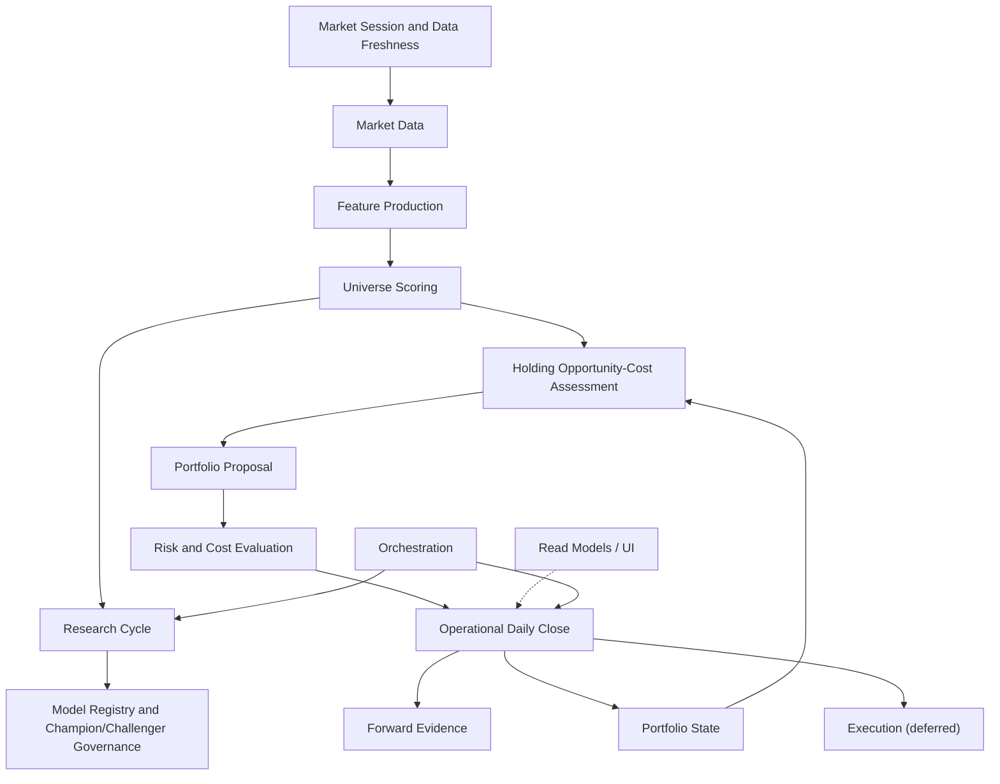

# Paper Trader — Target Architecture

> The intended boundaries that let the system deliver the seven milestones in
> [PROJECT_CHARTER.md](PROJECT_CHARTER.md) **without a big-bang rewrite**. This
> is a destination, reached by the bounded slices in
> [CONSOLIDATION_ROADMAP.md](CONSOLIDATION_ROADMAP.md). Names are derived from
> existing modules wherever a sensible owner already exists (Principle 8).
>
> The organizing rule is **Principle 1**: exactly one authoritative
> implementation per business concept, and **Principle 2**: one orchestration
> path per operator workflow. The current conflicts are catalogued in
> [CURRENT_ARCHITECTURE.md](CURRENT_ARCHITECTURE.md) §10–§11.

## 1. Bounded contexts

## 2. One authoritative owner per canonical concept

This table is the contract: exactly one owner per concept. A second writer is a
defect to be migrated, not a new owner to be blessed.

| Concept | Target owner | Consolidates today's |
|---|---|---|
| Market session / eligible date | `engine/market_session` (**LANDED, Slice 1**; built on `market_hours`) | ≥8 date resolvers + 6 `_today()` seams |
| Cross-source data freshness | `api/data_freshness` (**LANDED, Slice 1**; read-only) | ad-hoc per-surface date/freshness displays |
| Latest completed price date | `engine/market_session` | `func.max(PriceSnapshot.market_date)` sites, `daily_close._latest_eligible_market_date` |
| Market data (prices) | `market_data_service` (unify `engine/market_data` + owned-EOD transport) | World A Yahoo vs World B EODHD split |
| Feature production | `feature_service` (extract from `multi_horizon_engine` inputs) | scattered CSV input builders |
| Universe scoring / rankings | `api/universe_scoring` (**LANDED, Slice 4**; composition & read owner over the `multi_horizon_engine.compute_scores` kernel) | ≥8 z-score/rank reimplementations (legacy copies retire with the DB screener, Slice 11) |
| Research cycle orchestration | `api/daily_research_cycle` (**LANDED, Slice 3**; composes session/freshness + `alpha_target.run_refresh` + `multi_horizon_engine` scoring + `forward_prediction_skill` evidence + `daily_action_gate` bridge) | Daily Alpha Run vs alpha-target vs close-embedded refresh; hidden month-boundary prerequisite |
| Model registry / champion governance | `model_registry` (unify `alpha_registry` + tournament) — DEFERRED, separate consolidation; NOT part of Milestone 4. The Slice 8 Research Agent READS these registries (never forks or unifies them) | 2 challenger registries (phase20/21), dead phase18 wire |
| Data expansion / dataset purchase-gate | `engine/data_expansion_gate` (kernel) + `api/data_expansion` (catalog/composition/read) (**LANDED, Slice 9**; Milestone 5; a sixteen-dimension purchase/integration gate that REUSES `source_contracts` provenance, `data_freshness`, `experiment_contracts` evidence gates, Stage 13A `analyst_revisions`, and Slice 8 `research_agent` DATA opportunities; cadence disabled; read at `GET /v1/research/data-expansion`) | resolved (research governance only); no dataset purchased, no provider activated, no paid API called; NO paid-data registry fork |
| Research-state monitoring / governance | `engine/research_agent` (kernel) + `api/research_agent` (composition/read) (**LANDED, Slice 8**; Milestone 4; READS champion identity `universe_scoring`, rank IC `forward_prediction_skill`, realized performance `paper_trading_desk`+`forward_evidence`, challenger `current_alpha_tournament`, thresholds `current_alpha_decision_gate`, Slice-6 HOC + Slice-7 reallocation histories; runs inside the Daily Research Cycle; read at `GET /v1/research/research-agent`) | resolved (research governance only); no model promotion / recalibration / retraining, no champion pointer, no order/target/NAV authority is created |
| Portfolio state (NAV, cash, holdings) | `api/portfolio_state` (**LANDED, Slice 5**; read owner composing the active `operational_book` + `data_freshness` dates + `paper_trading_desk` performance + `daily_action_gate` + `forward_prediction_skill`; LIVE NAV authority = `paper_trading_desk.book_nav`, `portfolio_valuation` = explicitly-scoped legacy DB archive) | resolved at the read layer; `engine/portfolio.cached_total_value`/`current_alpha_book`/`_collect_positions` remain research/legacy writers scoped for Slices 8/11 |
| Holding opportunity-cost | `engine/holding_opportunity_cost` (kernel) + `api/holding_opportunity_cost` (composition/read) (**LANDED, Slice 6**; Milestone 2; reuses `multi_horizon_engine` constants + `paper_trading_desk` cost model; runs inside the Daily Research Cycle; read at `GET /v1/operations/holding-opportunity-cost`) | resolved; the prior ad-hoc rank/deterioration logic in `portfolio_manager` is superseded (review-only) |
| Portfolio proposal / target | `engine/reallocation_proposal` (kernel) + `api/reallocation_proposal` (composition/read) (**LANDED, Slice 7**; Milestone 3; consumes `portfolio_state` + `holding_opportunity_cost`; reuses `multi_horizon_engine` constants + `paper_trading_desk` cost model; runs inside the Daily Research Cycle; read at `GET /v1/operations/reallocation-proposal`) | resolved (review-only); no order/target authority is created |
| Risk and cost evaluation | `risk_cost_service` (unify `engine/risk` + cap families) | duplicated top-N-sector-cap + name-cap code |
| Forward evidence | `forward_evidence` (+ `forward_prediction_skill`) | already coherent — keep |
| Operational daily close | `daily_close.run_daily_close` | World A/B split; standalone refresh bypass |
| Workflow / gate state | `api/workflow_state` (**LANDED, Slice 2**; composes the gate/close/book/freshness domain facts) | `app.py:_build_workflow_state` (legacy), `command_center._derive_stage`, `daily_workflow_dashboard` stages, `derive_lifecycle_view` |
| Execution | `execution` (deferred; empty until Milestone 7) | the legacy paper "Create Orders" surface |
| Read models / UI | `read_models` + `api/ui` | NAV/holdings rendered from 3 payloads |
| Orchestration | `orchestration` (one path per workflow) | 5 standalone mark writers |

## 3. Context definitions

Each context lists responsibility, inputs, outputs, owned state, forbidden
responsibilities, candidate existing modules, and migration approach.

### Market Session and Data Freshness
- **Responsibility:** resolve the single eligible market session / latest
  completed date and classify freshness of every input family.
- **Inputs:** wall clock (ET), owned SPY/price calendar, provider readiness.
- **Outputs:** `eligible_market_date`, per-family freshness (`FRESH/STALE/BLOCKED`).
- **Source-of-truth boundary (Phase 29B.1):** OPERATIONAL date concepts
  (eligible/owned-data confirmation, valuation, desk mark, benchmark, target) are
  owned by the **active operational book** (`api/operational_book.py` — the
  authoritative book-selection policy) and its owned desk marks; a dormant
  legacy/current-alpha research book (`portfolio_valuation`/`current_operating_state`)
  MUST NOT supply operational readiness. RESEARCH dates (champion evaluation mark,
  latest price/score refresh, frozen monthly momentum input, fundamental panel,
  TRUE_FORWARD snapshot) are owned separately and never collapsed. The frozen
  monthly momentum input is read directly from its persisted `month_label` and is
  never proxied. The freshness owner additionally emits the active-book identity
  and a read-only cross-surface `consistency_status` (never a provider call).
- **Owned state:** none persistent (pure function over the calendar).
- **Forbidden:** fetching prices, writing ledgers, scoring.
- **Candidates:** `daily_operating_run.latest_completed_market_date`,
  `daily_close._latest_eligible_market_date`, `market_hours`.
- **Migration:** extract one `market_session` function; route all resolvers and
  `_today()` seams through it behind tests.
- **Status (Slice 1, LANDED):** `engine/market_session.py` (pure owner) +
  `api/data_freshness.py` (read-only freshness) + `GET /v1/operations/data-freshness`
  + one UI `loadDataFreshness()` loader. `daily_operating_run`, `daily_close` and
  `alpha_target` delegate the session arithmetic; the 17:30-vs-16:00 close policy
  is an explicit parameter. Owned-provider-confirmed sessions are the holiday-safe
  authority (no exchange-calendar dependency is installed); the weekday+cutoff
  calculation is a labelled *expectation* that never overrides confirmed owned
  data. The historical evidence calendar (`forward_prediction_skill.eligible_calendar`)
  and the research forward-roll (`alpha_agent/source_exhaustion.py`) are kept
  separate. Remaining resolvers (`paper_trading_desk._required_mark_date`,
  `current_alpha_tournament_sync`, `market_screener`) are documented follow-ups.
- **Non-session policy (Phase 29D.1):** a weekday is `NON_SESSION` ONLY through an
  AUTHORITATIVE source (an installed exchange calendar or a persisted provider-confirmed
  contract). The absence of same-day owned data is NEVER a holiday: with no calendar
  available the expected weekday stays `WAITING_FOR_OWNED_DATA` with
  `calendar_policy_degraded = True`, and the prior valid close is unchanged. The
  eligible session is confirmed only when BOTH the owned market marks AND the benchmark
  reach the expected date. This superseded the removed `likely_holiday` benchmark
  heuristic (the desk marks and the SPY benchmark share one owned provider).

### Workflow / Operator State
- **Responsibility:** hold the single authoritative *combined operator
  interpretation* — the overall workflow state, the current task, the one primary
  next action (severity/destination/safe/execution flags), the queued follow-ups,
  the portfolio-assessment currency, the blockers, the completed-state summary and
  a cross-surface consistency verdict.
- **Inputs:** the Slice-1 `data_freshness` contract (session + dates + active book
  + consistency), the Daily Action Gate (assessment domain fact + review clock),
  the probe-free Daily Close progress, the active Operational Book, the Forward
  Prediction Skill, alpha-target readiness. **Composed, never recomputed.**
- **Outputs:** one workflow contract (`GET /v1/operations/workflow-state`).
- **Owned state:** none (pure composition over injected read models).
- **Forbidden:** re-deriving any domain fact; any provider/prediction call; any
  Daily Close, research refresh, portfolio reassessment, model promotion or write.
- **Candidates:** `api/workflow_state` (**LANDED, Slice 2**).
- **Status (Slice 2, LANDED):** `api/workflow_state.py` (read-only owner) +
  `GET /v1/operations/workflow-state` + one UI `loadWorkflowState()` loader that
  fans the ONE payload to every primary surface and the Action/Safety panel. The
  frozen overall-state vocabulary, the assessment-currency vocabulary, the
  deterministic priority policy and the decision-currency rule (a stale gate
  result is never re-presented as a "today" conclusion) live here. Specialized
  modules keep their domain facts; the four legacy stage vocabularies
  (`app.py`×2, `command_center`, `daily_workflow_dashboard`) are documented and
  retired with the legacy Create-Orders surface (Slice 11). The UI derives no
  workflow priority or assessment currency. Slice 2 performs no workflow action.
- **UI DOM-ownership boundary (Phase 29C.1, LANDED):** `renderWorkflowState` is the
  EXCLUSIVE owner of every visible primary operator-interpretation node (the workflow
  banners, the right Action/Safety panel, and the reframed Daily-Action-Gate card
  title/currency-badge/headline/explanation), backed by additive backend
  `assessment_presentation` / `evidence_presentation` blocks. The specialized detail
  renderers (`renderDailyActionGate`/`renderDailyClose`/`renderOperationalBook`) own
  DETAIL only and are hard-guarded out of the canonical nodes, so the final visible
  state is independent of async loader completion order (ownership, not timing). This
  is the DOM-side analogue of "one concept, one owner": one owner per *visible*
  interpretation, mirroring the backend one-owner-per-concept boundary.

### Market Data
- **Responsibility:** produce point-in-time EOD prices for the universe and
  benchmark, from one provider policy.
- **Inputs:** market session, vendor (owned EODHD; Yahoo only as fallback).
- **Outputs:** price rows keyed `(ticker, market_date)`.
- **Owned state:** `price_snapshots`, `benchmark_prices`, desk mark cache.
- **Forbidden:** scoring, portfolio math.
- **Candidates:** `engine/market_data`, owned-EOD transport in `alpha_target`/
  `daily_close`.
- **Migration:** converge World A/World B onto one provider policy; keep both
  stores until parity is proven, then deprecate the Yahoo path.

### Feature Production
- **Responsibility:** derive model inputs (momentum, risk stats) as PIT CSVs.
- **Inputs:** market data, fundamentals.
- **Outputs:** input CSVs consumed by scoring.
- **Owned state:** input CSVs + manifest.
- **Forbidden:** ranking/selection.
- **Candidates:** `alpha_target` input builders.
- **Migration:** name the boundary; leave frozen monthly-momentum semantics.

### Universe Scoring
- **Responsibility:** compute `composite_sn` and rankings for the full universe.
- **Inputs:** features.
- **Outputs:** per-ticker scores/ranks (sector-neutral).
- **Owned state:** none (recomputed).
- **Forbidden:** portfolio construction, caps.
- **Candidates:** `api/universe_scoring` (**LANDED, Slice 4**) over the
  `multi_horizon_engine.compute_scores/build_current` kernel.
- **Status (Slice 4, LANDED):** `api/universe_scoring.py` is the ONE operational
  scoring/ranking composition & read owner. The kernel keeps all model mathematics
  (`compute_scores`/`_percentiles`/`compute_combined`/`build_books`, unchanged); the
  owner adds identity, the content-level `input_contract_hash`, count reconciliation,
  universe identity, exclusions and a cross-consumer consistency validator, exposed at
  `GET /v1/research/universe-scoring` (compat: `current-alpha-scores`). It deep-copies
  the kernel cache (never mutated), performs no scoring math, no provider/prediction
  call and no write, and never promotes/recalibrates a model.
- **Migration:** the DRC scoring adapter and `multi_horizon_platform.load_current_scores`
  delegate to the owner; `alpha_target`/`forward_prediction_skill` re-export its primary
  identity. Remaining: the ≥8 legacy `zscore`/`rank` copies and `engine/scoring.py`
  retire with the DB screener (Slice 11).

### Research Cycle
- **Responsibility:** orchestrate one persistent daily research pass (session →
  plan → data refresh → date-alignment → scoring → target → forward evidence →
  portfolio-assessment bridge) with no hidden operator prerequisites (Milestone 1).
- **Inputs:** market session / freshness, data, scoring.
- **Outputs:** one canonical run manifest + status contract.
- **Owned state:** run-status manifests under a research root (`PAPER_TRADER_DRC_DIR`).
- **Forbidden:** mutating holdings; running Daily Close; auto-confirming a target;
  promoting/recalibrating a model; creating an order/signal/decision/fill;
  approximating the frozen monthly input.
- **Candidates:** `api/daily_research_cycle` (**LANDED, Slice 3**).
- **Status (Slice 3, LANDED):** `api/daily_research_cycle.py` is the ONE idempotent,
  resumable orchestration owner. It composes the existing authoritative owners
  through adapters (it does NOT consolidate scoring — Slice 4 — or portfolio state —
  Slice 5, and is NOT the Milestone-2 opportunity-cost engine). The evidence count is
  derived from `forward_prediction_skill.SUPPORTED_BOOKS`; the bundle is immutable and
  first-write-wins; Daily Close idempotently reuses it (the cycle never runs Daily
  Close). There is no safe automatic monthly-momentum emitter, so the cycle BLOCKS at
  the month boundary (`RUN_RESEARCH_MONTHLY_INPUT_EMITTER`) instead of approximating.
  `GET /v1/operations/daily-research-cycle/status` + `POST .../run`
  (`RUN_DAILY_RESEARCH_CYCLE`); one UI status loader + one execution function;
  `api/workflow_state` consumes the status (`RESEARCH_CYCLE_RUNNING` /
  `RESEARCH_CYCLE_BLOCKED`). The standalone champion refresh remains a research detail.
- **Live-acceptance completion (Phase 29D.1):** the frozen monthly momentum input has
  a DECLARED canonical in-repo adapter owner (`api/monthly_momentum_input.py`) that
  wraps an injectable emitter seam and owns the safe contract (due-ness / schema /
  period / provenance validation / idempotency / atomic persist / reuse-or-reject);
  a due month with no wired emitter blocks HONESTLY through the adapter, never
  `NO_REFRESH_OWNER` and never a separate operator prerequisite. `target_calculation`
  is a DECLARED prepared-downstream owner (`alpha_target.load_readiness`, produced by
  `STEP_PREPARE_TARGET`). `WAITING_FOR_OWNED_DATA` strictly outranks any research
  blocker; the cycle executes through ONE manual UI action once the expected session
  is confirmed by owned data.
- **Production monthly emitter bridge (Phase 29D.2):** the production PRODUCER behind
  that adapter seam is `api/monthly_momentum_emitter.py` — a pure-stdlib SUBPROCESS
  bridge (imports no numpy/pandas) wired by the `api/app.py` import-time deployment
  wiring. Ownership stays layered: `research.phase24_daily_panel` owns the survivorship-
  free source panel, `research.phase25_multi_horizon_inputs` owns the frozen `mom_6_1`
  mathematics, `api.monthly_momentum_emitter` owns the isolated subprocess emission +
  output validation, `api.monthly_momentum_input` owns validation + idempotent atomic
  promotion, `api.daily_research_cycle` owns orchestration, `api.universe_scoring` owns
  scoring interpretation. No second monthly formula exists in Paper Trader. Source-panel
  policy: no refresh when the owned panel covers the eligible session; an explicit
  DATA_HOLD blocker (never an uncontrolled full rebuild) when it is behind, because
  Phase 24 supports no safe incremental extension. When momentum_monthly is due, ONE
  `RUN DAILY RESEARCH CYCLE` action emits, promotes, clears the scoring cache and
  continues the same run — no separate command / button / restart / file operation.

### Model Registry and Champion/Challenger Governance
- **Responsibility:** hold champion + challenger models, run gated evaluation,
  surface promotion eligibility (never auto-promote).
- **Inputs:** forward evidence, tournament sync.
- **Outputs:** leaderboard, eligibility, promotion proposals.
- **Owned state:** one unified registry.
- **Forbidden:** auto-promotion, changing operational holdings.
- **Candidates:** `alpha_registry`, `tournament`, `alpha_factory`,
  `price_alpha_factory`, `current_alpha_tournament_sync`.
- **Migration:** merge the two factory registries; remove the dead phase18 wire.

### Portfolio State (LANDED — Slice 5, Phase 29F)
- **Responsibility:** the one authoritative NAV / cash / holdings / positions read
  model for the active operational book.
- **Inputs:** the active `operational_book` (ledger-replayed NAV/cash/holdings/positions),
  `data_freshness` dates + active-book selection, `paper_trading_desk` performance,
  `daily_action_gate` assessment, `forward_prediction_skill` evidence.
- **Outputs:** NAV, positions, freshness dates, capital block, order/fill/target/
  assessment/evidence references, a 12-check consistency verdict, a stable state hash.
- **Owned state:** none (read model; never `cached_total_value`).
- **Forbidden:** proposing changes; any write / provider / prediction / order / fill.
- **Owner:** `api/portfolio_state.py` at `GET /v1/operations/portfolio-state`; ONE UI
  loader `loadPortfolioState()`. LIVE NAV authority = `paper_trading_desk.book_nav`;
  `portfolio_valuation` = explicitly-scoped legacy DB archive, never the active book.
- **Landed:** the read layer is resolved (audit `check_portfolio_state_ownership`,
  inventory drift = 0). The residual mark writers `engine/portfolio.cached_total_value`,
  `current_alpha_book` and `portfolio_terminal._collect_positions` are research/legacy
  lineages that retire with Slices 8/11; they are not on the operational NAV read path.

### Holding Opportunity-Cost Assessment (LANDED — Slice 6, Phase 29G)
- **Responsibility:** per-holding HOLD/REDUCE/EXIT/REPLACE/ADD with the full
  measure set (Milestone 2). Two owners: the pure kernel
  `engine/holding_opportunity_cost.py` (sole calculation) and
  `api/holding_opportunity_cost.py` (composition / validation / immutable artifact /
  read).
- **Inputs:** ONE immutable PIT assessment-input contract sourced from
  `api.portfolio_state` (holdings/weights/NAV/cash/sectors), `api.universe_scoring`
  (rank/score/eligibility/adv_dollar), `api.price_panel` (owned trailing close +
  dollar volume), `engine.market_session` (previous eligible session) and the previous
  eligible date's artifact (prior rank); reuses `api.multi_horizon_engine` constants +
  `api.paper_trading_desk` cost model via one versioned decision policy.
- **Outputs:** per-holding recommendation + full measure set + non-held ADD candidates
  + a deterministic `assessment_hash`; persisted as an immutable artifact under
  `PAPER_TRADER_HOC_DIR`; read at `GET /v1/operations/holding-opportunity-cost`.
- **Owned state:** immutable holding-opportunity-cost artifacts (research /
  decision-evidence root; never the operational ledger).
- **Forbidden:** executing changes; confirming a target; generating target weights;
  creating an order/fill; duplicating NAV; recomputing a universe score; calling a
  provider/prediction; a separate manual execution endpoint (the sole path is the Daily
  Research Cycle).
- **Status:** review-only, preview-first, paper-only. The Daily Action Gate delegates to
  its summary; the review banner reads `HOLDING OPPORTUNITY-COST REVIEW — REALLOCATION
  ENGINE NOT YET IMPLEMENTED` (Slice 7 not implemented).

### Portfolio Proposal (LANDED — Slice 7, Phase 29H)
- **Responsibility:** a complete paper-only proposed target portfolio with full
  before/after explanation (Milestone 3). Two owners: the pure kernel
  `engine/reallocation_proposal.py` (sole allocation-math owner) and
  `api/reallocation_proposal.py` (composition / validation / immutable artifact / read).
- **Inputs:** the current portfolio state (`api.portfolio_state`) and the Slice 6
  Holding Opportunity-Cost assessment (`api.holding_opportunity_cost`), plus the
  eligible universe ranking (`api.universe_scoring`) and owned returns
  (`api.price_panel`); reuses the `api.multi_horizon_engine` construction constants +
  the `api.paper_trading_desk` cost model via one versioned allocation policy.
- **Outputs:** ONE coherent proposed target portfolio (RETAIN/INCREASE/REDUCE/EXIT/ADD/
  REPLACE_OUT/REPLACE_IN), turnover, transaction + switching cost, before/after portfolio
  SCORE (expected return NEVER fabricated — null/`NOT_CALIBRATED`), concentration and
  volatility before/after, hard-constraint validation, and a deterministic `proposal_hash`;
  persisted as an immutable artifact under `PAPER_TRADER_REALLOC_DIR`; read at
  `GET /v1/operations/reallocation-proposal`.
- **Owned state:** immutable reallocation-proposal artifacts (research / decision-evidence
  root; a different source HOC hash for the same date supersedes, never silently reuses).
- **Forbidden:** creating an operational or alpha target, an order/fill, any holdings/cash/
  NAV mutation, broker execution, model promotion, or a create/apply/confirm/rebalance
  endpoint. The sole execution path is the Daily Research Cycle's
  `BUILD_REALLOCATION_PROPOSAL` step; the read endpoint is GET-only (NOT_RUN before a
  proposal exists).
- **Status:** review-only, preview-first, paper-only, manual review mandatory. The Daily
  Action Gate delegates to `load_proposal_summary`; `api.workflow_state` exposes the
  proposal state as an informational review action that never gates the Daily Close.

### Persistent Alpha Research Agent (LANDED — Slice 8, Phase 29I)
- **Responsibility:** continuously evaluate whether the current research/model stack remains
  trustworthy and whether bounded research experiments should be run (Milestone 4). Two
  owners: the pure kernel `engine/research_agent.py` (sole research-state calculation owner)
  and `api/research_agent.py` (composition / persistence / read). It is a monitoring &
  governance layer; it does NOT create a second/unified model registry and never moves
  champion-promotion authority.
- **Inputs:** an immutable point-in-time research-evidence contract READ from the existing
  owners (never re-derived): champion / challenger identity (`api.universe_scoring` /
  `api.current_alpha_tournament`), matured TRUE_FORWARD rank IC / decile spread / observation
  counts (`api.forward_prediction_skill`), realized benchmark-relative return / drawdown /
  turnover / cost (`api.paper_trading_desk` + `api.forward_evidence`), the minimum-
  forward-observation threshold (`api.current_alpha_decision_gate.MIN_FORWARD_OBS`, injected),
  the Slice-6 HOC + Slice-7 reallocation immutable histories, and the active book / eligible
  session / sector (`api.portfolio_state`). Thresholds are one versioned policy
  (`research_agent_policy.v1`).
- **Outputs:** evidence sufficiency (a short negative live P&L run yields INSUFFICIENT_EVIDENCE
  / WATCH, never a premature RECALIBRATION_DUE), explained champion-health components with
  reason codes, model-degradation categories, HOC + reallocation diagnostic feedback,
  challenger classification (never PROMOTED), a controlled recalibration recommendation, and a
  deterministic ranked queue of bounded SHADOW-only research opportunities; a deterministic
  `assessment_hash`; persisted as an immutable artifact under `PAPER_TRADER_RESEARCH_AGENT_DIR`;
  read at `GET /v1/research/research-agent`. Research state HEALTHY / WATCH / INVESTIGATE /
  RECALIBRATION_DUE / CHALLENGER_PROMISING / INSUFFICIENT_EVIDENCE / BLOCKED.
- **Owned state:** immutable research-agent assessment artifacts (research / decision-evidence
  root; a different evidence hash for the same date supersedes, never silently reuses).
- **Forbidden:** promoting / recalibrating / retraining / replacing a model, writing a
  champion pointer, confirming a target, creating an order/fill, any holdings/cash/NAV
  mutation, broker execution, executing an experiment, enabling cadence, or a
  promote/recalibrate/retrain/apply endpoint. The sole execution path is the Daily Research
  Cycle's `RUN_RESEARCH_AGENT` step; the read endpoint is GET-only (NOT_RUN before an
  assessment exists).
- **Status:** research governance only, manual approval mandatory. Findings never block a
  valid Daily Close (research recommendation != operational action). Guarded by
  `check_research_agent_ownership`; cadence remains disabled.

### Data Expansion / Purchase-Gate (LANDED — Slice 9, Phase 29J)
- **Responsibility:** decide whether a new external dataset is worth acquiring / integrating
  (Milestone 5). Two owners: the pure kernel `engine/data_expansion_gate.py` (sole dataset-gate
  calculation owner; `evaluate_dataset`) and `api/data_expansion.py` (catalog / composition /
  persistence / read). It is a decision layer over existing owners, not a new provider layer.
- **Inputs:** one immutable dataset-evaluation contract — candidate metadata (from the dataset
  catalog: PIT guarantee, history, inactive/delisted coverage, universe breadth, revision
  history, identifiers, licensing, cost, entitlement/integration state), the intended research
  requirements, and the MEASURED research evidence (out-of-sample rank-IC / decile-spread /
  challenger lift, regime & sector robustness, turnover, cost-adjusted lift, effective sample,
  correlation/redundancy versus owned features) produced by the existing experiment/evidence
  owners. Thresholds are one versioned policy (`data_expansion_gate_policy.v1`).
- **Outputs:** sixteen explained per-dimension sub-assessments (never one opaque score), hard
  blockers separated from soft visible gaps, and ONE explicit recommendation — `REJECT` /
  `INSUFFICIENT_EVIDENCE` / `RESEARCH_ONLY` / `CANDIDATE` / `PURCHASE_RECOMMENDED` /
  `INTEGRATION_RECOMMENDED` (the last two always MANUAL APPROVAL REQUIRED); a deterministic
  `evaluation_hash`; persisted as an immutable artifact under `PAPER_TRADER_DATA_EXPANSION_DIR`;
  read at `GET /v1/research/data-expansion` (+ `/{dataset_id}`). Never fabricates a score when
  data is absent; never recommends a purchase on in-sample-only evidence or on current/live P&L.
- **Reuses (never forks):** `alpha_agent/source_contracts` (provenance), `api/data_freshness`
  (freshness), `alpha_agent/experiment_contracts` (evidence gates), `alpha_agent/analyst_revisions`
  (Stage 13A analyst-revisions candidate), `engine/research_agent` (Slice 8 DATA opportunities).
- **Owned state:** immutable dataset-evaluation artifacts (research / decision-evidence root; a
  different metadata/evidence/policy supersedes, never silently reuses).
- **Forbidden:** purchasing a dataset, subscribing to / activating a provider, calling a paid
  provider, using a paid API quota, altering credentials, integrating a dataset, mutating the
  portfolio, promoting a model, creating an order/fill, enabling cadence, or a
  purchase/subscribe/activate/integrate/enable-paid-data endpoint. GET reads only persisted
  evaluations (`NOT_RUN` before one exists; no GET recomputes a research study).
- **Cadence DISABLED:** a full purchase-gate evaluation is never a daily job (`CADENCE_ENABLED =
  False`) — it runs only on candidate add / metadata change / sufficient new evidence / a review
  checkpoint / an explicit operator request; the Daily Research Cycle may only READ the latest
  status.
- **Status:** research governance only, manual purchase approval mandatory. Guarded by
  `check_data_expansion_ownership`; cadence remains disabled. Slice 10 (Intraday) remains next.

### Risk and Cost Evaluation
- **Responsibility:** volatility, drawdown, concentration, caps, switching cost.
- **Inputs:** portfolio state, target.
- **Outputs:** risk/cost metrics + cap compliance.
- **Owned state:** none.
- **Forbidden:** selection (only evaluates).
- **Candidates:** `engine/risk`, cap families in `multi_horizon_engine`,
  `absolute_return_research`, `daily_action_gate`.

### Forward Evidence
- **Responsibility:** immutable TRUE_FORWARD capture, maturation, attribution;
  gaps documented never fabricated (Principle 4).
- **Candidates:** `forward_prediction_skill`, `forward_evidence`. **Keep as-is.**

### Operational Daily Close
- **Responsibility:** the one atomic operational close composing marks + model
  inputs + gate + decision + evidence (Principle 2).
- **Candidates:** `daily_close.run_daily_close`. **Keep; remove bypass paths.**

### Execution (deferred — Milestone 7)
- **Responsibility:** none until Milestone 7. Empty by design.
- **Forbidden:** everything (no broker, no live orders, no automation).
- **Migration:** quarantine and document the legacy paper "Create Orders" surface.

### Read Models / UI
- **Responsibility:** render authoritative backend state only (Principle 6).
- **Candidates:** `api/ui/index.html`, `command_center`, read endpoints.
- **Migration:** every concept renders from one payload; no client-side money/
  date math.

### Orchestration
- **Responsibility:** sequence workflows deterministically; one path each.
- **Candidates:** `daily_close`, `daily_operating_run`, `research_cycle`.
- **Migration:** standalone mark writers become wrappers over the composed path.

## 4. What the target deliberately keeps

- **Service readiness vs workflow readiness stay distinct** (Phase 29G.1): `GET /v1/ready`
  answers service readiness (backend + DB reachable, with an exact failure reason);
  `api.workflow_state` answers workflow readiness (can today's action run now). A waiting
  workflow (`WAITING_FOR_SESSION_CLOSE`) is never a service fault, and the two are shown
  separately. The Daily Research Cycle stays the sole Slice 6 execution path; the Holding
  Opportunity-Cost review stays the primary portfolio decision surface; no target /
  rebalance / order authority is added ahead of Slice 7.
- **One primary portfolio-decision concept** (Phase 29G.2 residual hard cutover): the
  Holding Opportunity-Cost Review is the SOLE primary decision card on every operator
  surface (canonical operator state `HOLDING_OPPORTUNITY_COST_NOT_RUN` before the first
  artifact). The legacy rank-membership comparison is compatibility-only and collapsed
  (`compatibility_only` / `decision_authority=NONE` / `canonical_decision_owner=
  api.holding_opportunity_cost`), never a "Proposal Ready" / "Portfolio Changes Proposed"
  decision. Two read-only first-live operator gates (`pre_drc_readiness.ps1`,
  `post_drc_acceptance.ps1`) precede the first live cycle and the Daily Close. Guarded by
  `check_slice6_residual_cutover_ownership`; cadence remains disabled.
- **Durable DRC terminal state + safe idempotent recovery** (Phase 29G.3): a terminal
  `COMPLETE` is validated + read back before it is trusted (never COMPLETE on an unverified
  persist); read-only status REFLECTS a persisted terminal manifest verbatim (never
  NOT_STARTED under the benign hash drift caused by the cycle refreshing its own fast inputs)
  and returns `INCONSISTENT` / `TERMINAL_DOWNSTREAM_ARTIFACTS_WITHOUT_DRC_MANIFEST` for
  downstream artifacts without a manifest. A session-stable identity keys reuse/recovery so a
  same-date rerun through the normal run endpoint reuses the immutable outputs (no duplicate
  evidence / HOC artifact, no order / fill / target confirmation / ledger mutation) while a
  genuinely different slow-input contract for the same date is refused. The expected
  one-session pre-close valuation gap is `PENDING_DAILY_CLOSE` (`READY_WITH_PENDING_CLOSE`),
  not corruption; genuine gaps stay `INCONSISTENT`. A completed cycle + current HOC assessment
  satisfies the portfolio reassessment (`READY_FOR_DAILY_CLOSE`); the honest HOC `DEGRADED`
  gaps stay visible. Guarded by `check_drc_manifest_recovery`. No evidence fabrication, no
  order/target authority.
- Paper-only, preview-first, manual-review, no-automation boundaries.
- Remote prediction at `:9000`; no local prediction.
- The clean `db/session.py` boundary — the model for the future store service.
- The Phase 28C separation of operational status from research/forward evidence.
- Incremental, test-guarded migration — no monolith is rewritten wholesale.
