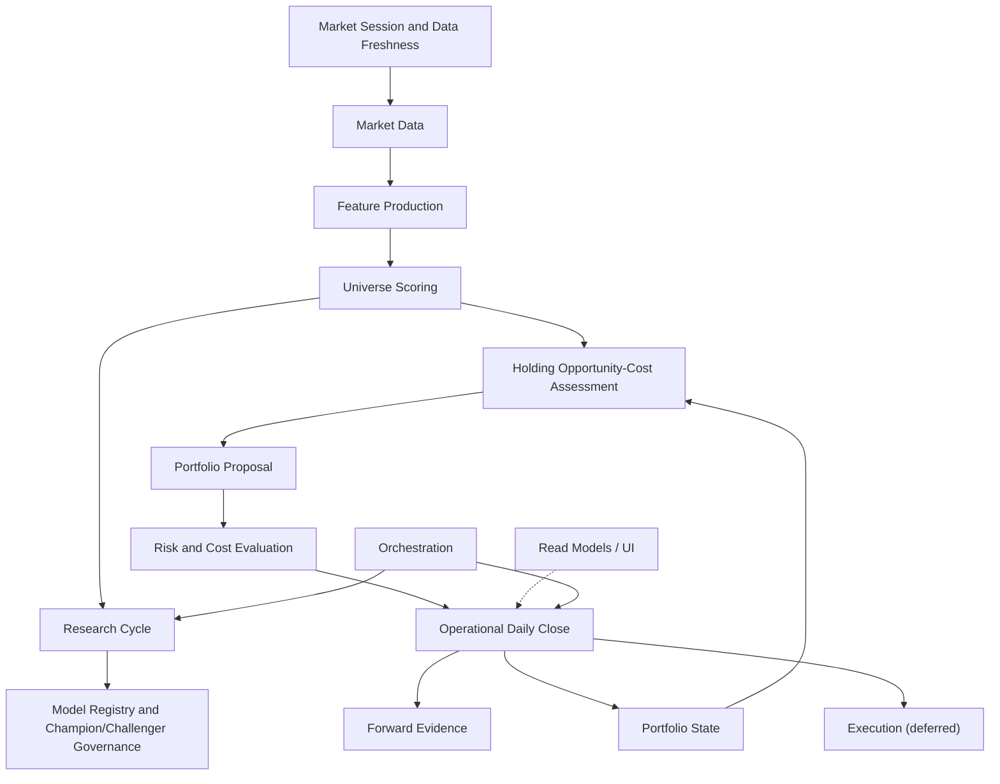

# Paper Trader — Target Architecture

> The intended boundaries that let the system deliver the seven milestones in
> [PROJECT_CHARTER.md](PROJECT_CHARTER.md) **without a big-bang rewrite**. This
> is a destination, reached by the bounded slices in
> [CONSOLIDATION_ROADMAP.md](CONSOLIDATION_ROADMAP.md). Names are derived from
> existing modules wherever a sensible owner already exists (Principle 8).
>
> The organizing rule is **Principle 1**: exactly one authoritative
> implementation per business concept, and **Principle 2**: one orchestration
> path per operator workflow. The current conflicts are catalogued in
> [CURRENT_ARCHITECTURE.md](CURRENT_ARCHITECTURE.md) §10–§11.

## 1. Bounded contexts

## 2. One authoritative owner per canonical concept

This table is the contract: exactly one owner per concept. A second writer is a
defect to be migrated, not a new owner to be blessed.

| Concept | Target owner | Consolidates today's |
|---|---|---|
| Market session / eligible date | `engine/market_session` (**LANDED, Slice 1**; built on `market_hours`) | ≥8 date resolvers + 6 `_today()` seams |
| Cross-source data freshness | `api/data_freshness` (**LANDED, Slice 1**; read-only) | ad-hoc per-surface date/freshness displays |
| Latest completed price date | `engine/market_session` | `func.max(PriceSnapshot.market_date)` sites, `daily_close._latest_eligible_market_date` |
| Market data (prices) | `market_data_service` (unify `engine/market_data` + owned-EOD transport) | World A Yahoo vs World B EODHD split |
| Feature production | `feature_service` (extract from `multi_horizon_engine` inputs) | scattered CSV input builders |
| Universe scoring / rankings | `universe_scoring` (`multi_horizon_engine.compute_scores`) | ≥8 z-score/rank reimplementations |
| Research cycle orchestration | `research_cycle` (compose `alpha_target.run_refresh` + scoring) | Daily Alpha Run vs alpha-target vs close-embedded refresh |
| Model registry / champion governance | `model_registry` (unify `alpha_registry` + tournament) | 2 challenger registries (phase20/21), dead phase18 wire |
| Portfolio state (NAV, cash, holdings) | `portfolio_state` (`portfolio_valuation` as the mark authority) | 2 NAV authorities, `book_nav`, `cached_total_value`, `_collect_positions` |
| Holding opportunity-cost | `opportunity_cost_engine` (new; Milestone 2) | ad-hoc rank/deterioration logic in `portfolio_manager` |
| Portfolio proposal / target | `portfolio_proposal` (`alpha_target` + `operational_book`) | operational snapshot vs frozen champion book |
| Risk and cost evaluation | `risk_cost_service` (unify `engine/risk` + cap families) | duplicated top-N-sector-cap + name-cap code |
| Forward evidence | `forward_evidence` (+ `forward_prediction_skill`) | already coherent — keep |
| Operational daily close | `daily_close.run_daily_close` | World A/B split; standalone refresh bypass |
| Workflow / gate state | `daily_action_gate` | `app.py:_build_workflow_state`, `derive_lifecycle_view` |
| Execution | `execution` (deferred; empty until Milestone 7) | the legacy paper "Create Orders" surface |
| Read models / UI | `read_models` + `api/ui` | NAV/holdings rendered from 3 payloads |
| Orchestration | `orchestration` (one path per workflow) | 5 standalone mark writers |

## 3. Context definitions

Each context lists responsibility, inputs, outputs, owned state, forbidden
responsibilities, candidate existing modules, and migration approach.

### Market Session and Data Freshness
- **Responsibility:** resolve the single eligible market session / latest
  completed date and classify freshness of every input family.
- **Inputs:** wall clock (ET), owned SPY/price calendar, provider readiness.
- **Outputs:** `eligible_market_date`, per-family freshness (`FRESH/STALE/BLOCKED`).
- **Source-of-truth boundary (Phase 29B.1):** OPERATIONAL date concepts
  (eligible/owned-data confirmation, valuation, desk mark, benchmark, target) are
  owned by the **active operational book** (`api/operational_book.py` — the
  authoritative book-selection policy) and its owned desk marks; a dormant
  legacy/current-alpha research book (`portfolio_valuation`/`current_operating_state`)
  MUST NOT supply operational readiness. RESEARCH dates (champion evaluation mark,
  latest price/score refresh, frozen monthly momentum input, fundamental panel,
  TRUE_FORWARD snapshot) are owned separately and never collapsed. The frozen
  monthly momentum input is read directly from its persisted `month_label` and is
  never proxied. The freshness owner additionally emits the active-book identity
  and a read-only cross-surface `consistency_status` (never a provider call).
- **Owned state:** none persistent (pure function over the calendar).
- **Forbidden:** fetching prices, writing ledgers, scoring.
- **Candidates:** `daily_operating_run.latest_completed_market_date`,
  `daily_close._latest_eligible_market_date`, `market_hours`.
- **Migration:** extract one `market_session` function; route all resolvers and
  `_today()` seams through it behind tests.
- **Status (Slice 1, LANDED):** `engine/market_session.py` (pure owner) +
  `api/data_freshness.py` (read-only freshness) + `GET /v1/operations/data-freshness`
  + one UI `loadDataFreshness()` loader. `daily_operating_run`, `daily_close` and
  `alpha_target` delegate the session arithmetic; the 17:30-vs-16:00 close policy
  is an explicit parameter. Owned-provider-confirmed sessions are the holiday-safe
  authority (no exchange-calendar dependency is installed); the weekday+cutoff
  calculation is a labelled *expectation* that never overrides confirmed owned
  data. The historical evidence calendar (`forward_prediction_skill.eligible_calendar`)
  and the research forward-roll (`alpha_agent/source_exhaustion.py`) are kept
  separate. Remaining resolvers (`paper_trading_desk._required_mark_date`,
  `current_alpha_tournament_sync`, `market_screener`) are documented follow-ups.

### Market Data
- **Responsibility:** produce point-in-time EOD prices for the universe and
  benchmark, from one provider policy.
- **Inputs:** market session, vendor (owned EODHD; Yahoo only as fallback).
- **Outputs:** price rows keyed `(ticker, market_date)`.
- **Owned state:** `price_snapshots`, `benchmark_prices`, desk mark cache.
- **Forbidden:** scoring, portfolio math.
- **Candidates:** `engine/market_data`, owned-EOD transport in `alpha_target`/
  `daily_close`.
- **Migration:** converge World A/World B onto one provider policy; keep both
  stores until parity is proven, then deprecate the Yahoo path.

### Feature Production
- **Responsibility:** derive model inputs (momentum, risk stats) as PIT CSVs.
- **Inputs:** market data, fundamentals.
- **Outputs:** input CSVs consumed by scoring.
- **Owned state:** input CSVs + manifest.
- **Forbidden:** ranking/selection.
- **Candidates:** `alpha_target` input builders.
- **Migration:** name the boundary; leave frozen monthly-momentum semantics.

### Universe Scoring
- **Responsibility:** compute `composite_sn` and rankings for the full universe.
- **Inputs:** features.
- **Outputs:** per-ticker scores/ranks (sector-neutral).
- **Owned state:** none (recomputed).
- **Forbidden:** portfolio construction, caps.
- **Candidates:** `multi_horizon_engine.compute_scores/build_current`.
- **Migration:** provide one shared `zscore`/`rank` primitive; delete the ≥8
  copies incrementally.

### Research Cycle
- **Responsibility:** orchestrate one persistent daily research pass (session →
  data → features → scoring → status → forward evidence) with no hidden operator
  prerequisites (Milestone 1).
- **Inputs:** market session, data, scoring.
- **Outputs:** run status, target review.
- **Owned state:** run-status record.
- **Forbidden:** mutating holdings.
- **Candidates:** `alpha_target.run_refresh`, `current_alpha_daily_refresh`.
- **Migration:** one orchestration path; the standalone refresh endpoints become
  thin wrappers over it.

### Model Registry and Champion/Challenger Governance
- **Responsibility:** hold champion + challenger models, run gated evaluation,
  surface promotion eligibility (never auto-promote).
- **Inputs:** forward evidence, tournament sync.
- **Outputs:** leaderboard, eligibility, promotion proposals.
- **Owned state:** one unified registry.
- **Forbidden:** auto-promotion, changing operational holdings.
- **Candidates:** `alpha_registry`, `tournament`, `alpha_factory`,
  `price_alpha_factory`, `current_alpha_tournament_sync`.
- **Migration:** merge the two factory registries; remove the dead phase18 wire.

### Portfolio State
- **Responsibility:** the one authoritative NAV / cash / holdings mark.
- **Inputs:** market data, ledger fills.
- **Outputs:** NAV, positions, freshness, reconciliation.
- **Owned state:** valuation read model (never `cached_total_value`).
- **Forbidden:** proposing changes.
- **Candidates:** `portfolio_valuation` (mark authority), `paper_trading_desk.book_nav`.
- **Migration:** one NAV function; UI reads one payload; retire `book_nav`/
  `_collect_positions`/`cached_total_value` as marks.

### Holding Opportunity-Cost Assessment
- **Responsibility:** per-holding HOLD/REDUCE/EXIT/REPLACE/ADD with the full
  measure set (Milestone 2).
- **Inputs:** scoring, portfolio state, risk.
- **Outputs:** per-holding recommendation + evidence.
- **Owned state:** none.
- **Forbidden:** executing changes.
- **Candidates:** new; seed from `portfolio_manager` signals.

### Portfolio Proposal
- **Responsibility:** a complete paper-only target with full before/after
  explanation (Milestone 3).
- **Inputs:** opportunity-cost, risk/cost.
- **Outputs:** target portfolio + turnover/cost/risk deltas.
- **Owned state:** confirmed snapshot ledger.
- **Forbidden:** creating orders without manual approval.
- **Candidates:** `alpha_target`, `operational_book`, `current_alpha_book`.

### Risk and Cost Evaluation
- **Responsibility:** volatility, drawdown, concentration, caps, switching cost.
- **Inputs:** portfolio state, target.
- **Outputs:** risk/cost metrics + cap compliance.
- **Owned state:** none.
- **Forbidden:** selection (only evaluates).
- **Candidates:** `engine/risk`, cap families in `multi_horizon_engine`,
  `absolute_return_research`, `daily_action_gate`.

### Forward Evidence
- **Responsibility:** immutable TRUE_FORWARD capture, maturation, attribution;
  gaps documented never fabricated (Principle 4).
- **Candidates:** `forward_prediction_skill`, `forward_evidence`. **Keep as-is.**

### Operational Daily Close
- **Responsibility:** the one atomic operational close composing marks + model
  inputs + gate + decision + evidence (Principle 2).
- **Candidates:** `daily_close.run_daily_close`. **Keep; remove bypass paths.**

### Execution (deferred — Milestone 7)
- **Responsibility:** none until Milestone 7. Empty by design.
- **Forbidden:** everything (no broker, no live orders, no automation).
- **Migration:** quarantine and document the legacy paper "Create Orders" surface.

### Read Models / UI
- **Responsibility:** render authoritative backend state only (Principle 6).
- **Candidates:** `api/ui/index.html`, `command_center`, read endpoints.
- **Migration:** every concept renders from one payload; no client-side money/
  date math.

### Orchestration
- **Responsibility:** sequence workflows deterministically; one path each.
- **Candidates:** `daily_close`, `daily_operating_run`, `research_cycle`.
- **Migration:** standalone mark writers become wrappers over the composed path.

## 4. What the target deliberately keeps

- Paper-only, preview-first, manual-review, no-automation boundaries.
- Remote prediction at `:9000`; no local prediction.
- The clean `db/session.py` boundary — the model for the future store service.
- The Phase 28C separation of operational status from research/forward evidence.
- Incremental, test-guarded migration — no monolith is rewritten wholesale.
