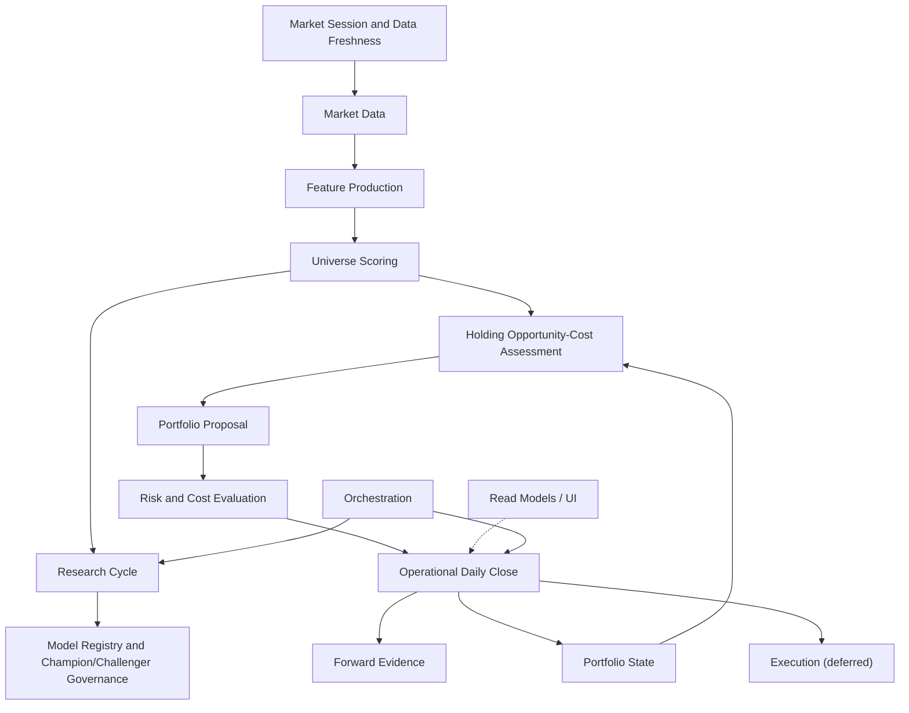

# Paper Trader — Target Architecture

> The intended boundaries that let the system deliver the seven milestones in
> [PROJECT_CHARTER.md](PROJECT_CHARTER.md) **without a big-bang rewrite**. This
> is a destination, reached by the bounded slices in
> [CONSOLIDATION_ROADMAP.md](CONSOLIDATION_ROADMAP.md). Names are derived from
> existing modules wherever a sensible owner already exists (Principle 8).
>
> The organizing rule is **Principle 1**: exactly one authoritative
> implementation per business concept, and **Principle 2**: one orchestration
> path per operator workflow. The current conflicts are catalogued in
> [CURRENT_ARCHITECTURE.md](CURRENT_ARCHITECTURE.md) §10–§11.

## 1. Bounded contexts



## 2. One authoritative owner per canonical concept

This table is the contract: exactly one owner per concept. A second writer is a
defect to be migrated, not a new owner to be blessed.

| Concept | Target owner | Consolidates today's |
|---|---|---|
| Market session / eligible date | `engine/market_session` (**LANDED, Slice 1**; built on `market_hours`) | ≥8 date resolvers + 6 `_today()` seams |
| Cross-source data freshness | `api/data_freshness` (**LANDED, Slice 1**; read-only) | ad-hoc per-surface date/freshness displays |
| Latest completed price date | `engine/market_session` | `func.max(PriceSnapshot.market_date)` sites, `daily_close._latest_eligible_market_date` |
| Market data (prices) | `market_data_service` (unify `engine/market_data` + owned-EOD transport) | World A Yahoo vs World B EODHD split |
| Feature production | `feature_service` (extract from `multi_horizon_engine` inputs) | scattered CSV input builders |
| Universe scoring / rankings | `api/universe_scoring` (**LANDED, Slice 4**; composition & read owner over the `multi_horizon_engine.compute_scores` kernel) | ≥8 z-score/rank reimplementations (legacy copies retire with the DB screener, Slice 11) |
| Research cycle orchestration | `api/daily_research_cycle` (**LANDED, Slice 3**; composes session/freshness + `alpha_target.run_refresh` + `multi_horizon_engine` scoring + `forward_prediction_skill` evidence + `daily_action_gate` bridge) | Daily Alpha Run vs alpha-target vs close-embedded refresh; hidden month-boundary prerequisite |
| Model registry / champion governance | `model_registry` (unify `alpha_registry` + tournament) — DEFERRED, separate consolidation; NOT part of Milestone 4. The Slice 8 Research Agent READS these registries (never forks or unifies them) | 2 challenger registries (phase20/21), dead phase18 wire |
| Data expansion / dataset purchase-gate | `engine/data_expansion_gate` (kernel) + `api/data_expansion` (catalog/composition/read) (**LANDED, Slice 9**; Milestone 5; a sixteen-dimension purchase/integration gate that REUSES `source_contracts` provenance, `data_freshness`, `experiment_contracts` evidence gates, Stage 13A `analyst_revisions`, and Slice 8 `research_agent` DATA opportunities; cadence disabled; read at `GET /v1/research/data-expansion`) | resolved (research governance only); no dataset purchased, no provider activated, no paid API called; NO paid-data registry fork |
| Research-state monitoring / governance | `engine/research_agent` (kernel) + `api/research_agent` (composition/read) (**LANDED, Slice 8**; Milestone 4; READS champion identity `universe_scoring`, rank IC `forward_prediction_skill`, realized performance `paper_trading_desk`+`forward_evidence`, challenger `current_alpha_tournament`, thresholds `current_alpha_decision_gate`, Slice-6 HOC + Slice-7 reallocation histories; runs inside the Daily Research Cycle; read at `GET /v1/research/research-agent`) | resolved (research governance only); no model promotion / recalibration / retraining, no champion pointer, no order/target/NAV authority is created |
| Portfolio state (NAV, cash, holdings) | `api/portfolio_state` (**LANDED, Slice 5**; read owner composing the active `operational_book` + `data_freshness` dates + `paper_trading_desk` performance + `daily_action_gate` + `forward_prediction_skill`; LIVE NAV authority = `paper_trading_desk.book_nav`, `portfolio_valuation` = explicitly-scoped legacy DB archive) | resolved at the read layer; `engine/portfolio.cached_total_value`/`current_alpha_book`/`_collect_positions` remain research/legacy writers scoped for Slices 8/11 |
| Holding opportunity-cost | `engine/holding_opportunity_cost` (kernel) + `api/holding_opportunity_cost` (composition/read) (**LANDED, Slice 6**; Milestone 2; reuses `multi_horizon_engine` constants + `paper_trading_desk` cost model; runs inside the Daily Research Cycle; read at `GET /v1/operations/holding-opportunity-cost`) | resolved; the prior ad-hoc rank/deterioration logic in `portfolio_manager` is superseded (review-only) |
| Portfolio proposal / target | `engine/reallocation_proposal` (kernel) + `api/reallocation_proposal` (composition/read) (**LANDED, Slice 7**; Milestone 3; consumes `portfolio_state` + `holding_opportunity_cost`; reuses `multi_horizon_engine` constants + `paper_trading_desk` cost model; runs inside the Daily Research Cycle; read at `GET /v1/operations/reallocation-proposal`) | resolved (review-only); no order/target authority is created |
| Risk and cost evaluation | `risk_cost_service` (unify `engine/risk` + cap families) | duplicated top-N-sector-cap + name-cap code |
| Forward evidence | `forward_evidence` (+ `forward_prediction_skill`) | already coherent — keep |
| Operational daily close | `daily_close.run_daily_close` | World A/B split; standalone refresh bypass |
| Workflow / gate state | `api/workflow_state` (**LANDED, Slice 2**; composes the gate/close/book/freshness domain facts) | `app.py:_build_workflow_state` (legacy), `command_center._derive_stage`, `daily_workflow_dashboard` stages, `derive_lifecycle_view` |
| Execution | `execution` (deferred; empty until Milestone 7) | the legacy paper "Create Orders" surface |
| Read models / UI | `read_models` + `api/ui` | NAV/holdings rendered from 3 payloads |
| Orchestration | `orchestration` (one path per workflow) | 5 standalone mark writers |

## 3. Context definitions

Each context lists responsibility, inputs, outputs, owned state, forbidden
responsibilities, candidate existing modules, and migration approach.

### Market Session and Data Freshness
- **Responsibility:** resolve the single eligible market session / latest
  completed date and classify freshness of every input family.
- **Inputs:** wall clock (ET), owned SPY/price calendar, provider readiness.
- **Outputs:** `eligible_market_date`, per-family freshness (`FRESH/STALE/BLOCKED`).
- **Source-of-truth boundary (Phase 29B.1):** OPERATIONAL date concepts
  (eligible/owned-data confirmation, valuation, desk mark, benchmark, target) are
  owned by the **active operational book** (`api/operational_book.py` — the
  authoritative book-selection policy) and its owned desk marks; a dormant
  legacy/current-alpha research book (`portfolio_valuation`/`current_operating_state`)
  MUST NOT supply operational readiness. RESEARCH dates (champion evaluation mark,
  latest price/score refresh, frozen monthly momentum input, fundamental panel,
  TRUE_FORWARD snapshot) are owned separately and never collapsed. The frozen
  monthly momentum input is read directly from its persisted `month_label` and is
  never proxied. The freshness owner additionally emits the active-book identity
  and a read-only cross-surface `consistency_status` (never a provider call).
- **Owned state:** none persistent (pure function over the calendar).
- **Forbidden:** fetching prices, writing ledgers, scoring.
- **Candidates:** `daily_operating_run.latest_completed_market_date`,
  `daily_close._latest_eligible_market_date`, `market_hours`.
- **Migration:** extract one `market_session` function; route all resolvers and
  `_today()` seams through it behind tests.
- **Status (Slice 1, LANDED):** `engine/market_session.py` (pure owner) +
  `api/data_freshness.py` (read-only freshness) + `GET /v1/operations/data-freshness`
  + one UI `loadDataFreshness()` loader. `daily_operating_run`, `daily_close` and
  `alpha_target` delegate the session arithmetic; the 17:30-vs-16:00 close policy
  is an explicit parameter. Owned-provider-confirmed sessions are the holiday-safe
  authority (no exchange-calendar dependency is installed); the weekday+cutoff
  calculation is a labelled *expectation* that never overrides confirmed owned
  data. The historical evidence calendar (`forward_prediction_skill.eligible_calendar`)
  and the research forward-roll (`alpha_agent/source_exhaustion.py`) are kept
  separate. Remaining resolvers (`paper_trading_desk._required_mark_date`,
  `current_alpha_tournament_sync`, `market_screener`) are documented follow-ups.
- **Non-session policy (Phase 29D.1):** a weekday is `NON_SESSION` ONLY through an
  AUTHORITATIVE source (an installed exchange calendar or a persisted provider-confirmed
  contract). The absence of same-day owned data is NEVER a holiday: with no calendar
  available the expected weekday stays `WAITING_FOR_OWNED_DATA` with
  `calendar_policy_degraded = True`, and the prior valid close is unchanged. The
  eligible session is confirmed only when BOTH the owned market marks AND the benchmark
  reach the expected date. This superseded the removed `likely_holiday` benchmark
  heuristic (the desk marks and the SPY benchmark share one owned provider).
- **Two questions, two owners (R54.2.1):** `evaluate_session` answers a
  CONFIRMATION question — *which completed session do the owned marks confirm?*
  — and by construction cannot express an obligation for a session whose data was
  never ingested. The OBLIGATION question — *which completed sessions have not
  been closed?* — is calendar arithmetic and belongs here
  (`completed_sessions_after`), bounded above by the EXPECTED COMPLETED session
  and below by the last successfully closed session (`api.daily_close`). The
  still-forming current session is therefore excluded by construction, and no
  `today - 1` arithmetic exists in the system. The catch-up STATE that composes
  the two is `api.workflow_state`'s, not this owner's.

### Workflow / Operator State
- **Responsibility:** hold the single authoritative *combined operator
  interpretation* — the overall workflow state, the current task, the one primary
  next action (severity/destination/safe/execution flags), the queued follow-ups,
  the portfolio-assessment currency, the blockers, the completed-state summary and
  a cross-surface consistency verdict.
- **Inputs:** the Slice-1 `data_freshness` contract (session + dates + active book
  + consistency), the Daily Action Gate (assessment domain fact + review clock),
  the probe-free Daily Close progress, the active Operational Book, the Forward
  Prediction Skill, alpha-target readiness. **Composed, never recomputed.**
- **Outputs:** one workflow contract (`GET /v1/operations/workflow-state`).
- **Owned state:** none (pure composition over injected read models).
- **Forbidden:** re-deriving any domain fact; any provider/prediction call; any
  Daily Close, research refresh, portfolio reassessment, model promotion or write.
- **Candidates:** `api/workflow_state` (**LANDED, Slice 2**).
- **Status (Slice 2, LANDED):** `api/workflow_state.py` (read-only owner) +
  `GET /v1/operations/workflow-state` + one UI `loadWorkflowState()` loader that
  fans the ONE payload to every primary surface and the Action/Safety panel. The
  frozen overall-state vocabulary, the assessment-currency vocabulary, the
  deterministic priority policy and the decision-currency rule (a stale gate
  result is never re-presented as a "today" conclusion) live here. Specialized
  modules keep their domain facts; the four legacy stage vocabularies
  (`app.py`×2, `command_center`, `daily_workflow_dashboard`) are documented and
  retired with the legacy Create-Orders surface (Slice 11). The UI derives no
  workflow priority or assessment currency. Slice 2 performs no workflow action.
- **UI DOM-ownership boundary (Phase 29C.1, LANDED):** `renderWorkflowState` is the
  EXCLUSIVE owner of every visible primary operator-interpretation node (the workflow
  banners, the right Action/Safety panel, and the reframed Daily-Action-Gate card
  title/currency-badge/headline/explanation), backed by additive backend
  `assessment_presentation` / `evidence_presentation` blocks. The specialized detail
  renderers (`renderDailyActionGate`/`renderDailyClose`/`renderOperationalBook`) own
  DETAIL only and are hard-guarded out of the canonical nodes, so the final visible
  state is independent of async loader completion order (ownership, not timing). This
  is the DOM-side analogue of "one concept, one owner": one owner per *visible*
  interpretation, mirroring the backend one-owner-per-concept boundary.
- **Missed-session recovery (R54.2.1, LANDED):** the catch-up STATE is composed
  here from two owners' published answers (`engine.market_session` for the
  calendar, `api.daily_close` for what was processed) and exposed as
  `session_recovery`. It is a **projection, not a new authority**: it enumerates
  no dates of its own, adds no overall state (recovery resolves through the
  existing `READY_FOR_DAILY_CLOSE`), and adds no route. Recovery runs through the
  ONE portfolio cycle with the session BOUND by the server —
  `api.portfolio_cycle` reads `recovery_session` verbatim and hands it to
  `api.daily_close` as `target_market_date`, which may only ever narrow the
  clock's expected session and REFUSES (never clamps) a forward binding. The
  operator supplies no date; there is no backfill, recover or force-close route.
  `api.active_manager_state` and `api.operator_presentation` republish the
  contract read-only and compute no session date.
- **Post-close research obligation (R54.2.2, LANDED): THREE CLOCKS, NOT ONE.** The
  operational close, the governed research cycle and the governed portfolio
  decision advance independently and may legitimately differ. A completed close for
  session S does not mean governed research ran for S; a live intraday event does
  not mean S's research may be fabricated; and a still-open S+1 is no reason for
  unfinished, legitimate S work to disappear. `build_research_obligation` composes
  those three clocks here — again a **projection, not a new authority**: it adds no
  route, no orchestrator and no overall state (recovery resolves through the
  existing `RESEARCH_CYCLE_REQUIRED` / `RESEARCH_CYCLE_BLOCKED`), and the
  recoverability of each stale input is READ from
  `api.daily_research_cycle.classify_stale_inputs`, which owns that classification.
  The obligation outranks every "nothing is outstanding" claim while it names real
  work or a real fix, and stands down to a documented gap when point-in-time
  reconstruction is genuinely impossible. **Blocker severity is decided here and
  READ by the presentation owner**, so an incomplete research lane can never render
  as an invalid book.
- **Attribution availability (R54.2.2):** whether a per-position decomposition may
  be PRESENTED is one rule with one owner
  (`api.forward_evidence.attribution_availability`), obeyed by both attribution
  surfaces. A decomposition that does not reproduce the recorded NAV move is
  UNAVAILABLE — never "every holding contributed $0" — and mark resolution requires
  the EXACT session date before it will accept a source. Total P&L validity and
  decomposition availability are separate questions with separate owners.

### Market Data
- **Responsibility:** produce point-in-time EOD prices for the universe and
  benchmark, from one provider policy.
- **Inputs:** market session, vendor (owned EODHD; Yahoo only as fallback).
- **Outputs:** price rows keyed `(ticker, market_date)`.
- **Owned state:** `price_snapshots`, `benchmark_prices`, desk mark cache.
- **Forbidden:** scoring, portfolio math.
- **Candidates:** `engine/market_data`, owned-EOD transport in `alpha_target`/
  `daily_close`.
- **Migration:** converge World A/World B onto one provider policy; keep both
  stores until parity is proven, then deprecate the Yahoo path.

### Feature Production
- **Responsibility:** derive model inputs (momentum, risk stats) as PIT CSVs.
- **Inputs:** market data, fundamentals.
- **Outputs:** input CSVs consumed by scoring.
- **Owned state:** input CSVs + manifest.
- **Forbidden:** ranking/selection.
- **Candidates:** `alpha_target` input builders.
- **Migration:** name the boundary; leave frozen monthly-momentum semantics.

### Universe Scoring
- **Responsibility:** compute `composite_sn` and rankings for the full universe.
- **Inputs:** features.
- **Outputs:** per-ticker scores/ranks (sector-neutral).
- **Owned state:** none (recomputed).
- **Forbidden:** portfolio construction, caps.
- **Candidates:** `api/universe_scoring` (**LANDED, Slice 4**) over the
  `multi_horizon_engine.compute_scores/build_current` kernel.
- **Status (Slice 4, LANDED):** `api/universe_scoring.py` is the ONE operational
  scoring/ranking composition & read owner. The kernel keeps all model mathematics
  (`compute_scores`/`_percentiles`/`compute_combined`/`build_books`, unchanged); the
  owner adds identity, the content-level `input_contract_hash`, count reconciliation,
  universe identity, exclusions and a cross-consumer consistency validator, exposed at
  `GET /v1/research/universe-scoring` (compat: `current-alpha-scores`). It deep-copies
  the kernel cache (never mutated), performs no scoring math, no provider/prediction
  call and no write, and never promotes/recalibrates a model.
- **Migration:** the DRC scoring adapter and `multi_horizon_platform.load_current_scores`
  delegate to the owner; `alpha_target`/`forward_prediction_skill` re-export its primary
  identity. Remaining: the ≥8 legacy `zscore`/`rank` copies and `engine/scoring.py`
  retire with the DB screener (Slice 11).

### Research Cycle
- **Responsibility:** orchestrate one persistent daily research pass (session →
  plan → data refresh → date-alignment → scoring → target → forward evidence →
  portfolio-assessment bridge) with no hidden operator prerequisites (Milestone 1).
- **Inputs:** market session / freshness, data, scoring.
- **Outputs:** one canonical run manifest + status contract.
- **Owned state:** run-status manifests under a research root (`PAPER_TRADER_DRC_DIR`).
- **Forbidden:** mutating holdings; running Daily Close; auto-confirming a target;
  promoting/recalibrating a model; creating an order/signal/decision/fill;
  approximating the frozen monthly input.
- **Candidates:** `api/daily_research_cycle` (**LANDED, Slice 3**).
- **Status (Slice 3, LANDED):** `api/daily_research_cycle.py` is the ONE idempotent,
  resumable orchestration owner. It composes the existing authoritative owners
  through adapters (it does NOT consolidate scoring — Slice 4 — or portfolio state —
  Slice 5, and is NOT the Milestone-2 opportunity-cost engine). The evidence count is
  derived from `forward_prediction_skill.SUPPORTED_BOOKS`; the bundle is immutable and
  first-write-wins; Daily Close idempotently reuses it (the cycle never runs Daily
  Close). There is no safe automatic monthly-momentum emitter, so the cycle BLOCKS at
  the month boundary (`RUN_RESEARCH_MONTHLY_INPUT_EMITTER`) instead of approximating.
  `GET /v1/operations/daily-research-cycle/status` + `POST .../run`
  (`RUN_DAILY_RESEARCH_CYCLE`); one UI status loader + one execution function;
  `api/workflow_state` consumes the status (`RESEARCH_CYCLE_RUNNING` /
  `RESEARCH_CYCLE_BLOCKED`). The standalone champion refresh remains a research detail.
- **Live-acceptance completion (Phase 29D.1):** the frozen monthly momentum input has
  a DECLARED canonical in-repo adapter owner (`api/monthly_momentum_input.py`) that
  wraps an injectable emitter seam and owns the safe contract (due-ness / schema /
  period / provenance validation / idempotency / atomic persist / reuse-or-reject);
  a due month with no wired emitter blocks HONESTLY through the adapter, never
  `NO_REFRESH_OWNER` and never a separate operator prerequisite. `target_calculation`
  is a DECLARED prepared-downstream owner (`alpha_target.load_readiness`, produced by
  `STEP_PREPARE_TARGET`). `WAITING_FOR_OWNED_DATA` strictly outranks any research
  blocker; the cycle executes through ONE manual UI action once the expected session
  is confirmed by owned data.
- **Production monthly emitter bridge (Phase 29D.2):** the production PRODUCER behind
  that adapter seam is `api/monthly_momentum_emitter.py` — a pure-stdlib SUBPROCESS
  bridge (imports no numpy/pandas) wired by the `api/app.py` import-time deployment
  wiring. Ownership stays layered: `research.phase24_daily_panel` owns the survivorship-
  free source panel, `research.phase25_multi_horizon_inputs` owns the frozen `mom_6_1`
  mathematics, `api.monthly_momentum_emitter` owns the isolated subprocess emission +
  output validation, `api.monthly_momentum_input` owns validation + idempotent atomic
  promotion, `api.daily_research_cycle` owns orchestration, `api.universe_scoring` owns
  scoring interpretation. No second monthly formula exists in Paper Trader. When
  momentum_monthly is due, ONE `RUN DAILY RESEARCH CYCLE` action emits, promotes, clears
  the scoring cache and continues the same run — no separate command / button / restart /
  file operation.
- **Bounded source-panel refresh (Release 54.2.3):** the source-panel policy is no longer
  "never refresh". The panel owner exposes ONE bounded entry point,
  `refresh_daily_panel_as_of(as_of)`, and the bridge owns the POLICY around it: a panel
  that COVERS the eligible session is used as-is (no provider call); a panel BEHIND it
  selects exactly ONE refresh bounded to that session, with the cutoff taken internally
  from the eligible session and never from a caller, route or operator control; a panel
  AHEAD of it, or one whose coverage cannot be verified, still BLOCKS and is never
  rebuilt backwards (that would discard observations a later session legitimately holds).
  The refresh binds the cutoff on BOTH the price and the index-constituent series,
  truncates again after assembly, retains delisted names through the Current & Past
  universe, promotes atomically, and fails closed on a short calendar, a future-dated row
  or lost historical names. This exists because nothing previously owned the maintenance:
  the acquisition is a one-time build and the bridge refused to trigger it, so every new
  month became a permanent blocker. Prerequisite maintenance now happens INSIDE the
  monthly step the cycle already had — there is still no second workflow, route or button.

### Model Registry and Champion/Challenger Governance
- **Responsibility:** hold champion + challenger models, run gated evaluation,
  surface promotion eligibility (never auto-promote).
- **Inputs:** forward evidence, tournament sync.
- **Outputs:** leaderboard, eligibility, promotion proposals.
- **Owned state:** one unified registry.
- **Forbidden:** auto-promotion, changing operational holdings.
- **Candidates:** `alpha_registry`, `tournament`, `alpha_factory`,
  `price_alpha_factory`, `current_alpha_tournament_sync`.
- **Migration:** merge the two factory registries; remove the dead phase18 wire.

### Portfolio State (LANDED — Slice 5, Phase 29F)
- **Responsibility:** the one authoritative NAV / cash / holdings / positions read
  model for the active operational book.
- **Inputs:** the active `operational_book` (ledger-replayed NAV/cash/holdings/positions),
  `data_freshness` dates + active-book selection, `paper_trading_desk` performance,
  `daily_action_gate` assessment, `forward_prediction_skill` evidence.
- **Outputs:** NAV, positions, freshness dates, capital block, order/fill/target/
  assessment/evidence references, a 12-check consistency verdict, a stable state hash.
- **Owned state:** none (read model; never `cached_total_value`).
- **Forbidden:** proposing changes; any write / provider / prediction / order / fill.
- **Owner:** `api/portfolio_state.py` at `GET /v1/operations/portfolio-state`; ONE UI
  loader `loadPortfolioState()`. LIVE NAV authority = `paper_trading_desk.book_nav`;
  `portfolio_valuation` = explicitly-scoped legacy DB archive, never the active book.
- **Landed:** the read layer is resolved (audit `check_portfolio_state_ownership`,
  inventory drift = 0). The residual mark writers `engine/portfolio.cached_total_value`,
  `current_alpha_book` and `portfolio_terminal._collect_positions` are research/legacy
  lineages that retire with Slices 8/11; they are not on the operational NAV read path.

### Holding Opportunity-Cost Assessment (LANDED — Slice 6, Phase 29G)
- **Responsibility:** per-holding HOLD/REDUCE/EXIT/REPLACE/ADD with the full
  measure set (Milestone 2). Two owners: the pure kernel
  `engine/holding_opportunity_cost.py` (sole calculation) and
  `api/holding_opportunity_cost.py` (composition / validation / immutable artifact /
  read).
- **Inputs:** ONE immutable PIT assessment-input contract sourced from
  `api.portfolio_state` (holdings/weights/NAV/cash/sectors), `api.universe_scoring`
  (rank/score/eligibility/adv_dollar), `api.price_panel` (owned trailing close +
  dollar volume), `engine.market_session` (previous eligible session) and the previous
  eligible date's artifact (prior rank); reuses `api.multi_horizon_engine` constants +
  `api.paper_trading_desk` cost model via one versioned decision policy.
- **Outputs:** per-holding recommendation + full measure set + non-held ADD candidates
  + a deterministic `assessment_hash`; persisted as an immutable artifact under
  `PAPER_TRADER_HOC_DIR`; read at `GET /v1/operations/holding-opportunity-cost`.
- **Owned state:** immutable holding-opportunity-cost artifacts (research /
  decision-evidence root; never the operational ledger).
- **Forbidden:** executing changes; confirming a target; generating target weights;
  creating an order/fill; duplicating NAV; recomputing a universe score; calling a
  provider/prediction; a separate manual execution endpoint (the sole path is the Daily
  Research Cycle).
- **Status:** review-only, preview-first, paper-only. The Daily Action Gate delegates to
  its summary; the review banner reads `HOLDING OPPORTUNITY-COST REVIEW — REALLOCATION
  ENGINE NOT YET IMPLEMENTED` (Slice 7 not implemented).

### Portfolio Proposal (LANDED — Slice 7, Phase 29H)
- **Responsibility:** a complete paper-only proposed target portfolio with full
  before/after explanation (Milestone 3). Two owners: the pure kernel
  `engine/reallocation_proposal.py` (sole allocation-math owner) and
  `api/reallocation_proposal.py` (composition / validation / immutable artifact / read).
- **Inputs:** the current portfolio state (`api.portfolio_state`) and the Slice 6
  Holding Opportunity-Cost assessment (`api.holding_opportunity_cost`), plus the
  eligible universe ranking (`api.universe_scoring`) and owned returns
  (`api.price_panel`); reuses the `api.multi_horizon_engine` construction constants +
  the `api.paper_trading_desk` cost model via one versioned allocation policy.
- **Outputs:** ONE coherent proposed target portfolio (RETAIN/INCREASE/REDUCE/EXIT/ADD/
  REPLACE_OUT/REPLACE_IN), turnover, transaction + switching cost, before/after portfolio
  SCORE (expected return NEVER fabricated — null/`NOT_CALIBRATED`), concentration and
  volatility before/after, hard-constraint validation, and a deterministic `proposal_hash`;
  persisted as an immutable artifact under `PAPER_TRADER_REALLOC_DIR`; read at
  `GET /v1/operations/reallocation-proposal`.
- **Owned state:** immutable reallocation-proposal artifacts (research / decision-evidence
  root; a different source HOC hash for the same date supersedes, never silently reuses).
- **Forbidden:** creating an operational or alpha target, an order/fill, any holdings/cash/
  NAV mutation, broker execution, model promotion, or a create/apply/confirm/rebalance
  endpoint. The sole execution path is the Daily Research Cycle's
  `BUILD_REALLOCATION_PROPOSAL` step; the read endpoint is GET-only (NOT_RUN before a
  proposal exists).
- **Status:** review-only, preview-first, paper-only, manual review mandatory. The Daily
  Action Gate delegates to `load_proposal_summary`; `api.workflow_state` exposes the
  proposal state as an informational review action that never gates the Daily Close.

### Persistent Alpha Research Agent (LANDED — Slice 8, Phase 29I)
- **Responsibility:** continuously evaluate whether the current research/model stack remains
  trustworthy and whether bounded research experiments should be run (Milestone 4). Two
  owners: the pure kernel `engine/research_agent.py` (sole research-state calculation owner)
  and `api/research_agent.py` (composition / persistence / read). It is a monitoring &
  governance layer; it does NOT create a second/unified model registry and never moves
  champion-promotion authority.
- **Inputs:** an immutable point-in-time research-evidence contract READ from the existing
  owners (never re-derived): champion / challenger identity (`api.universe_scoring` /
  `api.current_alpha_tournament`), matured TRUE_FORWARD rank IC / decile spread / observation
  counts (`api.forward_prediction_skill`), realized benchmark-relative return / drawdown /
  turnover / cost (`api.paper_trading_desk` + `api.forward_evidence`), the minimum-
  forward-observation threshold (`api.current_alpha_decision_gate.MIN_FORWARD_OBS`, injected),
  the Slice-6 HOC + Slice-7 reallocation immutable histories, and the active book / eligible
  session / sector (`api.portfolio_state`). Thresholds are one versioned policy
  (`research_agent_policy.v1`).
- **Outputs:** evidence sufficiency (a short negative live P&L run yields INSUFFICIENT_EVIDENCE
  / WATCH, never a premature RECALIBRATION_DUE), explained champion-health components with
  reason codes, model-degradation categories, HOC + reallocation diagnostic feedback,
  challenger classification (never PROMOTED), a controlled recalibration recommendation, and a
  deterministic ranked queue of bounded SHADOW-only research opportunities; a deterministic
  `assessment_hash`; persisted as an immutable artifact under `PAPER_TRADER_RESEARCH_AGENT_DIR`;
  read at `GET /v1/research/research-agent`. Research state HEALTHY / WATCH / INVESTIGATE /
  RECALIBRATION_DUE / CHALLENGER_PROMISING / INSUFFICIENT_EVIDENCE / BLOCKED.
- **Owned state:** immutable research-agent assessment artifacts (research / decision-evidence
  root; a different evidence hash for the same date supersedes, never silently reuses).
- **Forbidden:** promoting / recalibrating / retraining / replacing a model, writing a
  champion pointer, confirming a target, creating an order/fill, any holdings/cash/NAV
  mutation, broker execution, executing an experiment, enabling cadence, or a
  promote/recalibrate/retrain/apply endpoint. The sole execution path is the Daily Research
  Cycle's `RUN_RESEARCH_AGENT` step; the read endpoint is GET-only (NOT_RUN before an
  assessment exists).
- **Status:** research governance only, manual approval mandatory. Findings never block a
  valid Daily Close (research recommendation != operational action). Guarded by
  `check_research_agent_ownership`; cadence remains disabled.

### Data Expansion / Purchase-Gate (LANDED — Slice 9, Phase 29J)
- **Responsibility:** decide whether a new external dataset is worth acquiring / integrating
  (Milestone 5). Two owners: the pure kernel `engine/data_expansion_gate.py` (sole dataset-gate
  calculation owner; `evaluate_dataset`) and `api/data_expansion.py` (catalog / composition /
  persistence / read). It is a decision layer over existing owners, not a new provider layer.
- **Inputs:** one immutable dataset-evaluation contract — candidate metadata (from the dataset
  catalog: PIT guarantee, history, inactive/delisted coverage, universe breadth, revision
  history, identifiers, licensing, cost, entitlement/integration state), the intended research
  requirements, and the MEASURED research evidence (out-of-sample rank-IC / decile-spread /
  challenger lift, regime & sector robustness, turnover, cost-adjusted lift, effective sample,
  correlation/redundancy versus owned features) produced by the existing experiment/evidence
  owners. Thresholds are one versioned policy (`data_expansion_gate_policy.v1`).
- **Outputs:** sixteen explained per-dimension sub-assessments (never one opaque score), hard
  blockers separated from soft visible gaps, and ONE explicit recommendation — `REJECT` /
  `INSUFFICIENT_EVIDENCE` / `RESEARCH_ONLY` / `CANDIDATE` / `PURCHASE_RECOMMENDED` /
  `INTEGRATION_RECOMMENDED` (the last two always MANUAL APPROVAL REQUIRED); a deterministic
  `evaluation_hash`; persisted as an immutable artifact under `PAPER_TRADER_DATA_EXPANSION_DIR`;
  read at `GET /v1/research/data-expansion` (+ `/{dataset_id}`). Never fabricates a score when
  data is absent; never recommends a purchase on in-sample-only evidence or on current/live P&L.
- **Reuses (never forks):** `alpha_agent/source_contracts` (provenance), `api/data_freshness`
  (freshness), `alpha_agent/experiment_contracts` (evidence gates), `alpha_agent/analyst_revisions`
  (Stage 13A analyst-revisions candidate), `engine/research_agent` (Slice 8 DATA opportunities).
- **Owned state:** immutable dataset-evaluation artifacts (research / decision-evidence root; a
  different metadata/evidence/policy supersedes, never silently reuses).
- **Forbidden:** purchasing a dataset, subscribing to / activating a provider, calling a paid
  provider, using a paid API quota, altering credentials, integrating a dataset, mutating the
  portfolio, promoting a model, creating an order/fill, enabling cadence, or a
  purchase/subscribe/activate/integrate/enable-paid-data endpoint. GET reads only persisted
  evaluations (`NOT_RUN` before one exists; no GET recomputes a research study).
- **Cadence DISABLED:** a full purchase-gate evaluation is never a daily job (`CADENCE_ENABLED =
  False`) — it runs only on candidate add / metadata change / sufficient new evidence / a review
  checkpoint / an explicit operator request; the Daily Research Cycle may only READ the latest
  status.
- **Status:** research governance only, manual purchase approval mandatory. Guarded by
  `check_data_expansion_ownership`; cadence remains disabled. Slice 10 (Intraday) remains next.

### Risk and Cost Evaluation
- **Responsibility:** volatility, drawdown, concentration, caps, switching cost.
- **Inputs:** portfolio state, target.
- **Outputs:** risk/cost metrics + cap compliance.
- **Owned state:** none.
- **Forbidden:** selection (only evaluates).
- **Candidates:** `engine/risk`, cap families in `multi_horizon_engine`,
  `absolute_return_research`, `daily_action_gate`.

### Forward Evidence
- **Responsibility:** immutable TRUE_FORWARD capture, maturation, attribution;
  gaps documented never fabricated (Principle 4).
- **Candidates:** `forward_prediction_skill`, `forward_evidence`. **Keep as-is.**

### Operational Daily Close
- **Responsibility:** the one atomic operational close composing marks + model
  inputs + gate + decision + evidence (Principle 2).
- **Candidates:** `daily_close.run_daily_close`. **Keep; remove bypass paths.**

### Execution (deferred — Milestone 7)
- **Responsibility:** none until Milestone 7. Empty by design.
- **Forbidden:** everything (no broker, no live orders, no automation).
- **Migration:** quarantine and document the legacy paper "Create Orders" surface.

### Read Models / UI
- **Responsibility:** render authoritative backend state only (Principle 6).
- **Candidates:** `api/ui/index.html`, `command_center`, read endpoints.
- **Migration:** every concept renders from one payload; no client-side money/
  date math.
- **Operator information architecture (Phase 29J.1, LANDED):** FOUR operator-oriented
  primary areas — **Today / Portfolio / Research / System · Audit** — replace the six
  architecture-centric views. Today (default) answers market → portfolio → abnormal →
  recommendation → next action, with a restored **Market Context** strip that READS the
  SINGLE authoritative owner `GET /v1/market/indicators` (no new market-data owner, no
  new provider, no provider call or market math in JS; reference context only, honest
  UNAVAILABLE for series with no owned source), the ONE canonical next-action from
  `workflow_state.primary_action`, and one persistent safety strip. Legacy/detail views
  are demoted (aliases preserved, no dead links); diagnostics move behind progressive
  disclosure. Guarded by `check_operator_ux_consolidation_ownership`. No intraday.

### Orchestration
- **Responsibility:** sequence workflows deterministically; one path each.
- **Candidates:** `daily_close`, `daily_operating_run`, `research_cycle`.
- **Migration:** standalone mark writers become wrappers over the composed path.

## 4. What the target deliberately keeps

- **Service readiness vs workflow readiness stay distinct** (Phase 29G.1): `GET /v1/ready`
  answers service readiness (backend + DB reachable, with an exact failure reason);
  `api.workflow_state` answers workflow readiness (can today's action run now). A waiting
  workflow (`WAITING_FOR_SESSION_CLOSE`) is never a service fault, and the two are shown
  separately. The Daily Research Cycle stays the sole Slice 6 execution path; the Holding
  Opportunity-Cost review stays the primary portfolio decision surface; no target /
  rebalance / order authority is added ahead of Slice 7.
- **One primary portfolio-decision concept** (Phase 29G.2 residual hard cutover): the
  Holding Opportunity-Cost Review is the SOLE primary decision card on every operator
  surface (canonical operator state `HOLDING_OPPORTUNITY_COST_NOT_RUN` before the first
  artifact). The legacy rank-membership comparison is compatibility-only and collapsed
  (`compatibility_only` / `decision_authority=NONE` / `canonical_decision_owner=
  api.holding_opportunity_cost`), never a "Proposal Ready" / "Portfolio Changes Proposed"
  decision. Two read-only first-live operator gates (`pre_drc_readiness.ps1`,
  `post_drc_acceptance.ps1`) precede the first live cycle and the Daily Close. Guarded by
  `check_slice6_residual_cutover_ownership`; cadence remains disabled.
- **Durable DRC terminal state + safe idempotent recovery** (Phase 29G.3): a terminal
  `COMPLETE` is validated + read back before it is trusted (never COMPLETE on an unverified
  persist); read-only status REFLECTS a persisted terminal manifest verbatim (never
  NOT_STARTED under the benign hash drift caused by the cycle refreshing its own fast inputs)
  and returns `INCONSISTENT` / `TERMINAL_DOWNSTREAM_ARTIFACTS_WITHOUT_DRC_MANIFEST` for
  downstream artifacts without a manifest. A session-stable identity keys reuse/recovery so a
  same-date rerun through the normal run endpoint reuses the immutable outputs (no duplicate
  evidence / HOC artifact, no order / fill / target confirmation / ledger mutation) while a
  genuinely different slow-input contract for the same date is refused. The expected
  one-session pre-close valuation gap is `PENDING_DAILY_CLOSE` (`READY_WITH_PENDING_CLOSE`),
  not corruption; genuine gaps stay `INCONSISTENT`. A completed cycle + current HOC assessment
  satisfies the portfolio reassessment (`READY_FOR_DAILY_CLOSE`); the honest HOC `DEGRADED`
  gaps stay visible. Guarded by `check_drc_manifest_recovery`. No evidence fabrication, no
  order/target authority.
- **Downstream-artifact provenance: live signal vs governed evidence** (Release 29.5). The
  target boundary is that a downstream artifact carries a CLAIM about what produced it, and
  only the manifest owner adjudicates that claim. `api.holding_opportunity_cost` owns
  `build_provenance()` / `classify_artifact_provenance()` and the two-class vocabulary
  (`LIVE_PRE_DRC_SIGNAL`, `GOVERNED_DRC_TERMINAL`); `api.daily_research_cycle` remains the
  ONE manifest owner and publishes `governed_research_evidence_current`; every other module
  reads and none classifies. Class 1 artifacts — written by `api.event_signal_refresh` when
  continuous collection finds material information — may exist before a manifest, stay fully
  visible as current signal context, and never satisfy the governed daily cycle or permit
  approval/execution. Only a Class-2 claim whose manifest cannot be read is corruption, and
  it still fails closed to `INCONSISTENT` /
  `TERMINAL_DOWNSTREAM_ARTIFACTS_WITHOUT_DRC_MANIFEST` with zero executable mutations.
  Guarded by `check_release29_5_drc_provenance` (13 blocking invariants). The composed
  portfolio decision carries `decision_provenance` so a pre-cycle verdict is never presented
  as the governed daily-cycle decision; no state, economic value or approvability changes
  with it.
- **ONE operator command + ONE post-close orchestration path** (Stage 19.3): a newly
  eligible completed market close OUTRANKS passive pending-order monitoring, and the
  canonical Daily Close settles eligible NEXT_CLOSE paper orders internally by reusing
  the EXISTING Paper Desk owner (`desk.refresh_desk` -> owned marks ->
  `settle_due_orders` -> immutable fills -> performance). The normal operator workflow
  therefore never requires a separate post-close desk refresh; that endpoint survives
  as a bounded MAINTENANCE / RECOVERY capability, is classified in
  `workflow_state.MAINTENANCE_EXECUTION_KINDS`, and can never become the canonical
  `primary_action` (`assert_primary_action_contract` fails closed). The backend owns a
  single `operator_command` contract — state, task, why, what happens next and at most
  ONE primary action — which every operator surface mirrors and none reinterprets;
  `primary_action_available` is the sole authority for whether any normal-path mutation
  control may render. `book_active` (quiet book) and `forward_tracking` (holds real
  filled positions) are distinct facts, so working paper orders never make a live book
  look inactive. Every CURRENT-rebalance count is lineage-scoped to the current order
  plan, with the historical initial implementation and superseded plans reported
  separately and kept auditable. Guarded by `check_operator_atomic_close_ownership`;
  fail-closed data paths, no-hindsight NEXT_CLOSE settlement, manual confirmation,
  paper-only and automation-off boundaries are all unchanged.
- Paper-only, preview-first, manual-review, no-automation boundaries.
- Remote prediction at `:9000`; no local prediction.
- The clean `db/session.py` boundary — the model for the future store service.
- The Phase 28C separation of operational status from research/forward evidence.
- Incremental, test-guarded migration — no monolith is rewritten wholesale.

---

## Stage 20 target boundary — the active reassessment cycle (LANDED)

The target architecture always required three SEPARATE operating cycles. Stage 20 makes
the second one real and keeps the third out of it:

| Cycle | Cadence | Owner | May it change the portfolio? |
|---|---|---|---|
| 1. Signal refresh | frequent | `api/daily_research_cycle.py` (refresh → score → evidence) | no |
| 2. **Portfolio reassessment** | **after every valid signal refresh** | **`api/portfolio_reassessment.py`** | **it may produce a REVIEWABLE proposal — nothing more** |
| 3. Model recalibration | controlled, evidence-gated | `api/research_agent.py` | no |

### Target boundaries Stage 20 establishes

* **One portfolio-level decision owner.** Whether to act at all is decided exactly once,
  by `engine/portfolio_reassessment.py`, from the Slice-6 per-holding analytics. No other
  module — including `api/workflow_state.py` and the browser — may hold an economic gate.
* **The target engine is downstream of the gate.** `engine/reallocation_proposal.py`
  remains the single allocation-math owner and is invoked only on `PROPOSAL_READY`. The
  reassessment never assigns capital.
* **Generation is automatable; authorisation is not.** The cycle may compute and persist a
  proposal without a human. Approval (Stage 18) and order-plan confirmation (Stage 19)
  remain two independent manual gates, and only the second creates paper orders.
* **Commitment outranks evidence.** While a confirmed Stage-19 plan is executing, the
  execution lifecycle owns the operator's single action; a newer reassessment is presented
  as evidence only.
* **Evidence is forward-only.** Recommendation history is append-only and never
  back-filled; attribution measures an outcome only where genuine owned closes exist.
* **Recalibration stays separate.** The reassessment consumes model output; it never
  promotes, retrains or recalibrates, and the Alpha Research Agent may CONSUME
  reassessment evidence for research without gaining any operational authority.

### Deferred (explicitly NOT in Stage 20)

* Intraday / real-time reassessment (Slice 10). The cycle remains keyed to the eligible
  completed session; there is no scheduler and no cadence.
* A calibrated expected-return model. Until one exists and passes the evidence gates,
  every improvement stays a signal-score comparison and expected return stays
  `NOT_CALIBRATED`.
* Automatic policy tuning from attribution. The attribution read is evidence for a later
  human-gated recalibration review; nothing adjusts a threshold automatically.
* Broker execution of any kind.

---

## Stage 21 target boundaries

Stage 21 adds four owner pairs and one guard, all of which are already at their target
shape - none of them is a transitional module.

| Concern | Calculation owner | Composition / persistence owner |
| --- | --- | --- |
| Reassessment outcome evidence | `engine/reassessment_outcomes.py` | `api/reassessment_outcomes.py` |
| Post-execution rebalance lineage | `engine/execution_lineage.py` | `api/execution_lineage.py` |
| Production / hermetic environment isolation | `api/environment_isolation.py` (pure) | consumed at `api/app.py` import |
| Economic portfolio fingerprint | `api/portfolio_state.py` (`economic_identity`) | same owner |
| Durable daily-close run status | `api/daily_close.py` (unchanged owner) | same owner |

Target invariants Stage 21 must keep satisfying:

* ONE forward-evidence owner, ONE price-history owner, ONE horizon taxonomy - all
  `api.forward_prediction_skill`. Stage 21 reuses them and defines none of its own.
* ONE NAV / cash / holdings composition - `api.portfolio_state`. The lineage owner reports
  the resulting portfolio from it and values nothing itself.
* ONE transaction-cost model - the desk's, consumed through the recorded
  `expected_net_improvement`. Stage 21 re-derives no cost.
* ONE execution-lineage owner, and execution identity is READ from the immutable ledger,
  never recomputed from current research state.
* ONE Daily Close, ONE durable run record, ONE maturation trigger.
* ONE economic fingerprint, which by construction cannot contain any downstream consumer's
  own output.
* Evidence surfaces stay GET-only and stay out of the operator's action path. The maximum
  action Stage 21 can ever produce is a recommendation that a human review a policy.

## Stage 22 — Normal-cycle ownership boundaries

| Concern | Target owner | Today |
| --- | --- | --- |
| The canonical daily stage sequence | `engine/normal_cycle.py` (pure) | same owner |
| Per-stage gate ("may this surface offer its action?") | `engine/normal_cycle.py` | same owner |
| Which stage the operator is in | `api/workflow_state.py` (projection only) | same owner |
| Data-gap severity / effect / safe fallback | `engine/data_gap_taxonomy.py` (pure) | same owner |
| Gap classification over an immutable artifact | `api/holding_opportunity_cost.py` (read layer) | same owner |
| Stale-evidence classification + presentation rank | `api/workflow_state.py` | same owner |
| Assessment / proposal binding verdict | `api/workflow_state.py` | same owner |

Target invariants Stage 22 must keep satisfying:

* ONE normal-cycle state owner. The kernel decides nothing about the world; the workflow
  owner decides nothing about the sequence. Neither may be duplicated.
* AT MOST ONE normal-path mutation is ever offered, and it is always the current stage's.
  A review is not a mutation, and the invariant is ENFORCED at composition time.
* The Daily Close precedes the Daily Research Cycle for a session, and a completed close
  makes the research cycle DUE. No hidden desk / target / evidence / mark refresh stands
  between them.
* Stale evidence never drives a portfolio change, in either classification. Demotion moves
  presentation rank only.
* Severity is a property of a data gap, never inferred from its code by a consumer. An
  unknown code is BLOCKING; nothing missing is ever substituted with zero or current data.
* A binding failure is stated exactly once; UNVERIFIABLE is never treated as broken.
* Classification and projection are READ-layer concerns: they never perturb an immutable
  artifact's hash, never re-run an engine, and never write.
* A hermetic scenario can bind EVERY canonical read seam, so no acceptance run can read a
  production store.


## Release 29.3 boundary amendment — where each portfolio constraint is decided

The Slice 6 → Stage 20 → Slice 7 sequence is unchanged. What Release 29.3 fixes is
WHICH OWNER DECIDES WHICH CONSTRAINT, because a constraint can only be judged on the
business object that actually determines it.

```
HOC (per-holding signal)                      engine.holding_opportunity_cost
        |
        v
Portfolio reassessment  -- the ASK gate --    engine.portfolio_reassessment
   decides: net-improvement hurdle, churn / cooldown / reversal, liquidity,
            point-in-time data quality, mandatory eligibility-exit override
   publishes (NON-BINDING context): expected turnover, retained-book concentration
        |
        v  (only when PROPOSAL_READY)
Reallocation proposal -- the COMPLETE TARGET  engine.reallocation_proposal
   builds:  ONE complete target; allocates every released dollar exactly once
   decides: name cap, sector cap, position count, long-only, capital reconciliation,
            turnover budget, concentration deterioration, sector deterioration,
            post-change risk        --> READY / DEGRADED / WITHHELD / BLOCKED
        |
        v
Portfolio decision                            api.portfolio_decision
   NO_CHANGE | CHANGE_CANDIDATE_WITHHELD | PROPOSAL_REVIEW_REQUIRED | DECISION_RECORDED
        |
        v  manual review only
Controlled paper rebalance                    api.rebalance_execution
   only from an approved proposal, behind two manual gates
```

**The boundary rule.** A constraint that cannot be evaluated without knowing the final
target belongs to the target owner. The reassessment may estimate it and MUST label the
estimate non-binding; it may not veto on it. Conversely the proposal engine never
re-derives a per-holding comparison, a rank or a switching cost — those stay Slice 6's.
Nothing is duplicated: the codes are identical on both sides and the architecture audit
fails the build if they drift (`check_release29_3_decision_integrity`).

**The composed answer.** `api.workflow_state.build_canonical_portfolio_decision`
publishes ONE decision object over the three owners, recomputing none of their
economics. It is the single contract Release 30 (operator notifications) consumes;
`PROPOSAL_REVIEW_REQUIRED` is the only state carrying an operator action.

**Forbidden, unchanged.** No Create Orders, no order execution, no automation, no
automatic approval, no fabricated expected return, and no relaxing a limit to force a
proposal into existence. A target that cannot satisfy the limits is WITHHELD and says
so explicitly.

## Release 30 boundary amendment - forecast, intrinsic target, implementable target

Release 30 adds three canonical concepts to the ownership table. Each has exactly one
owner, and none of them displaces an existing one.

| Concept | Target owner | Consolidates |
|---|---|---|
| Forward-return forecast (what it IS, how a frozen model is applied, its uncertainty and identity) | `engine/return_forecast` (kernel) + `api/return_forecast` (composition / activation / evidence) | the `EXPECTED_RETURN_NOT_CALIBRATED` gap the Slice-7 proposal has carried since Phase 29H |
| **Zero-base target** - the intrinsic desired allocation | `engine/zero_base_allocator` (kernel) + `api/zero_base_target` (composition / read) | resolved (review-only); no proposal, target, order or decision authority is created |
| **Implementable target** - the transition-aware version of the same objective | the same owner, same objective, same constraints, same optimiser | resolved; the ONLY place incumbency enters |
| Daily-return covariance | `engine/holding_opportunity_cost.build_covariance` | the allocator and the risk contributions now share ONE matrix |
| Trailing aligned return series | `api/price_panel.aligned_returns` | the Slice-7 proposal and the allocator now share ONE definition |

**The boundary that matters.** ZERO-BASE TARGET and IMPLEMENTABLE TARGET are different
objects and are never conflated. The first may not read the current portfolio at all; the
second reads it only to price the transition. A single "proposal" that let holdings
influence which assets look attractive is precisely the ownership-inertia defect this
boundary removes.

**What Release 30 deliberately does NOT own.**

* It is not a proposal engine - `engine/reallocation_proposal` remains the one owner.
* It is not a decision owner - `api/portfolio_decision` remains the one owner.
* It is not an execution path - Stage 19 controlled execution is untouched.
* It is not a model-promotion authority - activation requires a human and no code path
  can write an activation record.
* It is not a second event-authority table - the capital-impact feed READS
  `engine/event_fabric`'s own frozensets.

**Three cycles, unchanged in cadence.** Signal refresh (frequent) gains a forecast
refresh; portfolio reassessment (frequent) gains zero-base recalculation and transition
economics feeding the existing HOC -> reassessment -> proposal -> decision chain; model
recalibration stays CONTROLLED - ensemble weights and risk prices change only at an
evidence checkpoint, never per event.

**Governance amendment.** Historical point-in-time walk-forward out-of-sample evidence
may qualify a forecasting candidate for MANUAL paper approval; twelve future live
observations are no longer a precondition. Existing TRUE_FORWARD evidence remains
immutable and is never merged with walk-forward evidence. Automatic promotion remains
forbidden.

---

## Release 31 — the model-research boundary

The target architecture already separates research, operations, portfolio
decisions and execution (Principle 3). Release 31 makes the **research side** of
that boundary as well-defined as the operational side, because "research" had
been the one lane whose scope was bounded by intent rather than by contract.

### The boundary, stated

A model-research campaign is a **closed object** with a frozen contract, an
append-only candidate registry, a single judge, a single-use lockbox and a
terminal verdict. It reads owned data and canonical economics; it writes only
immutable artifacts under its own research root; and its output is at most a
package for **manual paper review**.

Three properties of that boundary were added by Campaign v3, and each generalises
beyond Release 31:

* **The universe a model may LEARN from is a different object from the universe
  it may OWN.** A research campaign states both, and the evaluation universe is
  the business objective's, never whichever panel happened to be loaded.
* **A research judge builds the portfolio the operator would actually hold.** It
  routes candidates through the canonical allocator with cash as a real choice,
  rather than through a construction convenient for scoring. A score reaches the
  allocator only through a monotonic, rank-preserving calibration, or not at all.
* **A benchmark is part of the question, not a presentation detail.** A campaign
  reports the universe-neutral comparison and the investable one, and may
  substitute neither for the other.

```
OWNED PIT DATA ──► campaign snapshot (hashed, frozen)
                        │            + TRAINING universe (declared, hashed)
                        ▼
        DISCOVERY ─► VALIDATION ─► LOCKBOX        evidence partition (frozen)
                        │
                        ▼
                  ONE research judge ◄── engine.zero_base_allocator.optimise
                        │                engine.holding_opportunity_cost.build_covariance
                        │                (cost, caps, liquidity, risk, cash)
                        ▼
        stocks + CASH over the INVESTMENT universe (PIT index members)
                        │
                        ▼
        judged against BOTH the universe-neutral and the investable benchmark
                        │
                        ▼
            candidate registry (append-only, budgeted)
                        │
                        ▼
              campaign-wide multiple testing
                        │
                        ▼
                  terminal verdict
                        │
                        ▼
        MODEL_READY_FOR_MANUAL_PAPER_REVIEW ──► a human
                        │
                        ✗ no automatic path to the operational model,
                          a target, a proposal, a decision or an order
```

### What this unblocks

The Release-30 zero-base allocator remains the intended downstream allocation
architecture, and remains **not** operational, for the reason Release 30.1
established: it consumes `mu`, and no defensible `mu` exists for the approved
model. Release 31 is the search for one.

The consolidation therefore stays where 30.1 left it — a **data problem, not an
architecture problem** — with one addition: Release 31 also measures *how much*
of it is a data problem, by quantifying the survivorship limitation of the owned
fundamental history rather than describing it.

### The extension contract for new data

When genuinely new orthogonal information arrives — the pending Intrinio
historical analyst-revision sample, or a survivorship-complete point-in-time
fundamental history — it enters **this same framework**:

1. one more entry in `data_snapshot_manifest.json`'s `data_families`, carrying
   its own PIT semantics, publication/effective-date semantics, historical
   membership semantics, delisting handling, missingness and eligible
   transformations;
2. its **measured** survivorship coverage, which decides whether the sample it
   creates may carry a verdict;
3. its features joined to the frozen feature order;
4. a **new campaign id**, because adding a data family changes the snapshot hash
   and the snapshot hash is bound into the campaign contract;
5. the same judge, the same partition policy, the same budgets, unchanged.

No historical analyst revision is ever fabricated, and no current snapshot is
substituted backwards. Until real point-in-time history exists, the family stays
`READY_FOR_EXTENSION_NOT_ACQUIRED`.

### What remains deliberately out of scope

* A second portfolio optimiser, risk engine, cost model or HOC engine — the
  campaign reads the canonical owners and the audit forbids a fork.
* Any automatic promotion path. Principle 7 is now enforced in code
  (`AUTOMATIC_PROMOTION_ALLOWED = False`) and by blocking audit invariants, not
  only intended.
* News, event text and external reference links as predictors. They remain
  `EVENT_TRIGGER_ONLY` and reference-only respectively, and the audit asserts no
  news-shaped feature exists in the frozen feature set.
* Historical sector as a modelling input, in any form, including as a peer group.
## Release 32 — the multi-asset opportunity boundary

Release 32 draws the boundary that Release 33 will build the allocator inside.
Four rules, each derived from the eight architectural principles rather than
added to them.

**Sleeves generate opportunities; the allocator owns capital.** A sleeve
expresses an opinion in its own terms and stops there. Six sleeves that each
size their own book are six portfolio managers who cannot see each other's
exposures — two can hold the same factor through different instruments and both
believe they are diversified, and nothing knows the total. Sizing is global
because risk is global. *(Principles 1 and 3.)*

**Asset labels are not risk factors.** Exposure is tracked by risk factor and
correlation cluster, never by counting instruments. Release 32 measured why:
three sleeves with different instruments and different state variables
correlated 0.78–0.91 and are a single latent bet. *(Principle 4 — a
diversification claim without point-in-time evidence is fabricated evidence.)*

**Daily reassessment is not daily trading.** A gap between the current portfolio
and the target is a reason to evaluate a change, not to make one. The portfolio
moves only when expected after-cost utility improvement clears the governance
hurdle. Most days the correct action is none. *(Principles 3 and 7.)*

**One future NAV owner.** Multi-asset NAV is declared to `api.portfolio_valuation`
before any second implementation can appear. *(Principle 1.)*

The daily loop, its scheduled and event-driven modes (sharing ONE orchestration
contract and reusing `engine.event_fabric`, never a second event system), mixed
market calendars, the IDEAL vs CURRENTLY EXECUTABLE target split, turnover
budgets, stale-data fail-closed behaviour and risk-driven reduction are
specified in `DAILY_MULTI_ASSET_GOVERNANCE.md` and declared in
`alpha_agent/r32/governance.py`. Release 32 declares them; it runs none of them.

## R54 boundary — ONE operating-state projection, two clocks, no new engine

The operator-facing operating state has exactly ONE owner
(`api.active_manager_state`), which is a composition/projection and may never
become a calculation engine: NAV, HOC, targets, proposals, rankings and
freshness verdicts stay with their owners. Two clocks are a permanent boundary:
the OPERATIONAL BOOK clock (latest closed eligible session; advanced only by
the Daily Close owner) and the LIVE/INTRADAY RESEARCH clock (observations,
event cycles, scoring, prospective emissions). No surface may conflate them and
no intraday observation may become an operational mark. The R54.1 target —
near-real-time portfolio reassessment — activates through the EXISTING
Release-28 event cycle and the ONE collection cadence policy, never through a
second scheduler or a second materiality vocabulary; reassessment frequency
never loosens the Stage-20 churn controls, the R47 switching hurdle, or the
manual-review boundary.

## R54.1 boundary — ONE governance gate between the two decision lanes

There are exactly TWO decision lanes and exactly ONE bridge between them.

* The **live intraday lane** (`api.event_signal_refresh`, provenance
  `LIVE_PRE_DRC_SIGNAL`) is current signal state. It is never authoritative and
  may never become the headline.
* The **governed lane** (`api.portfolio_decision`, provenance
  `GOVERNED_DAILY_CYCLE` or `GOVERNED_INTRADAY`) holds the ONE authoritative
  recommendation.
* The bridge is the **intraday governance gate**, and it is code inside the
  canonical decision owner. No second governance framework, no second decision
  engine, no second economics, no second ordering. If a future slice needs a
  governance rule, it belongs in that owner or nowhere.

Permanent boundaries:

* the gate decides ADMISSIBILITY only — hurdles, costs, risk, concentration,
  turnover and outcomes stay with `engine.constrained_reallocation`;
* HOLD and CHANGE are both governed decisions; a governed CHANGE is a
  RECOMMENDATION and never an approval, an order plan, an order or a fill;
* supersession uses ONE total ordering and is always an append — a governed
  record is never rewritten, and a stale or older assessment never supersedes a
  newer decision;
* promotion never advances the operational close mark and never clears or
  weakens `OWNED_DATA_NOT_CONFIRMED`;
* latency is MEASURED from persisted stamps by the cycle owner; a stage with no
  stamp is named, never filled in;
* detection cadence stays governed by the ONE collection cadence policy and is
  raised only once measured `observation_to_governed_seconds` proves detection
  is the binding constraint.

## R54.4 boundary — ONE governed-decision writer, TWO producers

The governed portfolio decision is ONE business concept, and a producer is never
an authority.

* `api.portfolio_decision` is the ONE writer (`record_governed_decision`), the
  ONE ledger (`governed_decisions.json` + `governed_index.json`) and the ONE
  ordering (`governed_decision_ordering_key`). A second writer, a second store,
  a second index or a second ordering anywhere in `api/` or `engine/` is a build
  failure.
* There are exactly TWO producers — the session-terminal Daily Research Cycle
  (`GOVERNED_DAILY_CYCLE`) and the live intraday event cycle
  (`GOVERNED_INTRADAY`). Each owns its own evidence and its own admissibility
  gate; neither owns persistence, ordering, supersession or authority. A future
  producer (a weekly cycle, a manual re-run, a recovery path) adds a provenance
  value and a gate — never a store.
* A governed decision may never be DERIVED AT READ TIME from mutable upstream
  inputs. A conclusion that is recomputed on read is not a decision the system
  made: it changes retroactively, it has no record id, and nothing can name it
  in a lineage. Read paths resolve rows; they never re-decide.
* Both producers share ONE identity contract and ONE conclusion contract, so
  identical evidence in either lane is recognised as the SAME decision and
  reused. Identity covers evidence only and may never absorb a run id or a wall
  clock; `decided_at` is the evidence's own stamp, so no clock race can decide
  capital authority.
* Producer precedence exists ONLY as a deterministic tie-break for an exact
  collision of session AND timestamp. It may never be widened into "daily always
  wins" or "intraday always wins".
* Legacy compatibility is read-only and explicit. A projection that stands in
  for an unwritten historical decision must declare itself as such and must be
  retired the moment a real row exists. History is never rewritten, and a
  historical row is never fabricated.
* The separation from execution is absolute: a governed decision — from either
  producer — creates no order, fill, order plan or approval, advances no
  operational mark, and never runs the close. `api.daily_close` remains a
  separate owner and workflow.

## R54.2 boundary — ONE reassessment history, versioned on EVIDENCE

A session may hold MANY immutable assessments and exactly ONE history.

* `api.portfolio_reassessment` stays the ONE reassessment owner, the ONE store
  and the ONE persistence writer. The Daily Research Cycle and the live event
  cycle both append to the same chain; there is no "intraday reassessment store"
  and no "DRC reassessment store". Provenance may distinguish producers; the
  history may not be split.
* Versioning is decided on TWO independent axes — the ECONOMIC portfolio
  (`economic_state_hash`) and the ASSESSMENT EVIDENCE
  (`assessment_evidence_hash`) — and never on the document-wide
  `portfolio_state_hash`, which embeds this owner's own output. A future slice
  that needs a new versioning trigger extends the evidence identity in that
  owner or nowhere.
* Versioning is always an APPEND. No artifact is ever rewritten, truncated or
  deleted; an explicit-id read always resolves the exact artifact it names;
  latest-state readers resolve the newest version through ONE ordering.
* Evidence identity may never absorb provenance. Wall clock, run id and
  materiality trigger fingerprint stay OUT, so a poll cannot manufacture a
  version and a re-derivation of identical evidence stays idempotent.
* Identical evidence with a different conclusion stays an INCONSISTENCY, not a
  version, and an artifact whose own parts disagree about the session or the
  book is never written.
* A session's authoritative recommendation is its LAST version and votes ONCE.
  Every reader answering "what did we recommend at session X" — churn control,
  forward attribution, outcome observation — consumes the authoritative rows,
  and the churn input never reads the session it is assessing.
* An UNPERSISTED conclusion is never governable. Versioning makes persistence
  correct; it never becomes an exemption from the R54.1 gate.

## R54.2.4 boundary — named economic scopes, one current-decision projection, two visible lanes

* Every economics block a surface renders carries exactly ONE named scope from
  the frozen vocabulary owned by `api.operator_presentation`:
  `CURRENT_GOVERNED_DECISION`, `COMPLETE_TARGET_PROPOSAL`,
  `HOC_RELEASE_SET_ESTIMATE`. A decision hero renders only the
  current-decision scope; an artifact's numbers render only under an explicit
  alternative/history label. No surface mixes scopes on one card.
* The CURRENT-DECISION economics have ONE builder
  (`operator_presentation._current_decision_economics`). A governed HOLD's
  zeros are the decision's definitional semantics — never a computed estimate
  and never another owner's number — and no second module may define the
  builder.
* Material change has ONE tolerance (`material_weight_delta`, the proposal
  kernel's). A row inside the band is never labelled a change; a non-held name
  repaired to nothing produces no row at all. Display precision must always
  support the labelled action.
* Today keeps TWO visible lanes: the governed portfolio decision (Lane A) and
  the latest live/intraday reassessment (Lane B,
  `active_manager_state.live_reassessment_lane` — a composed projection, not a
  new owner). Lane B states its governance verdict verbatim and can claim
  supersession of the standing decision ONLY on a recorded governed promotion.
* Operator vocabulary is truthful and disjoint: universe
  membership/scoreability, the HOC retention rule, and the legacy scheduled
  full-review clock are three concepts with three names, and a projection
  (corporate-action reconciliation, outcome-history rows) always names its
  scope and version identity.

## R54.3 boundary - one opportunity-cost store, three identities, a provable dependency

* The Holding Opportunity-Cost store has exactly ONE writer
  (`api.holding_opportunity_cost`), ONE root and ONE artifact-id scheme. No
  parallel intraday HOC store may exist.
* An opportunity-cost assessment has THREE independent identities, named with
  the SAME words the portfolio reassessment already uses (one vocabulary, two
  stores): the ECONOMIC portfolio (`economic_state_hash`), the ASSESSMENT
  EVIDENCE (`assessment_evidence_hash`) and the CONCLUSION
  (`decision_fingerprint`).
* The evidence identity is derived ONLY from inputs the kernel demonstrably
  consumes, and never from provenance. The exclusion list is DECLARED
  (`EVIDENCE_EXCLUDED_PROVENANCE`) so it is testable: no wall clock, no
  request/run/event-cycle/scheduler id, no persistence timestamp, no
  materiality fingerprint, no document-wide portfolio hash, no economic hash and
  no self-referential assessment hash.
* Same-session versions are APPENDED, never overwritten. Every version that was
  ever authoritative stays byte-identical and exactly retrievable by its own id
  forever; the by-id read resolves the artifact FILE, never the index pointer.
* Identical evidence that yields a DIFFERENT conclusion is a determinism
  failure, not a version, and fails closed. An artifact whose own parts disagree
  about its session or book is never written at all.
* Anything that CLAIMS to depend on an opportunity-cost assessment - a
  reassessment, a proposal, a governed decision - binds the EXACT persisted
  version. "Same session" and "the latest" are never sufficient.
* A governance gate may never accept a hash that was computed but never
  persisted. Retrievability is PROVEN by the artifact's owner and handed to the
  gate as a fact; the gate itself stays pure and opens no store. Absence of the
  proof is inadmissible and withholds.
* Multiple same-session assessment versions are multiple ASSESSMENTS. They never
  count as multiple turnover events or executed decisions; churn and cooldown
  stay one row per economic session, in the reassessment owner.
